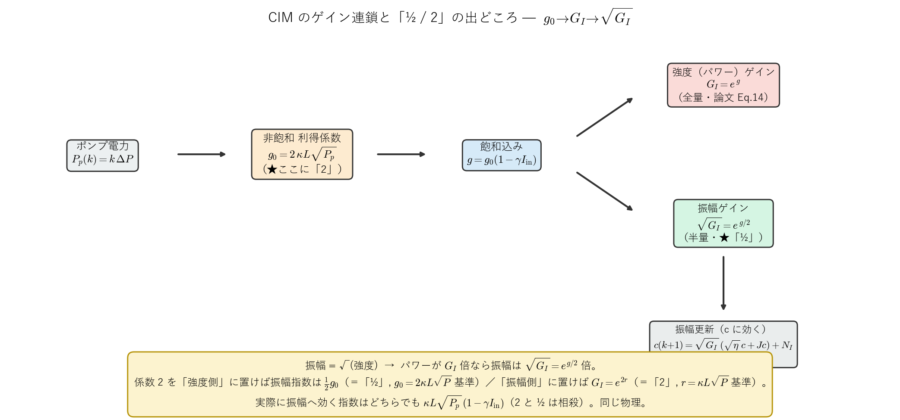

# CIM のゲイン定義まとめ — $g_0,\ G_I,\ \sqrt{G_I}$ と「½ / 2」の関係

作成日: 2026-06-15 / 対象実装: `modules/CIM.py`（Inoue–Yoshida 進行波モデル）
模式図生成: `scripts/plotting/plot_gain_definition_schematic.py`
背景: これまでの議論（exp の中身、½ はどこから、どの論文、2 か ½ か）の整理。

---

## 0. 要点（先に結論）

- CIM の 1 周更新で**振幅 $c_i$ に実際に掛かるのは $\sqrt{G_I}$（振幅ゲイン）**。
- 論文（Inoue–Yoshida）は**強度（パワー）ゲイン** $G_I=\exp(g)$、$g=g_0(1-\gamma I_{\rm in})$ を定義し、
  振幅の発展式では $\sqrt{G_I}$ を使う。
- $\sqrt{G_I}=\exp(g/2)$ なので、**振幅に効く指数は $\tfrac12 g$**。これが私の図で「½」が付いていた理由。
- **「½」と「2」は矛盾ではなく、同じ物理（振幅 $=\sqrt{\text{強度}}$）の逆数規約**。$g$ を強度の利得係数に
  取れば振幅側に $\tfrac12$、振幅の利得係数に取れば強度側に $2$ が出る。
- 実際に振幅へ効く指数は、どちらの規約でも $\kappa L\sqrt{P_p}\,(1-\gamma I_{\rm in})$（$g_0$ の中の $2$ と
  $\sqrt{G_I}$ の $\tfrac12$ が相殺）。

---

## 1. ゲインの連鎖（記号の定義と流れ）



`modules/CIM.py`（Inoue–Yoshida 進行波モデル）が引用している式:

| 段階 | 式 | 役割 | コード |
|---|---|---|---|
| ポンプ | $P_p(k)=k\,\Delta P$ | 毎周回ポンプ電力 | `CIM.py:318` |
| 非飽和利得係数 | $g_0=\mathbf{2}\,\kappa L\sqrt{P_p}$ | **ここに係数 2** | `CIM.py:319` |
| 飽和込み利得 | $g=g_0(1-\gamma I_{\rm in})$ | 強い信号で飽和 | Eq.(14) |
| 強度ゲイン | $G_I=\exp(g)$ | パワーの増幅率 | Eq.(14) |
| 振幅ゲイン | $\sqrt{G_I}=\exp(g/2)$ | **振幅に掛かる（½）** | `CIM.py:332-333` |
| 振幅更新 | $c(k{+}1)=\sqrt{G_I}\,(\sqrt{\eta}\,c+Jc)+N_I$ | 1 周の発展 | Eq.(3), `CIM.py:341` |

ここで $\kappa=130,\ L=0.05,\ \gamma=42.09,\ \eta=10^{-1.1}$。$I_{\rm in}=(\sqrt{\eta}\,c+Jc)^2$（Eq.15）。

---

## 2. 「½」はどこから来るか — 振幅 $=\sqrt{\text{強度}}$

PSA（位相感応増幅器）の利得 $G_I$ は**強度（パワー）ゲイン**として定義される（Eq.14）:

$$G_I=\exp(g),\qquad g=g_0(1-\gamma I_{\rm in}).$$

一方、更新するのは**振幅 $c$（電場の in-phase 成分）**で、パワーは振幅の 2 乗（$I\propto c^2$）。よって

$$\text{パワーが }G_I\text{ 倍}\;\Longleftrightarrow\;\text{振幅は }\sqrt{G_I}\text{ 倍},
\qquad \sqrt{G_I}=\sqrt{\exp(g)}=\exp\!\Big(\tfrac12 g\Big).$$

**$\tfrac12$ は論文が「½」という係数を書いているのではなく、$\sqrt{G_I}$（強度ゲインの平方根）を指数で
書き直すと自動的に出てくる**ものです。コードでも:

```python
# modules/CIM.py:332-341
half_g   = 0.5 * g0 * (1.0 - gamma * I_in)   # = g/2  ← ½ はここ
sqrt_G_I = np.exp(half_g)                     # = exp(g/2) = √G_I
c = sqrt_G_I * coupled_in + N_I               # 振幅に √G_I を掛ける
```

物理的には、増幅媒質中で強度 $I(z)=I_0e^{gz}$、振幅 $E(z)=E_0e^{gz/2}$。**強度の指数 $g$ ↔ 振幅の指数 $g/2$**。

---

## 3. 「½」と「2」は同じ物理の逆数規約

「2021 年の論文では 2 になっている」という指摘は正しく、**矛盾ではありません**。
差は「指数の中の利得係数 $g$ を**振幅**で測るか**強度**で測るか」だけです。

| $g$ の定義 | 強度（パワー）ゲイン | 振幅ゲイン | 表に出る係数 |
|---|---|---|---|
| **振幅**の利得係数 $r$ | $\exp(2r)$ | $\exp(r)$ | **2**（強度側） |
| **強度**の利得係数 $g_0$ | $\exp(g_0)$ | $\exp(g_0/2)$ | **½**（振幅側） |

パラメトリック増幅の標準形そのもので、振幅が $e^r$ 倍ならパワーは $e^{2r}$ 倍——ここの「2」です。

- **私の図 / コード（2022 版）**: 強度の利得係数 $g_0=2\kappa L\sqrt{P}$ を基準にし、振幅ゲインを
  $\sqrt{G_I}=e^{g_0/2}$ と書いた → **「½」**。
- **2021 版（あなたの参照）**: おそらく振幅の利得係数 $r=\kappa L\sqrt{P}$ を基準にし、強度ゲインを
  $G_I=e^{2r}$ と書いている → **「2」**。

**逆数の関係で、物理は完全に一致**します。

---

## 4. 実は同じ式に「2」も「½」も両方ある

コードの定義 $g_0=\mathbf{2}\kappa L\sqrt{P}$（既に 2 入り）を展開すると、両方が見えます:

$$\underbrace{G_I=\exp\!\big[\,2\kappa L\sqrt{P}\,(1-\gamma I)\big]}_{\text{パワーゲイン（2 が出る）}},
\qquad
\underbrace{\sqrt{G_I}=\exp\!\big[\,\kappa L\sqrt{P}\,(1-\gamma I)\big]=\exp\!\big[\tfrac12 g_0(1-\gamma I)\big]}_{\text{振幅ゲイン（½ が出る）}}.$$

**振幅に実際に効く指数は $\kappa L\sqrt{P}\,(1-\gamma I)$**で、

- 「$\tfrac12 g_0$」と書けば **½**（$g_0=2\kappa L\sqrt P$ 基準）、
- 「$r$」と書けば 2 は強度側へ移り $G_I=e^{2r}$（$r=\kappa L\sqrt P$ 基準）。

どちらでも同じ $e^{\kappa L\sqrt P}$。**係数 2 を「パワー＝振幅²」のどちら側に置くかの違い**だけです。

---

## 5. グラフの縦軸への影響（前回の不一致調査との接続）

この ½/2 は、「exp の中身」をプロットするときの**縦軸の定義**に直結します
（`results/2026-06-15/cim_user_discrepancy/` の調査）。

| プロットする量 | exp の中身 | 発振しきい | 係数 |
|---|---|---|---|
| 強度ゲイン $G_I=\exp(g)$ | $g_0(1-\gamma I)$（**全量**） | $\ln(1/\eta)=2.53$ | 2 側 |
| 振幅ゲイン $\sqrt{G_I}=\exp(g/2)$ | $\tfrac12 g_0(1-\gamma I)$（**半量**） | $\tfrac12\ln(1/\eta)=1.27$ | ½ 側 |

- **私の図**は半量 $\tfrac12 g_0(1-\gamma I)$（振幅に効く指数）、しきい 1.27。
- **ユーザー版** `arg_val = g_0*(1-γI)` は全量（$G_I$ の指数）、しきい 2.53。

「Max が倍くらい違う」「しきいが 2.53 vs 1.27」はすべてこの ½/2 の定義差で、**どちらも正しい**。

---

## 6. 参照論文と注意（透明性）

- `modules/CIM.py` が実装・引用しているのは
  **K. Inoue and K. Yoshida, "Traveling-wave model of coherent Ising machine based on fiber loop with
  pulse-pumped phase-sensitive amplifier," *Optics Communications* **522**, 128642 (2022)**
  （ScienceDirect の索引は 2022）。式番号（Eq.3, Eq.14, …）は**コードの docstring が付けたラベル**です。
- ユーザーの指摘する **2021 年版（または同モデルの先行論文）の「2」**は手元（リポジトリ `papers/`）に無く、
  原典 PDF と式番号の突き合わせはしていません。ただし §3–§4 のとおり、その「2」は
  **振幅利得係数規約**で説明でき、私の「½」（強度利得係数規約）と**完全に整合**します。
- いずれにせよ ½/2 は **「振幅 $=\sqrt{\text{強度}}$」という標準的な PSA/OPO 物理**（振幅 $\times e^r$、
  パワー $\times e^{2r}$）から来るもので、特定論文に固有の係数ではありません。

> 確実にしたい場合: 2021 論文の「ゲインの定義式」と「振幅更新式」を見せていただければ、
> `CIM.py` の $g_0,\ G_I,\ \sqrt{G_I},\ \kappa,L,P$ に 1 対 1 で対応づけ、「その 2 がどの 2 か」を確定します。

---

## まとめ（一文）

**CIM の振幅に効くのは強度ゲインの平方根 $\sqrt{G_I}=e^{g/2}$**——だから振幅基準の指数には「½」が付く。
「2」と「½」は、利得係数 $g$ を**強度で測るか振幅で測るか**の逆数規約で、$g_0=2\kappa L\sqrt P$ の「2」と
$\sqrt{G_I}$ の「½」は相殺して、振幅指数はどちらでも $\kappa L\sqrt{P}(1-\gamma I_{\rm in})$。物理は1つです。
