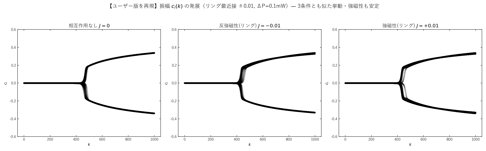
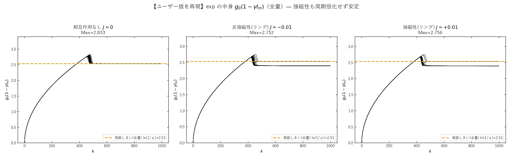
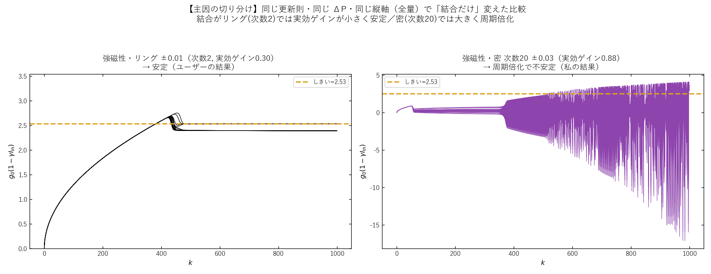
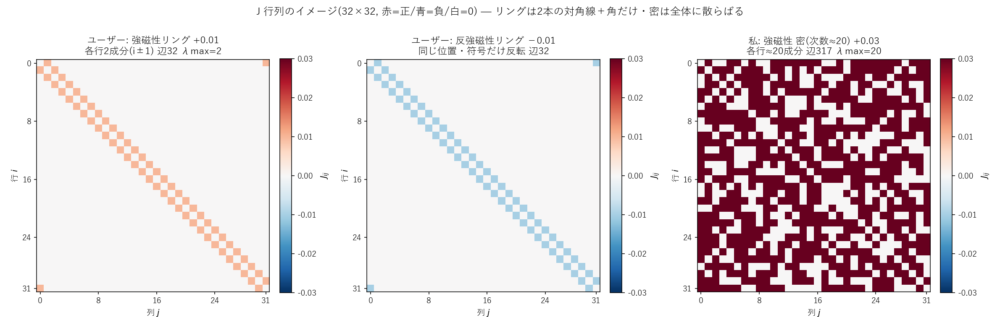

# ユーザー版スクリプトと本実装で「結果が違う」原因の調査

調査日: 2026-06-15 / 対象: ユーザー提供の Colab スクリプト vs 本リポジトリ実装（`modules/CIM.py`）
再現コード: `scripts/plotting/investigate_user_discrepancy.py`
データ: 本ディレクトリ `A_user_amplitude.png` / `B_user_argcontent.png` / `C_ferro_ring_vs_dense.png` / `D_Jmatrices.png`

---

## 0. 結論（先に要約）

**結果が違う主因は「結合行列 $J$ の作り方」です。** ユーザー版は **1 次元リング最近接結合（次数 2, $J=\pm0.01$）**、
私の図は **密なグラフ（次数 ≈20, $J=\pm0.03$、G22 相当）** を使っていました。これは結合の **実効ゲイン**
$\sqrt{\eta}+|J|\,\lambda_{\max}(A)$ にして **0.30 vs 0.88**、約 30 倍の差です。

強磁性の「ギザギザ（周期倍化不安定）」は **実効ゲインが臨界（≈0.9）を超えたときだけ**起きます。
ユーザー版のリング結合は弱すぎて臨界に届かないので、**3 条件（無結合・反強磁性・強磁性）すべて安定**になり、
強磁性でもギザギザが出ません。これが「私の図（強磁性が暴れる）と違う」最大の理由です。

副次的な差として、**縦軸の定義（全量 $g_0(1-\gamma I)$ か 半量 $\tfrac12 g_0(1-\gamma I)$ か＝因子 2）**、
**ポンプ刻み $\Delta P$（0.1 vs 0.05 mW）**、**ステップ数（1000 vs 1500）** も違います（後述）。

| 差分 | ユーザー版 | 私の図 | 効き |
|---|---|---|---|
| **結合の構造・強さ** | リング最近接 次数2 / $\pm0.01$ | 密 次数≈20 / $\pm0.03$ | **★主因**（実効ゲイン 0.30 vs 0.88） |
| 縦軸の量 | $g_0(1-\gamma I_{\rm in})$（全量＝$G_I$ の指数） | $\tfrac12 g_0(1-\gamma I_{\rm in})$（半量＝$\sqrt{G_I}$ の指数） | 値が 2 倍違う |
| ポンプ刻み $\Delta P$ | 0.1 mW/step | 0.05 mW/step | しきい到達が step 380 vs 760 |
| ステップ数 | 1000 | 1500 | 横軸の長さ |
| 乱数 seed | 未固定（毎回変動） | 固定（42 等） | 細部のばらつき |

---

## 1. ユーザー版の再現結果

ユーザーのコードを**ロジックそのままに**（`japanize_matplotlib` だけ Yu Gothic に置換）再実行しました。

### 振幅の発展 $c_i(k)$



### exp の中身 $g_0(1-\gamma I_{\rm in})$



**3 条件（無結合・反強磁性リング・強磁性リング）がほぼ同じ形**になり、いずれも

- step ≈380 で発振しきい $\ln(1/\eta)=2.53$ を通過、
- わずかなオーバーシュートの後、プラトー（≈2.4–2.53）に**安定**して落ち着く

という挙動です。**強磁性でも周期倍化（ギザギザ）は起きません**。Max 値も 2.83 / 2.75 / 2.76 とほぼ同じ。
数値でも、後半（step 500–1000）の平均 arg の標準偏差は **3 条件とも 0.001**（＝完全に安定）でした。

---

## 2. 主因の切り分け — 「結合だけ」を変えて比較

差の主因が結合であることを確かめるため、**同じ更新則・同じ $\Delta P$・同じ縦軸（全量）** のまま、
**結合行列だけ** をリング $\pm0.01$ → 密 次数20 $\pm0.03$ に差し替えました。



- **左（リング $\pm0.01$, 実効ゲイン 0.30）**: 安定 → **ユーザーの結果**
- **右（密 次数20 $\pm0.03$, 実効ゲイン 0.88）**: step ≈380 から **周期倍化で激しく振動** → **私の結果**

更新則も ΔP も縦軸も同じで、**結合だけ**でこれだけ変わる。これが「結果が違う」決定的な証拠です。

---

## 3. J 行列のイメージ（成分の可視化）

「結合の作り方が違う」を具体的に見るため、両者の $32\times32$ の $J$ 行列を可視化しました
（**赤＝正 / 青＝負 / 白＝0**）。



- **ユーザー版（リング最近接）**: 各行に**2 成分だけ**（自分の隣 $i\pm1$。両端は $0\leftrightarrow31$ が繋がる
  **角の点**）。対角線 2 本＋角だけの**すかすかな帯行列**。辺 32 本、各ノードの次数は**ちょうど 2**。
  強磁性(+0.01, 赤) と 反強磁性(−0.01, 青) は **同じ位置で符号だけ反転**（左 2 枚）。
- **私の版（密グラフ）**: 各行に**約 20 成分**が散らばる。辺 317 本、平均次数 ≈20、$0.03$ がほぼ全面（右）。

### 成分の数値（左上 6×6 の抜粋）

**強磁性リング +0.01**（三重対角＝$i,\,i\pm1$ だけ非ゼロ）:

```
[[0     0.01  0     0     0     0   ]
 [0.01  0     0.01  0     0     0   ]
 [0     0.01  0     0.01  0     0   ]
 [0     0     0.01  0     0.01  0   ]
 [0     0     0     0.01  0     0.01]
 [0     0     0     0     0.01  0   ]]
```
各行の非ゼロ数（次数）= [2, 2, 2, 2, 2, 2, …]（全行 2）

**強磁性 密 +0.03**（多数の非ゼロが散在）:

```
[[0     0.03  0     0     0.03  0.03]
 [0.03  0     0.03  0.03  0.03  0   ]
 [0     0.03  0     0.03  0     0.03]
 [0     0.03  0.03  0     0.03  0   ]
 [0.03  0.03  0     0.03  0     0.03]
 [0.03  0     0.03  0     0.03  0   ]]
```
各行の非ゼロ数（次数）= [22, 23, 20, 19, 21, 19, …]（平均 ≈20）

この**「1 行あたりの非ゼロ数（＝各パルスが何本の相手から結合入力を受けるか）」が 2 vs 20 と 10 倍違う**ことが、
次節の $\lambda_{\max}(A)$（リング 2 / 密 20）にそのまま効き、実効ゲイン $\sqrt\eta+|J|\lambda_{\max}$ の
**0.30 vs 0.88** を生みます。行列の「埋まり方」の差が、そのまま挙動の差です。

---

## 4. なぜ結合で決まるのか（理論）

CIM の 1 周更新は、結合後の場 $\mathbf F=\sqrt{\eta}\,\mathbf c+J\mathbf c=(\sqrt{\eta}\,I+J)\mathbf c$ を
飽和増幅する写像です。発振が立つ・暴れるかは、線形演算子 $\sqrt{\eta}\,I+J$ の**最大固有値（実効ゲイン）**

$$\text{実効ゲイン} \;=\; \sqrt{\eta} + |J|\,\lambda_{\max}(A)\qquad(J=\text{(結合係数)}\times A,\ A=\text{隣接行列})$$

で決まります。$\sqrt{\eta}=0.282$。

| 条件 | 結合の作り方 | $\lambda_{\max}(A)$ | 実効ゲイン | 後半 std | 挙動 |
|---|---|---|---|---|---|
| 無結合 | — | 0 | 0.282 | 0.001 | 安定（しきいで飽和） |
| **反強磁性リング** $-0.01$ | 次数2 (環) | 2 | **0.302** | 0.001 | 安定 |
| **強磁性リング** $+0.01$ | 次数2 (環) | 2 | **0.302** | 0.001 | 安定 |
| 強磁性 密 $+0.03$ | 次数20 | 20 | **0.882** | **3.891** | **周期倍化で不安定** |

ポイント:

- **リングは次数 2** なので $\lambda_{\max}(A)=2$。$|J|=0.01$ を掛けても寄与は $0.01\times2=0.02$ しかなく、
  実効ゲインは **0.30**（無結合 0.282 とほぼ同じ）。だから**ほぼ無結合**として振る舞い、安定。
- **密グラフは次数 20** で $\lambda_{\max}(A)=20$。$|J|=0.03$ を掛けると寄与 $0.6$、実効ゲイン **0.88**。
  高ゲイン × 深い飽和 × 1 周遅れ → ゲインが過補正（オーバーシュート）して **周期倍化 → カオス**。
- 強磁性「ギザギザ」が出る臨界は実効ゲイン ≈0.9 付近。**リングは 30 倍弱く、臨界に全く届かない**。

> 補足: リングは反強磁性も強磁性も $\lambda_{\max}(A)=|\lambda_{\min}(A)|=2$ で対称（環は 2 部グラフ）なので、
> 実効ゲインが同じ 0.30 になり、**反強磁性と強磁性が見分けられないほど似る**。これもユーザー図で 3 枚が
> そっくりになる理由です。密グラフでは $\lambda_{\max}\neq|\lambda_{\min}|$ なので両者に差が出ます。

---

## 5. その他の差分（副次的だが値がずれる原因）

### (a) 縦軸の量 — 全量 $g_0(1-\gamma I)$ か 半量 $\tfrac12 g_0(1-\gamma I)$ か

コードでは強度ゲイン $G_I=\exp[g_0(1-\gamma I)]$、振幅ゲイン $\sqrt{G_I}=\exp[\tfrac12 g_0(1-\gamma I)]$ で、
**振幅更新 `c = sqrt(G_I)*c_iii` に実際に掛かる指数は半量** $\tfrac12 g_0(1-\gamma I)$ です。

- **ユーザー版**は `arg_val = g_0*(1-γ*I)`（**全量**＝$G_I$ の指数）を縦軸に取っている。
- **私の図**は $\tfrac12 g_0(1-\gamma I)$（**半量**＝$\sqrt{G_I}$ の指数、c 更新で実際に掛かる量）。

どちらも正当ですが **値は 2 倍違います**。発振しきいも、全量なら $\ln(1/\eta)=2.53$、半量なら $1.27$。
「Max が私の図の倍くらいある」のはこの定義差です（誤りではなく規約の違い）。

### (b) ポンプ刻み $\Delta P$ — 0.1 vs 0.05 mW

$g_0(k)=2\kappa L\sqrt{k\,\Delta P}$。しきい $P_{\rm th}=37.96$ mW への到達は
$\Delta P=0.1$ なら **step ≈380**、$\Delta P=0.05$（私）なら **step ≈760**。**横軸の時間スケールが 2 倍違う**ので、
「発振が立つ位置」がそもそもずれます。

### (c) ステップ数・乱数

steps は 1000 vs 1500。さらにユーザー版は `np.random.randn` を **seed 固定していない**ため、
実行ごとに細部が変わります（定性的な結論は不変）。本調査では再現性のため seed を固定しました。

---

## 6. どちらが「正しい」のか — 目的次第

- **リング $\pm0.01$ は弱結合（ほぼ無結合）領域**を見ています。これはこれで正しい計算で、
  「弱く結合した CIM は 3 条件とも安定」という**正しい結果**です。
- 一方 **MAX-CUT（G22）は密で結合が強い**ので、強磁性不安定や反強磁性のしきい下プラトーが現れる
  **私の密設定が G22／実機側に対応**します。
- **強磁性のギザギザを見たい**なら、実効ゲインを上げる必要があります＝**密なグラフにする**か
  **$|J|$ を大きくする**（例: リングのままなら $|J|\gtrsim0.3$ 必要）。

つまり「どちらかが間違い」ではなく、**見ている結合強度のレジームが違う**だけです。

---

## 7. 再現方法

```bash
# 本調査(ユーザー版の再現 + 主因の切り分け + J行列の可視化)
.venv/Scripts/python.exe scripts/plotting/investigate_user_discrepancy.py
```

ユーザーのコードで強磁性不安定を出したい場合は、`J_ferro` を **密グラフ**（次数 ~20）にするか、
リングのままなら結合係数を **0.01 → 0.3 程度**に上げてください（実効ゲインを ≈0.9 にする）。

---

## まとめ（一文）

**「結果が違う」最大の原因は結合 $J$ の作り方**：ユーザー版は次数 2 のリング $\pm0.01$（実効ゲイン 0.30）で
弱結合のため 3 条件とも安定、私の図は次数 20 の密 $\pm0.03$（実効ゲイン 0.88）で強磁性が周期倍化する——
**更新則も物理定数も同じ**で、結合の実効ゲインだけがこの差を生んでいます（J 行列の図で言えば「2 本の対角線」
対「全面に散らばる点」の差、§3）。縦軸の全量/半量（因子 2）、$\Delta P$（横軸 2 倍）はそれに次ぐ副因です。
