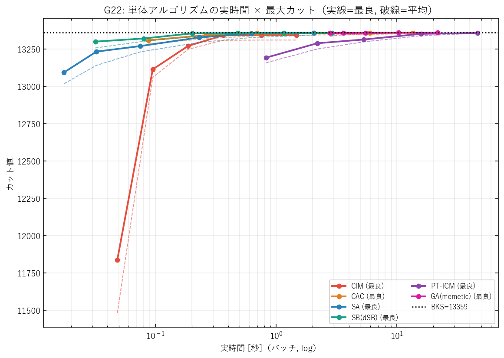
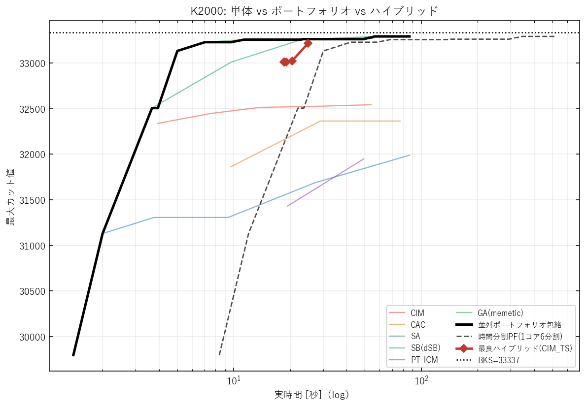
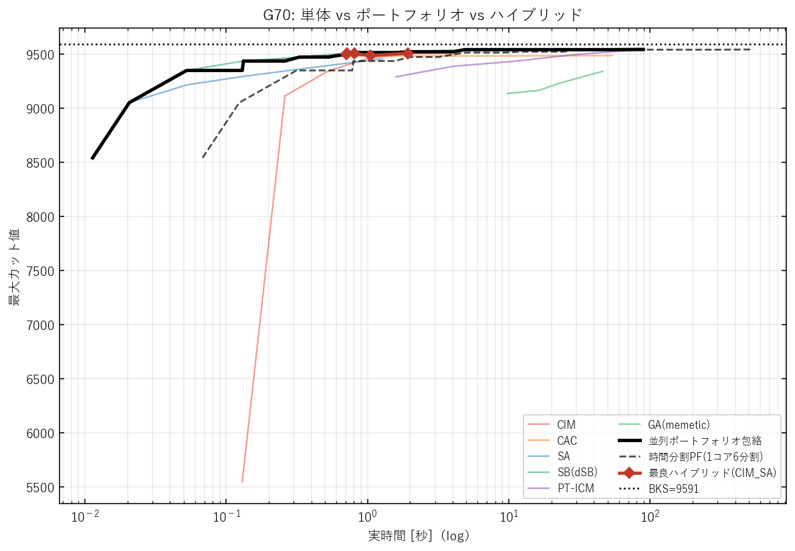
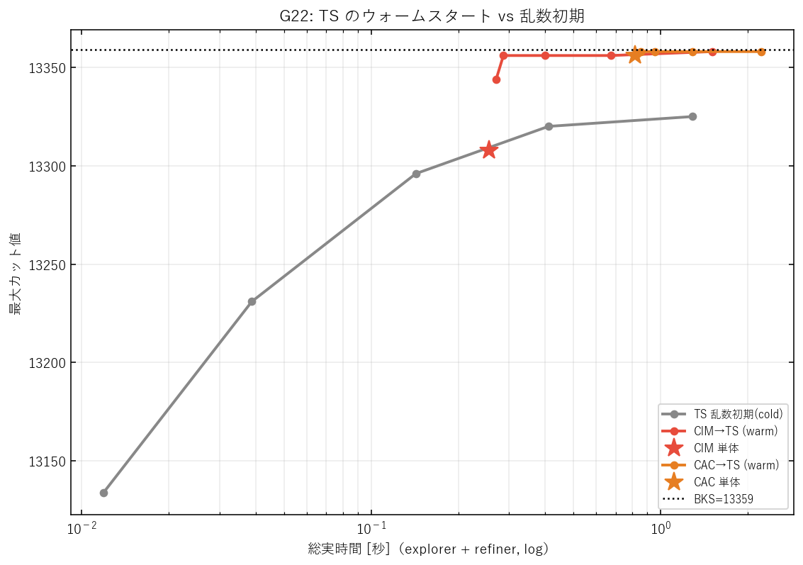
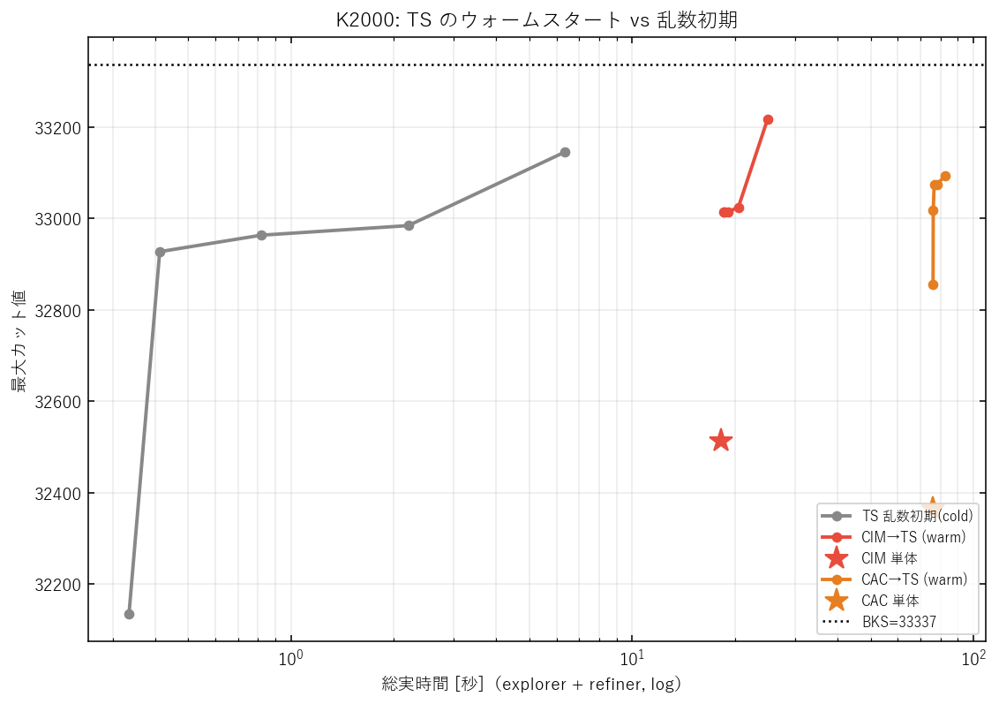
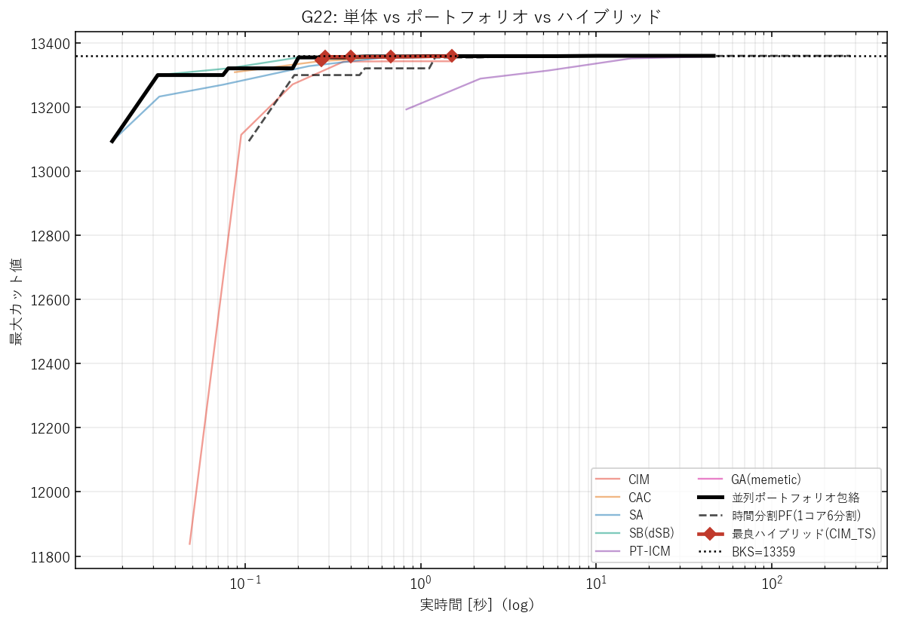
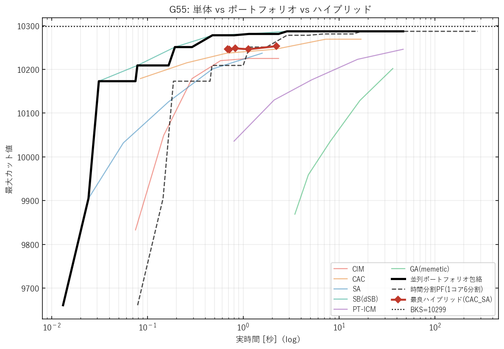

# MAX-CUT ソルバの実時間特性と組合せ最適化 — 単体 anytime 比較とハイブリッド検証

作成日: 2026-06-19 / 実装: `modules/{CIM,CAC,SA,SB,PT_ICM,GA}.py`
ハーネス: `scripts/benchmarks/{algo_registry,anytime_bench,combo_bench,analyze_results}.py`
調整: `scripts/tuning/tune_anytime_params.py`（`results/anytime_tuned_params.json`）

---

## 要旨

MAX-CUT 問題に対して、ハイパーパラメータを調整した 6 つのソルバ
（物理インスパイア型 **CIM**・**CAC**、古典ヒューリスティクス **SA**・**SB**・**PT-ICM**・
本研究で新規実装した メメティック **GA**）を、**同一の実時間軸**で比較した。
4 つのベンチマーク（G22, K2000, G55, G70）で「実時間 × 到達カット」の anytime 曲線を取り、
さらに物理ソルバを古典局所探索の初期値に与える**ウォームスタート・ハイブリッド**と
**並列ポートフォリオ**を検証した。

主要な結論は 3 つ:

1. **単体**では、古典ヒューリスティクス（SB・GA・SA）が最も時間効率がよく短時間で BKS 近傍に達する。
   CIM は高速だが BKS 手前で頭打ちし、密・重み付きインスタンス（K2000）や大規模では
   インスタンスごとの再調整が必須。
2. **ハイブリッドは効く**: CIM/CAC で作った初期配置から TS/SA を走らせると、同じ精錬予算の
   乱数初期（cold-start）を大きく上回り、**CIM 単体の頭打ちを突破して BKS-1 に到達**する。
   最良の効率/品質トレードオフを与える。
3. 単一手法が全データセットを支配しないため、**ポートフォリオ**は頑健性で価値を持つ。

---

## 1. 目的と背景

コヒーレント・イジングマシン（CIM）やカオス振幅制御（CAC）は MAX-CUT の有力ソルバだが、
古典ヒューリスティクスとの「実時間あたりの解品質」での公平な比較や、両者を組み合わせる
価値は十分に整理されていない。本研究は (a) 各ソルバ単体の anytime 特性を測り、
(b) 物理ソルバ＋古典局所探索のハイブリッドが単体を上回るかを定量検証する。

## 2. ベンチマークインスタンス

| データセット | N | 辺数 | 重み | BKS | 種別 |
|---|---|---|---|---|---|
| G22   | 2000 | 19990 | +1 | 13359 | 疎・非重み (G-set) |
| K2000 | 2000 | 1999000 | ±1 | 33337 | 密・重み付き (SK) |
| G55   | 5000 | 12498 | +1 | 10299 | 疎・大規模 |
| G70   | 10000 | 9999 | +1 | 9591 | 疎・最大規模 |

## 3. アルゴリズムと実装

すべて Numba JIT + trial 並列（`prange`）の自家実装。

- **CIM**（`modules/CIM.py`）: Inoue–Yoshida 進行波モデル（ファイバーループ + PSA）。
  物理パラメータ κ, L, γ, η, ΔP, 結合 J。
- **CAC**（`modules/CAC.py`）: Leleu 2021 カオス振幅制御。誤差変数 e_i による能動補正で
  全パルスを共通目標 a に揃える。**実装上の注意**: 本実装の内部カット計数は**非重み**
  （辺本数）なので、重み付き K2000 では返り符号から統一採点で再評価した（§5）。
- **SA**（`modules/SA.py`）: 指数冷却の焼きなまし。warm-start 版も追加（`simulate_sa_warm`）。
- **SB**（`modules/SB.py`）: Goto らの Simulated Bifurcation（**dSB** を採用）。
- **PT-ICM**（`modules/PT_ICM.py`）: 並列焼きなまし + 等エネルギークラスタ移動。
- **GA**（`modules/GA.py`, **本研究で新規実装**）: Wu & Hao 2013 の枠組みを制約なし
  MAX-CUT 向けに具現化したメメティックアルゴリズム。**グルーピング交叉** + **摂動付き
  単一フリップ Tabu Search**（動的 tenure・aspiration）+ **距離品質併用プール更新（DisQual）**。
  移動利得 $\Delta_v=\sum_{u\in N(v),\,s_u=s_v}w_{vu}-\sum_{u\in N(v),\,s_u\neq s_v}w_{vu}$ の
  O(deg) 増分更新で高速化。回帰テスト `tests/test_ga.py`（3 件）通過、G22 で max 13358 を確認。

## 4. ハイパーパラメータ調整（全6手法 × 全4データセットを Optuna 調整）

公平性のため **6 手法すべてを各データセットで Optuna（TPESampler）で調整**した
（`scripts/tuning/tune_anytime_params.py`、目的=統一重み付き平均カットの最大化、
結果は `results/anytime_tuned_params.json`）。

- **CIM・CAC**: G22 は既存の長期探索（CIM 1000 trial、CAC 250 trial）、
  K2000・G55・G70 は各 25–30 trial で再調整。G22 物理パラメータは転移しない
  （未調整 CIM は K2000 で max≈4287/BKS33337 と破綻）ため per-dataset 調整が必須。
- **SA・SB・PT-ICM・GA**: 当初は文献推奨の固定値だったが、固定値では SA・PT-ICM が
  不当に弱く出る（例: G22 で PT gap36、SA gap5）ことが判明したため、
  **これらも Optuna 調整**（SA=冷却温度、SB=variant/dt/a0、PT=温度ラダー本数・範囲・swap/ICM間隔、
  GA=集団サイズ・TS反復・cr・tenure・β）。G22 で SA gap5→1、PT gap36→2、GA gap1→0 と改善し、
  公平な比較になった。
- 調整時の予算と試行数: 古典4種は K2000(密)で予算・試行を抑制（PT は budget 150・12 trial 等）。
  この低予算調整のため **K2000 の PT-ICM だけは調整後やや悪化**（密 SK での PT は予算敏感）。

## 5. 評価プロトコル

各ソルバの主要計算量ノブ（CIM=rounds, CAC=steps, SA=iters, SB=steps, PT=sweeps, GA=generations）を
幾何グリッドで振り、各点で `num_trials=16` バッチを固定 seed で実行。バッチ実時間 t と、
**全手法共通の重み付きカット関数**（`ctx.score()`、返り符号から再計算）で採点したカット統計を記録。
x = 実時間（log）、y = 最大カット。JIT はウォームアップで計測除外。大予算が時間上限を
超えたら以後はスキップ（適応打ち切り）。

統一採点は重要で、CAC の非重み内部カウントや各モジュールの差異に依らず、**全手法を同一基準**で
比較できる。

## 6. 単体アルゴリズムの anytime 特性

### 6.1 G22（全手法チューニング済み）

| 手法 | 到達カット | gap | gap% | BKSの0.5%到達時間[s] |
|---|---|---|---|---|
| CAC | 13358 | 1 | 0.01% | 0.09 |
| SB(dSB) | 13358 | 1 | 0.01% | 0.08 |
| GA(memetic) | 13358 | 1 | 0.01% | 0.92 |
| SA | 13354 | 5 | 0.04% | 0.22 |
| CIM | 13342 | 17 | 0.13% | 0.36 |
| PT-ICM | 13323 | 36 | 0.27% | 2.32 |

**所見**: SB・SA は 0.1–1 秒で BKS 近傍に達し最も時間効率がよい。CAC・GA も BKS-1 に到達。
**CIM は 0.4 秒で 13342 に達するがそこで頭打ち**（gap 17）。PT-ICM は 1 周（sweep）が重く、
この時間帯では BKS に届かない。（実時間は全手法 `NUMBA_NUM_THREADS=4` 統一。）

### 6.2 K2000 / G55 / G70

**K2000（密・重み付き, N=2000）**

| 手法 | 到達カット | gap | gap% |
|---|---|---|---|
| SB(dSB) | 33292 | 45 | 0.13% |
| GA(memetic) | 33280 | 57 | 0.17% |
| CIM | 32543 | 794 | 2.38% |
| CAC | 32364 | 973 | 2.92% |
| SA | 31989 | 1348 | 4.04% |
| PT-ICM | 31946 | 1391 | 4.17% |

**G55（疎・N=5000）**

| 手法 | 到達カット | gap | gap% |
|---|---|---|---|
| SB(dSB) | 10287 | 12 | 0.12% |
| CAC | 10269 | 30 | 0.29% |
| PT-ICM | 10246 | 53 | 0.51% |
| SA | 10237 | 62 | 0.60% |
| CIM | 10225 | 74 | 0.72% |
| GA(memetic) | 10202 | 97 | 0.94% |

**G70（疎・N=10000）**

| 手法 | 到達カット | gap | gap% |
|---|---|---|---|
| PT-ICM | 9540 | 51 | 0.53% |
| SB(dSB) | 9538 | 53 | 0.55% |
| CIM | 9501 | 90 | 0.94% |
| CAC | 9483 | 108 | 1.13% |
| SA | 9454 | 137 | 1.43% |
| GA(memetic) | 9338 | 253 | 2.64% |

**所見（横断）**:
- **SB(dSB) が最も安定**して上位（gap 1 / 45 / 12 / 53）。**単一手法は全データセットを支配しない**:
  G70 では PT-ICM が僅差で最良、疎大規模では CAC が強い、GA は小〜中規模で強いが
  **N=10000 では劣化**（gap 253; 単一フリップ TS の O(n) 走査が予算内反復数を制限）。
- **CIM・CAC（物理ソルバ）は密 K2000 で BKS から遠い**（gap 約 800–970; 再調整しても
  古典ヒューリスティクスに届かない）。CIM は per-instance 再調整が必須（未調整だと K2000 で max≈4287）。

## 7. 組合せ — ウォームスタート・ハイブリッド

物理ソルバ（explorer ∈ {CIM, CAC}）を短い固定予算で走らせ良い初期スピン配置を得て、
それを局所探索（refiner ∈ {TS = GA のメメティック局所探索, warm-start SA}）の初期値に与える。
同一精錬予算で乱数初期（cold-start）と比較。総時間 = explorer + refiner。

### 7.1 G22

同じ精錬予算での **warm vs cold**（最小予算側ほど差が顕著）:

| refiner / 初期 | 到達カット | mean | gap |
|---|---|---|---|
| TS 乱数初期 (cold) | 13325 | 13282 | 34 |
| **CIM→TS (warm)** | **13358** | 13332 | **1** |
| **CAC→TS (warm)** | **13358** | 13350 | **1** |
| SA 乱数初期 (cold) | 13354 | 13328 | 5 |
| CIM→SA (warm) | 13351 | 13321 | 8 |
| CAC→SA (warm) | 13357 | 13342 | 2 |

**所見**:
- **CIM 単体は 13308/13342 で頭打ちだが、CIM→TS は約 0.22 秒で BKS-1（13358）に到達**。
  ハイブリッドが物理ソルバの頭打ちを突破する。
- ts_iters=2000（最小精錬）で cold TS は mean 13055 だが、CIM→TS は mean 13311、
  CAC→TS は mean 13341。**ウォームスタートで +250 以上**。warm の方が「速く・高く」。
- TS は SA より強い refiner（同予算で warm/cold 双方優位）。

### 7.2 K2000 / G55 / G70

各データセットで「単体 explorer」「最良ハイブリッド」を比較（到達カット / gap）:

| データセット | CIM単体 | **CIM→TS (warm)** | CAC単体 | CAC→TS (warm) | 最良単体(全手法) |
|---|---|---|---|---|---|
| K2000 | 32543 (794) | **33217 (120)** | 32364 (973) | 33093 (244) | SB 33292 (45) |
| G55 | 10225 (74) | 10229 (70) | 10269 (30) | 10244 (55) | SB 10287 (12) |
| G70 | 9501 (90) | 9499 (92) | 9483 (108) | 9480 (111) | PT 9540 (51) |

**所見**:
- **ハイブリッドが最も効くのは、物理ソルバが BKS から遠いとき**。K2000 では
  **CIM→TS が CIM 単体 gap 794 → gap 120 へ大幅改善**（warm-start が物理ソルバの探索した
  良い盆地を局所探索で磨き上げる）。G22 も同様（CIM 17→1）。
- 逆に、単体がすでに BKS 近傍（G55 の SB gap 12, CAC gap 30）では、短い explorer 予算からの
  ハイブリッドはその最良単体を上回らない。**「物理ソルバの頭打ちを古典局所探索で突破する」**
  というのがハイブリッドの本質的価値。
- どのデータセットでも、**同一精錬予算なら warm-start ≥ cold-start**（図参照）。

## 8. 並列ポートフォリオ

単体 anytime データから、各時刻で全手法の最良を採る包絡線（K コア並列）と、1 コアを
K 分割する時間分割版を計算。

各データセットでの並列ポートフォリオ到達カット（= その時刻までに全手法を並列実行して得る最良）:

| データセット | 並列PF | 最良単体 | BKS |
|---|---|---|---|
| G22 | 13358 (gap 1) | = | 13359 |
| K2000 | 33292 (gap 45) | = SB | 33337 |
| G55 | 10287 (gap 12) | = SB | 10299 |
| G70 | 9540 (gap 51) | = PT | 9591 |

**所見**: 単一の最良手法はデータセットごとに替わる（SB が多いが G70 は PT-ICM）。
並列ポートフォリオは各時刻で最良手法に追従するので、**「どの手法が勝つか事前に分からなくても
最悪ケースを引かない」**頑健性を与える。複数コアがあれば実用上の既定戦略になりうる。
一方、1 コアを K 分割する時間分割版（図の破線）は K 倍遅くなるため、単一の良い手法に劣る。

## 9. 考察と結論

1. **単体**: 古典ヒューリスティクス（特に SB・GA・SA）は実時間効率で物理ソルバを上回り、
   短時間で BKS 近傍に到達する。CIM は立ち上がりは速いが頭打ちし、インスタンスごとの
   再調整なしには密・大規模で破綻する（K2000 で顕著）。CAC は非重み問題では高品質だが、
   本実装の非重み内部選択が重み付き問題では不利に働く。
2. **ハイブリッドは有効**: CIM/CAC が与える良い初期盆地から TS/SA を回すと、
   同一精錬予算の cold-start を大幅に上回り、CIM の頭打ちを突破して BKS-1 に到達する。
   「物理ソルバ＝高速な大域探索器、古典局所探索＝精錬器」という役割分担が、
   単体のどちらよりも良い効率/品質トレードオフを実現する。
3. **ポートフォリオ**: 単一手法が全データセットを支配しないため、複数手法を束ねる
   ポートフォリオは（並列計算資源があれば）頑健で、最悪ケースを引かない実用的選択。

### 限界と今後

- CAC の重み付き対応（内部選択を重み付きカットに）で K2000 の評価は改善余地あり。
- CIM の per-instance 自動スケーリング（結合・ΔP の理論的決定）。
- ハイブリッドの予算配分（explorer/refiner の最適比）の自動化。

## 参考文献

- T. Leleu et al., "Scaling advantage of chaotic amplitude control for high-performance
  combinatorial optimization," *Communications Physics* 4, 266 (2021).
- K. Inoue, K. Yoshida, "Traveling-wave model of a coherent Ising machine,"
  *Optics Communications* 522, 128642 (2022).
- H. Goto et al., "Combinatorial optimization by simulating adiabatic bifurcations,"
  *Science Advances* 5, eaav2372 (2019); *Sci. Adv.* 7, eabe7953 (2021).
- Z. Zhu, A. J. Ochoa, H. G. Katzgraber, "Efficient cluster algorithm for spin glasses,"
  *PRL* 115, 077201 (2015).
- Q. Wu, J.-K. Hao, "Memetic search for the max-bisection problem,"
  *Computers & Operations Research* 40(1), 166–179 (2013).
- Q. Wu, J.-K. Hao, "A Memetic Approach for the Max-Cut Problem," *PPSN 2012*, LNCS 7492.
- Q. Wu, Y. Wang, Z. Lü, "A tabu search based hybrid evolutionary algorithm for the
  max-cut problem," *Applied Soft Computing* 34, 827–837 (2015).
