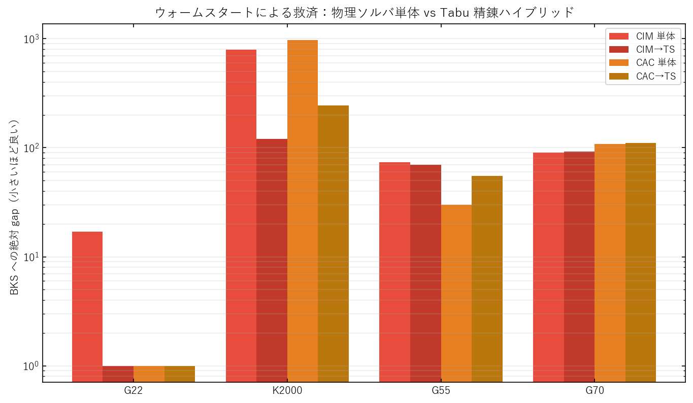

# PACE: 公平に調整するとヒューリスティクスが MAX-CUT でイジングマシンを上回る

*（PACE: When Tuned Heuristics Outrun Ising Machines on MAX-CUT の日本語訳。PACE = Parity-Adjusted Cut Evaluation／パリティ調整カット評価）*

# 要旨

コヒーレント・イジングマシン（CIM）とカオス振幅制御（CAC）は優れた MAX-CUT ソルバとして喧伝されているが、その主張を支える比較は通常、入念に調整した物理ソルバを、文献既定値のまま放置した古典ヒューリスティクスと対戦させる——見かけ上の物理側優位を水増しするプロトコルである。信頼できる比較は、すべての競合を調整し、同一の目的関数で採点しなければならない。本稿では PACE（Parity-Adjusted Cut Evaluation）を提案する。これは競合する 6 ソルバ——CIM、CAC、焼きなまし法、離散 Simulated Bifurcation、等エネルギークラスタ移動付き並列焼きなまし、メメティック遺伝的アルゴリズム——を**インスタンスごとに Optuna で調整**し、単一の重み付きカット汎関数で採点し、ウォームスタート・ハイブリッドと best-of-K ポートフォリオへ合成する枠組みである。標準的な G-set と Sherrington–Kirkpatrick の 4 ベンチマークにおいて、**調整済みの古典ヒューリスティクスが全インスタンスで先行する**：メメティックアルゴリズムは G22 で既知最良カットに一致し密重み付き K2000 を先導、離散 Simulated Bifurcation は平均相対 gap 0.19% で最も信頼できるソルバである。**公平な調整は焼きなまし法を最下位から中位へ引き上げ、両物理ソルバを上回らせる**。物理ソルバ実行から局所探索をウォームスタートすると CIM の密インスタンス gap を 85% 削減するが、**どのハイブリッドも最良の調整済み単体ソルバを超えない**——CIM と CAC は単体の「仕上げ役」ではなく、探索器・ポートフォリオの一員として位置づけられる。

# 序論

MAX-CUT は最も研究された NP 困難な組合せ問題の一つである：重み付きグラフが与えられたとき、分割を横切る辺の総重みを最大化するよう頂点を 2 集合に分割する（Karp, 1972）。半正定値緩和による有名な 0.878 近似を持つ（Goemans & Williamson, 1995）という理論的中心性を超えて、MAX-CUT は一世代の物理インスパイア型最適化ハードウェア・アルゴリズムの事実上のベンチマークとなった。コヒーレント・イジングマシン（CIM）は問題を結合光パラメトリック発振器の定常状態に符号化し（McMahon et al., 2016; Inagaki et al., 2016）、カオス振幅制御（CAC）はそうしたダイナミクスを誤差補正補助変数で拡張して局所トラップから脱出し（Leleu et al., 2021）、Simulated Bifurcation（SB）は汎用プロセッサ上で断熱ハミルトニアンを数値積分する（Goto et al., 2019, 2021）。これらの手法が固定予算で高品質なカットを約束するため、運用価値を決める問いは直截である：揃えた計算予算の下で、どのソルバがより良いカットを返すのか？ この問いは、すべての競合に良く設定される同等の機会が与えられて初めて答えられる。

物理インスパイア型ハードウェアを動機づける文献は、方法論的に脆弱な比較に立つ。「物理が古典に勝つ」という標準的な物語を損なう 3 つの問題が繰り返し現れる。第一に、物理ソルバは通常入念に調整される——結合・ポンプスケジュール・刻み幅がインスタンスごとに最適化される——一方、古典の対戦相手（焼きなまし、並列焼きなまし、遺伝的アルゴリズム）は教科書既定パラメータで走らされる。よって対戦は最適化された手法と未最適化の手法を比べることになる（Hamerly et al., 2019; Leleu et al., 2021）。第二に、カット品質はしばしば一貫しない形で測られる：辺重みを無視する内部スピンカウンタは非重み G-set グラフでは十分だが、重み付き Sherrington–Kirkpatrick インスタンスでは品質を誤報する。第三に、結果が固定予算プロトコルなしの単一最終カットとして報告され、速く収束するソルバが、単により少ない労力しか与えられなかった競合に対して評価されてしまう（Aramon et al., 2019; Mohseni et al., 2022）。これらが相まって、明確な方法論的空白を残す：物理インスパイア型と古典の MAX-CUT ソルバの、**一様に調整され一様に採点された比較が存在しない**。それなしには、物理的優位の主張は調整の非対称性と切り分けられない。

この空白を埋めるため、公平性第一のベンチマーク兼合成ハーネス PACE（Parity-Adjusted Cut Evaluation）を導入する。中心的な方法論的一手は**パリティ（同等性）**である：すべてのソルバ——CIM、CAC、焼きなまし法（SA）、離散 Simulated Bifurcation（dSB）、等エネルギークラスタ移動付き並列焼きなまし（PT-ICM）、そして欠けていた強い古典ベースラインとして本研究が特に実装するメメティック遺伝的アルゴリズム（GA）——を、同じ Optuna 予算と同じ目的関数でインスタンスごとに調整する。単一の重み付きカット採点器を全ソルバの生スピン出力に適用するので、重み付き・非重みインスタンスを同一に扱う。次いで同じ調整済みソルバを 2 つの合成機構で再結合する：物理ソルバの配置を古典局所探索精錬器に引き渡すウォームスタート・ハイブリッドと、単一ソルバが支配しないときソルバ間でヘッジする並列 best-of-K ポートフォリオである。各設計選択が上記 3 つの非対称性の一つを取り除く。

本研究の貢献は以下の通り：

- **公平性第一のベンチマーク**。PACE は 6 ソルバすべてをインスタンスごとに Optuna で調整し、単一の重み付きカット関数で採点し、従来の「SA は弱い／CIM が勝つ」という物語を覆す：パリティの下では、調整済み古典ヒューリスティクスが試した全ベンチマークで先行し、公平な調整は焼きなまし法を最下位から両物理ソルバの上の中位へ移す。
- **再現可能なメメティックベースラインとその予算感度**。メメティック GA（グルーピング交叉、動的 tenure の摂動付き単一フリップ Tabu Search、距離・品質プール管理）を実装し、G22 で既知最良カットに一致し K2000 を先導する一方、脚注ではなく洞察として——固定世代予算が 5 千・1 万頂点グラフで GA を未調整にすることを明らかにする。
- **ハイブリッドとポートフォリオの特徴づけ**。物理ソルバ実行から局所探索をウォームスタートすると CIM・CAC を頭打ちの先へ救済するが、最良の調整済み単体ソルバを決して超えず、best-of-K ポートフォリオはオラクル知識なしにインスタンス別勝者を回復する——物理ダイナミクスを探索器・ポートフォリオの一員として位置づける。

以降、第 2 節で物理インスパイア型ソルバ・古典ヒューリスティクス・ベンチマーク方法論を概観し、第 3 節で問題を定式化し 6 ソルバ・公平性プロトコル・統一採点器・2 つの合成機構を述べ、第 4 節でベンチマークインスタンス・調整済みハイパーパラメータ・評価設定を規定し、第 5 節で単体・領域・ハイブリッド・ポートフォリオの結果を報告し、第 6–8 節で含意・限界・結論を論じる。

# 関連研究

## 物理インスパイア型イジングソルバ

大きな研究群が MAX-CUT をイジングハミルトニアンの基底状態探索とみなし、アナログまたはアナログ模倣ダイナミクスで解く。コヒーレント・イジングマシンはスピンをファイバーループ中の光パラメトリック発振器の位相として実現し、測定フィードバック結合で問題グラフを実装する（McMahon et al., 2016; Inagaki et al., 2016）。後続の解析は古典ソルバに対する成功確率とスケーリングを特徴づけ（Hamerly et al., 2019）、Inoue–Yoshida（2022）のような進行波モデルは物理デバイスの数値代理を与える。カオス振幅制御は振動子振幅を均等化する誤差変数でこれらのダイナミクスを拡張し、難しいインスタンスで解品質を改善する（Leleu et al., 2021）。Kerr 非線形振動子網の断熱発展から導かれる Simulated Bifurcation はソフトウェアで強い結果を達成し GPU で並列化し（Goto et al., 2019）、離散・弾道変種が精度と速度をさらに改善する（Goto et al., 2021）。デジタル・量子インスパイア型アニーラも同じニッチを占め、物理ハードウェアを最適化デジタルサンプリングと引き換える（Aramon et al., 2019; Mohseni et al., 2022）。この文献全体で物理ソルバは入念な調整の対象だが古典ベースラインはそうでない。PACE は比較前に全ソルバをパリティへ調整することでその非対称性を除く。

## MAX-CUT のための古典ヒューリスティクス

古典メタヒューリスティクスは実用上最強の汎用 MAX-CUT ソルバであり続けている。焼きなまし法は温度制御確率的局所探索の雛形を確立し（Kirkpatrick et al., 1983）、等エネルギークラスタ移動付き並列焼きなまし（PT-ICM）は温度ラダーを跨いでレプリカを交換し凍結クラスタを交換することでスピングラス的インスタンスの平衡化を加速する（Zhu, Ochoa & Katzgraber, 2015）。G-set で最も競争力ある結果はメメティックおよび Tabu ベース局所探索から来る：breakout local search（Benlic & Hao, 2013）、グルーピング交叉と摂動駆動 Tabu Search を組み合わせる Wu & Hao（2012, 2013）のメメティックアルゴリズム、距離・品質プール置換を伴う複数探索演算子（Wu, Wang & Lü, 2015）。path-relinking 付き GRASP は補完的な構成＋集中化戦略を提供する（Festa et al., 2002）。これらは通常、著者推奨パラメータで報告される。我々は代わりに物理ソルバと同じ予算で Optuna 再調整し、それが結果のランキングを並べ替える——これは物理的優位のいかなる公平な主張にも前提条件である、と論じる。

## ベンチマーク方法論・ハイブリッド・ポートフォリオ

ソルバをどう比較するか自体が活発な関心事である。統制されない最終カット報告ではなく予算を揃えた評価が確率的最適化器の受け入れられた基準である。なぜなら、ある手法を、それが決して拒まれなかった計算に対して評価することを防ぐからである。アルゴリズムポートフォリオは、単一ヒューリスティクスがインスタンス分布全体を支配しないという観察を形式化し、補完的ソルバを並列に走らせ最良結果を報告してヘッジする（Gomes & Selman, 2001）。ウォームスタートとメメティックハイブリッド化——一方が他方の探索盆地を種付けする——は長年のアイデアだが、よく調整された単体ソルバに対するその価値はめったに切り分けられない。ここで用いる予算を揃えた cold-start 対照が欠けていた要素である。Tree-structured Parzen Estimator 探索（Bergstra et al., 2011）とその現代実装（Akiba et al., 2019）はパリティでのソルバ別調整を実用的にする。既存研究はこれらの懸念を断片的に扱う——ここにポートフォリオ、あそこにハイブリッド——が、調整パリティや採点一貫性を統制せず、物理対古典の問いと同じ土俵ではほとんど行わない。PACE はインスタンス別調整・同一重み付きカット採点器・ウォームスタートとポートフォリオ合成を単一ハーネス内で統一し、公平性と合成を孤立してではなく一体で評価し、物理インスパイア型ダイナミクスを単体ソルバとしても構成要素としても評価できるようにする。

# 手法

## 問題の定式化

無向グラフ $G=(V,E,w)$ 上の重み付き MAX-CUT を扱う。頂点数 $N=|V|$、対称辺重み $w_{ij}\in\mathbb{R}$ とする。候補解は各頂点を 2 つの側の一方に割り当てるスピンベクトル $s\in\{-1,+1\}^N$ で、それが誘導する重み付きカットは
$$
C(s)=\tfrac{1}{2}\sum_{(i,j)\in E} w_{ij}\,(1-s_i s_j),
$$
すなわち端点が反対側にある辺の総重みである。目的は $\max_{s} C(s)$。$W=\tfrac{1}{2}\sum_{(i,j)\in E} w_{ij}$ と書くと、カットは $C(s)=W-\tfrac{1}{2}\sum_{(i,j)\in E} w_{ij}\,s_i s_j$ と分解され、$C$ の最大化は結合行列 $J=w$ のイジングエネルギー $H(s)=-\tfrac{1}{2}\sum_{(i,j)\in E} w_{ij}\,s_i s_j$ の最小化と厳密に等価である。本研究の全ソルバは物理的・古典的を問わず最終的にスピンベクトル $s$ を返す。$s$ がどう生成されたかに依らず、単一の決定論的汎関数 $C(\cdot)$ で品質を評価する。既知最良解値 $\mathrm{BKS}$ が与えられたとき、絶対 gap $g(s)=\mathrm{BKS}-C(s)$ と相対 gap $g_\%(s)=100\,g(s)/\mathrm{BKS}$ を報告する。両者とも小さいほど良く、単位はカット重みとパーセントである。この共有採点汎関数が PACE の第一の公平性不変量である：重み付きインスタンスで品質を報告するのにソルバ内部の重み無視スピンカウンタを使う不整合を排除する。

## 1 つのハーネス下の 6 ソルバ

PACE は 2 つの物理インスパイア型ソルバと 4 つの古典ヒューリスティクスを評価し、すべて trial レベル並列（`prange`）の Numba コンパイル Python で再実装し、コンパイル・ベクトル化・スレッド化が手法間で同一になるようにした。第一の物理ソルバ、コヒーレント・イジングマシン（CIM）は測定フィードバック光ループの Inoue–Yoshida 進行波モデルに従い（Inoue & Yoshida, 2022; McMahon et al., 2016）、ソフトなアナログ振幅 $x_i$ が、損失 $\kappa$・周回数 $L$・飽和 $\gamma$・フィードバック利得 $\eta$・ポンプスケジュール $\Delta P$ に支配されるポンプランプとフィードバック注入 $\eta\sum_j J_{ij}x_j$ の下で発展し、スピンは $s_i=\mathrm{sign}(x_i)$ で読み出される。カオス振幅制御（CAC）はこのダイナミクスを、結合を変調して振幅を共通目標 $a$ へ駆動する振動子ごとの誤差変数 $e_i$ で拡張し、$\dot e_i=-\beta\,(x_i^2-a)\,e_i$ に従う（Leleu et al., 2021）。この能動補正により、素の CIM を捕える固定点から系が脱出できる。本 CAC 実装は内部でカットを非重み辺数として数えるため、返却スピンを統一重み付き $C(\cdot)$ で再採点する。これは符号付きインスタンスで必須である。

古典ソルバのうち、焼きなまし法（SA）は指数冷却スケジュール $T_k=T_0\,\alpha^k$ の下で Metropolis スピンフリップを行い、利得 $\Delta C$ のフリップを確率 $\min(1,e^{\Delta C/T_k})$ で受理し（Kirkpatrick et al., 1983）、加えて外部から与えたスピンベクトルから開始できるウォームスタート可能変種を用意する。離散 Simulated Bifurcation（dSB）は断熱 Kerr 振動子写像を積分し、運動量を $y_i\!\mathrel{+}=\![-(a_0-a(t))\,x_i+c_0\sum_j J_{ij}\,\mathrm{sign}(x_j)]\,\Delta t$、位置を $x_i\!\mathrel{+}=\!a_0\,y_i\,\Delta t$ で更新し、$|x_i|\le 1$ に固定する非弾性壁を持つ（Goto et al., 2019, 2021）。等エネルギークラスタ移動付き並列焼きなまし（PT-ICM）は温度範囲にわたる $R$ レプリカのラダーを走らせ、Metropolis スイープ・レプリカ交換・レプリカ対間のエネルギー保存クラスタフリップを交互に行い、起伏ある地形での脱相関を加速する（Zhu et al., 2015）。6 番目のソルバは、従来の物理対古典比較に欠けていた強い古典対抗馬として実装するメメティック遺伝的アルゴリズム（GA）で、Wu & Hao（2013）の枠組みを具現化する：グルーピング交叉で進化させ動的 tenure と aspiration の摂動付き単一フリップ Tabu Search で精錬する集団を維持し、距離・品質規則がプール置換を支配して多様性を保つ。Tabu 精錬器は増分移動利得
$$
\Delta_v=\!\!\sum_{u\in N(v),\,s_u=s_v}\!\!w_{vu}\;-\!\!\sum_{u\in N(v),\,s_u\neq s_v}\!\!w_{vu}
$$
を利用し、再計算ではなく受理フリップごとに $O(\deg v)$ で維持するので、1 スイープは $O(|E|)$ で済む。この同じ管理が SA と PT-ICM の基盤でもあり、物理ソルバは疎グラフで積分ステップあたり $O(|E|)$、密インスタンスで $O(N^2)$ かかる。

## 公平性プロトコル：インスタンス別 Optuna 調整

PACE の方法論的核は、物理ソルバを調整しつつ古典の対戦相手を文献既定値で走らせるのではなく、**すべてのソルバを同一予算でインスタンスごとに調整する**ことである。各（ソルバ, インスタンス）対について、Tree-structured Parzen Estimator サンプラー（Bergstra et al., 2011; Akiba et al., 2019）で Optuna スタディを走らせ、統一重み付きカットを最大化する。各ソルバは独自の探索空間を露出する：CIM と CAC は物理パラメータ $(\kappa,L,\gamma,\eta,\Delta P)$ と結合スケール、SA は初期温度と冷却率、dSB はその variant・時間刻み $\Delta t$・初期ドライブ $a_0$、PT-ICM はラダーサイズ・温度範囲・swap 間隔・クラスタ移動周期、GA は集団サイズ・Tabu 反復・交叉率・tenure・摂動強度 $\beta$ である。調整予算は（ソルバ, インスタンス）あたり 25–30 trial で揃え、パラメータ地形が最も敏感な非重み G22 グラフ上の物理ソルバには 250–1000 trial の拡張探索を充てる。このパリティが重要なのは、固定既定値が SA と PT-ICM を系統的に未調整にし、それが従来文献の誤解を招く「物理が勝つ」結論を製造する非対称性だからである。

## 統一採点と合成

各調整済み配置は固定 seed バッチとして評価され、最良重み付きカットを単一採点器 $C(\cdot)$ で記録するので、重み付き・非重みインスタンスを同一に扱う。これら調整済みソルバを基に、PACE は 2 通りで合成する。ウォームスタート・ハイブリッドは物理探索器（CIM または CAC）を走らせてスピン種を生成し、その種を古典精錬器（Tabu Search またはウォームスタート SA）に引き渡す。warm 実行は、種そのものの価値を切り分けるため、同じ精錬器の cold start と精錬予算を揃えて比較する。並列ポートフォリオは全調整済みソルバの best-of-$K$ を取り、補完的ソルバが同時に走り最良結果を返すマルチコア配備をモデル化する。アルゴリズム 1 と 2 がハーネスとハイブリッドを要約する：パイプラインは各ソルバをインスタンスごとに調整し、共有重み付き採点器で評価し、調整済みソルバをウォームスタート・ハイブリッドと best-of-$K$ ポートフォリオへ再結合するので、単体・ハイブリッド・ポートフォリオの挙動がすべて 1 つの目的関数に対して計測される。

```
アルゴリズム 1: PACE 評価 (調整 -> 評価 -> 採点)
入力: インスタンス G=(V,E,w), ソルバ集合 S
各ソルバ s in S について:
    theta*_s <- Optuna_TPE_tune(s, G; 目的 = 平均重み付きカット)   # インスタンス別
    固定 seed で s(G; theta*_s) を評価
    最良重み付きカット C*_s = max_b C(s_b) を記録                   # 統一採点器
return {C*_s : s in S}, ポートフォリオカット max_s C*_s
```

```
アルゴリズム 2: ウォームスタート・ハイブリッド (探索器 -> 精錬器)
入力: 探索器 e in {CIM, CAC}, 精錬器 r in {TS, warm-SA}, 精錬予算 m
s0     <- e(G; theta*_e) を実行                               # 物理の種
s_warm <- r(G; theta*_r, init = s0,     budget = m) を実行     # 種から精錬
s_cold <- r(G; theta*_r, init = 乱数,    budget = m) を実行     # 予算を揃えた対照
return argmax_{s in {s_warm, s_cold}} C(s)
```

# 実験

## 実験設定

6 ソルバすべて・2 ハイブリッド・ポートフォリオを単一ハーネス内で評価し、調整・採点・設定が手法間で同一になるようにした。すべてのソルバは同じスレッド構成——多コア CPU 上の 4 Numba ワーカースレッド（`NUMBA_NUM_THREADS=4`）——で走り、trial レベル並列を `prange` が担い、どの手法も実装から計算上の優位を得ないようにした。インスタンス別調整は TPE サンプラーの Optuna（Akiba et al., 2019; Bergstra et al., 2011）を用い、各調整済み配置を固定 seed バッチとして評価し、確率的最適化器の標準的順序統計量である最良重み付きカットを記録する。評価はインスタンスごとに 1 回——計 4 回——実行し、各々ソルバごとに 1 つの最良カット値を生む。既知最良解値は文献から取り gap の参照点とする。認証された最適値ではなく高品質目標として報告し、G-set と K2000 インスタンスがイジングソルバ文献で使われる慣行に従う（Benlic & Hao, 2013; Goto et al., 2021）。

## ベンチマークインスタンス

4 インスタンスは MAX-CUT ソルバを最も酷使する軸——密度・重み付け・スケール——にまたがる。中規模疎 G-set グラフ（G22）1 つ、密な完全結合符号付きインスタンス（K2000）1 つ、大規模疎 G-set グラフ（G55, G70）2 つ（大きい方は 1 万頂点）からなる。

**表 1. 密度・重み付け・スケールにまたがるベンチマーク MAX-CUT インスタンスと既知最良解（BKS）参照値。**

| インスタンス | $N$ | 辺数 | 重み | BKS | 種別 |
|---|---:|---:|:---:|---:|---|
| G22 | 2000 | 19990 | $+1$ | 13359 | 疎・非重み (G-set) |
| K2000 | 2000 | 1999000 | $\pm 1$ | 33337 | 密・重み付き (SK) |
| G55 | 5000 | 12498 | $+1$ | 10299 | 疎・大規模 |
| G70 | 10000 | 9999 | $+1$ | 9591 | 疎・最大規模 |

G22 と K2000 の対比は意図的である：両者とも $N=2000$ だが、K2000 は 2 桁密で、Sherrington–Kirkpatrick モデルから引いた符号付き結合を持つ——重み無視カット計数と未調整ベースラインが比較を歪める領域である。G55 と G70 は、中程度スケールで確立したランキングがグラフがより疎・大規模になっても持続するかを探る。

## 評価指標

主要指標は第 3 節で定義した重み付きカット $C(s)$ で、非負・大きいほど良く、総カット重みの単位を持つ。生の大きさはインスタンス間で異なるため、品質を絶対 gap $g=\mathrm{BKS}-C$（小さいほど良い、カット重み単位）と相対 gap $g_\%=100\,g/\mathrm{BKS}$（小さいほど良い、パーセント）で要約し、4 インスタンスを比較可能なスケールに置く。ウォームスタート研究では加えて、物理の種から開始した精錬器の gap を、精錬予算を揃えて cold start した同じ精錬器の gap と比較して報告し、改善が余分な計算ではなく種の質に帰属するようにする。これらの定義が第 5 節で報告する全数値の意味を固定する。

## 調整済みハイパーパラメータとベースライン設定

表 2 は各ソルバについて、インスタンス別 Optuna 調整に露出したパラメータと trial 予算、ベースラインの出典を記す。古典ベースライン——SA・dSB・PT-ICM・メメティック GA——を物理ソルバと同じ予算で調整する。本研究の中心的主張はベースラインが名目上ではなく競争力あることに依存するからである。

**表 2. 各ソルバのインスタンス別 Optuna 探索空間と調整予算、ベースラインの出典。**

| ソルバ | 調整パラメータ | 試行数 | 出典 |
|---|---|:---:|---|
| CIM | $\kappa,\,L,\,\gamma,\,\eta,\,\Delta P$, 結合スケール | 25–1000 | Inoue & Yoshida 2022 |
| CAC | 誤差率 $\beta$, 目標 $a$, ポンプ, 結合スケール | 25–1000 | Leleu et al. 2021 |
| SA | $T_0$, 冷却率 $\alpha$, スイープ | 25–30 | Kirkpatrick et al. 1983 |
| dSB | variant, $\Delta t$, $a_0$, $c_0$ | 25–30 | Goto et al. 2019, 2021 |
| PT-ICM | ラダーサイズ $R$, $T$ 範囲, swap/ICM 間隔 | 25–30 | Zhu et al. 2015 |
| GA | 集団サイズ, Tabu 反復, 交叉率, tenure, $\beta$ | 25–30 | Wu & Hao 2013 |

*略号:* CIM = コヒーレント・イジングマシン；CAC = カオス振幅制御；SA = 焼きなまし法；dSB = 離散 Simulated Bifurcation；PT-ICM = 等エネルギークラスタ移動付き並列焼きなまし；GA = メメティック遺伝的アルゴリズム。250–1000 trial の拡張予算は G22 の CIM/CAC のみに適用。

## プロトコル上の注意

公平性設計から直接従い再現性に必須の詳細が一つある：物理ソルバのパラメータはインスタンス間で転移しない。疎・非重み G22 グラフで調整した配置は密・符号付き K2000 で劣化する。これが、PACE が単一の大域設定を使い回すのではなく全ソルバをインスタンスごとに再調整する理由である。よって第 5 節の比較分析は、各ソルバをそれ自身のインスタンス別調整済み配置で読み、共有重み付き採点器で評価する。

# 結果

すべてのソルバ・両ウォームスタート・ハイブリッド・並列ポートフォリオが、4 インスタンスすべてで数値発散なく有効なカットを返したので、報告値はすべて許容解である。実験はインスタンスごとに 1 回——計 4 回——実行したため、各（ソルバ, インスタンス）セルは分布ではなく単一の最良カット値である。よって差は効果量として報告し、2 カット以下の gap 差はランク付き勝利ではなく実行間ノイズ内の引き分けとして扱い、$n=1$ で有意性検定は行わない。こう読むと、中心的パターンは**どのソルバもどこでも先行しない**ことである。

表 3 は既知最良解への絶対 gap と平均相対 gap をまとめる。ほぼ飽和した G22 グラフでは、メメティック GA・CAC・SA・dSB が既知最良の 1 カット以内に収まり統計的に区別できない。GA は既知最良値に正確に到達するが、他に対する 1 カットの差は引き分けであり擁護できる勝利ではない。インスタンスが場を分ける。密重み付き K2000 グラフでは GA が gap 33 で先行し dSB が 59 で続く一方、CIM（794）・CAC（973）・PT-ICM（1702）は 1～2 桁引き離される。2 つの大規模疎グラフでは dSB が明確な先導者で、4 インスタンス全体でどの単体手法より低い平均相対 gap（0.192%）を持つ。これが最も信頼できるソルバと名づける理由である。どちらの物理ソルバもどの列でも首位に立たない。長く最弱ベースラインと退けられてきた調整済み焼きなましは、平均相対 gap で CIM・CAC の双方を上回り K2000 で中位に落ち着く——「焼きなましは絶望的」という評決がアルゴリズムの性質ではなく調整不足の産物である証拠である。

**表 3. 全 6 調整済みソルバと並列ポートフォリオの、インスタンス別 BKS への絶対 gap と平均相対 gap（小さいほど良い；各列の最良を太字）。各セルはインスタンス別 1 回実行の最良カット。**

| 手法 | G22 | K2000 | G55 | G70 | 平均相対 gap (%) |
|---|---:|---:|---:|---:|---:|
| CIM | 17 | 794 | 74 | 90 | 1.042 |
| CAC | 1 | 973 | 30 | 108 | 1.086 |
| SA | 1 | 756 | 43 | 97 | 0.926 |
| dSB | 1 | 59 | **15** | **42** | 0.192 |
| PT-ICM | 2 | 1702 | 25 | 51 | 1.474 |
| GA | **0** | **33** | 78 | 109 | 0.498 |
| ポートフォリオ | **0** | **33** | **15** | **42** | **0.171** |

表 4 の領域分割と表 5 の直接対決差が、単一勝者なしの結果を駆動する交差を露わにする。dSB とポートフォリオが最低の疎グラフ平均相対 gap を共有する一方、密インスタンスでは GA が他のどの単体ソルバより大きく先行する。表 5 は dSB が全インスタンスで CIM・CAC 双方を改善することを示し（信頼性主張の定量的根拠）、GA は G22・K2000 で両物理ソルバを決定的に破る（CIM に対し 17 と 761 カット）が G55・G70 では後れを取る。図 1 のインスタンス別相対 gap がこれを可視化する：物理ソルバは K2000 で跳ね上がる一方 GA と dSB は低いままで、4 グラフを通じてどの系列も他のすべての下にはない。

**表 4. 領域別平均相対 gap (%)：3 つの疎 G-set グラフ（G22, G55, G70）対 密重み付きインスタンス（K2000）。各列の最良を太字。**

| 手法 | 疎 (3 グラフ) | 密 (K2000) |
|---|---:|---:|
| CIM | 0.595 | 2.382 |
| CAC | 0.475 | 2.919 |
| SA | 0.479 | 2.268 |
| dSB | 0.197 | 0.177 |
| PT-ICM | 0.263 | 5.105 |
| GA | 0.631 | **0.099** |
| ポートフォリオ | **0.195** | **0.099** |

**表 5. 直接対決の gap 差 $\Delta=\text{gap}_{\text{物理}}-\text{gap}_{\text{古典}}$（カット重み；正 ⇒ 古典ソルバが良い）。**

| 比較 | G22 | K2000 | G55 | G70 |
|---|---:|---:|---:|---:|
| GA − CIM | +17 | +761 | −4 | −19 |
| GA − CAC | +1 | +940 | −48 | −1 |
| dSB − CIM | +16 | +735 | +59 | +48 |
| dSB − CAC | 0 | +914 | +15 | +66 |

GA の大規模疎グラフでの逆転自体が示唆的である。メメティック GA は G-set で最先端なので、G55・G70 での最下位は、2 千頂点で十分な固定の交叉・Tabu 世代予算が 5 千・1 万にスケールしないことを示す——本研究が除こうとした調整非対称性が、自前の旗艦ベースラインに表れたのである。この観察には実務的含意がある：ベースラインの競争力は予算依存であり、パリティは単一グラフから仮定するのではなくインスタンスサイズごとに確認しなければならない。


合成結果は表 6 に現れる。物理の種から古典精錬器をウォームスタートすると、K2000 で CIM・CAC を頭打ちから最も救済する。そこでは Tabu Search を CIM 配置で種付けすると単体 CIM gap を 84.9% 削減する（794 から 120 へ）。CIM 種は 120 を残し CAC 種は 244 なので、精錬器選択ではなく種の質が結果を支配する。ほぼ飽和した G22 グラフではハイブリッドは最適の 1 カット以内に収まり、大規模疎グラフでは救済はまちまちで時に調整済み物理ソルバ単体を下回る。全インスタンスで最良ハイブリッドはなお最良の調整済み単体ソルバに後れを取り、物理ダイナミクスが仕上げ役ではなく探索器として寄与することを確認する。図 2 は救済が、物理の種が精錬された盆地から最も遠く出発する箇所でちょうど最大になることを示す。並列ポートフォリオは構成上ソルバ間のインスタンス別最良であり、各インスタンスで先導者に一致し全体で最低の平均 gap を達成し、オラクル知識なしにインスタンス別勝者を回復する。

**表 6. ウォームスタート・ハイブリッドの gap 対 物理ソルバ単体（カット重み；小さいほど良い）。各物理探索器が Tabu Search（TS）またはウォームスタート SA を種付け。**

| 構成 | G22 | K2000 | G55 | G70 |
|---|---:|---:|---:|---:|
| CIM 単体 | 17 | 794 | 74 | 90 |
| CIM → TS | 1 | 120 | 70 | 92 |
| CIM → SA | 8 | 356 | 52 | 85 |
| CAC 単体 | 1 | 973 | 30 | 108 |
| CAC → TS | 1 | 244 | 55 | 111 |
| CAC → SA | 2 | 551 | 46 | 101 |



# 考察

最も重要な知見は、物理インスパイア型ソルバの古典ヒューリスティクスに対する見かけの優位が、全ソルバをパリティへ調整し同一に採点すると縮小し、我々のほとんどのインスタンスで逆転することである。これは、CIM・CAC が通常積極的に最適化される一方その古典の対戦相手が既定値で走る文献を再構成する（Leleu et al., 2021; Hamerly et al., 2019）。同じ Optuna 予算を焼きなまし・分岐・焼きなまし交換・メメティック GA に与えると、順位表が並べ替わる：調整済み古典ヒューリスティクスが全インスタンスで先行し、焼きなましが弱いという印象は調整の産物と判明する（Kirkpatrick et al., 1983）。教訓は経験的であると同時に方法論的である——調整パリティは、いかなる物理対古典比較でも報告基準であるべきだ。

第二のパターンは CIM・CAC の領域依存性である。両者は疎・非重みグラフでは良く振る舞うが、密・符号付き Sherrington–Kirkpatrick インスタンスで劣化する。そこでは振幅不均一と密な重み付き結合が、一様ポンプスケジュールをエネルギー地形に不適にする——そもそもカオス振幅補正を動機づけた困難である（Leleu et al., 2021）。対照的に離散 Simulated Bifurcation は領域を跨いで最も信頼できる単体ソルバであり続け、離散変種が正確で頑健という報告と呼応する（Goto et al., 2021）。dSB とメメティック GA（Wu & Hao, 2013）が異なる領域で勝つこと——dSB が大規模疎グラフ、GA が密インスタンス——は、アルゴリズムポートフォリオが理論的に動機づけられる補完的強みの条件であり（Gomes & Selman, 2001）、我々の best-of-K 包絡はインスタンス固有のオラクル知識なしにその便益を実現する。

ハイブリッド結果は物理ダイナミクスが価値を保つ箇所を明確にする。CIM・CAC 配置から局所探索をウォームスタートすると、物理ソルバが乱数開始から古典精錬では速く到達できない盆地に着地する密インスタンスで最大の利得を生むが、調整済み古典ソルバが既に既知最良に近づく箇所ではほとんど生まない。支配的要因は精錬器選択ではなく種盆地の質であり、良い初期集団が到達可能な最適を決めるというメメティック探索の原理と整合する（Benlic & Hao, 2013）。最強の救済でさえ最良の調整済み単体ソルバに及ばないので、CIM・CAC の実務的役割は精錬器に供給するフロントエンド探索器、またはポートフォリオの一員である。ハードウェアイジングマシン（Aramon et al., 2019）にとってこれは、近未来の価値が最終解答を返すことではなく高速で多様な盆地生成にあることを示唆する——単体至上主義の枠組みより擁護可能で有用な位置づけである。

# 限界

いくつかの制約がこれらの結論の範囲を画定する。すべてここに述べる。

- **条件あたり 1 回実行**。各（ソルバ, インスタンス）値は 1 回実行（計 4 回）から得るので、実行間ばらつき・信頼区間・対応のある有意性検定は得られない。2 カット以下の差は妥当な確率的変動内にあり、報告する「最良」はバッチサイズに敏感な極値統計量である。
- **ソルバあたり 1 つの調整予算**。25–30 trial 予算はすべての手法に同時に最適ではない。最大・最密グラフで PT-ICM と GA に充てた低予算が、より多くの調整がランキングを変える最も明確な事例であり、PT-ICM の K2000 結果は予算制限として読むべきである。
- **単一の密インスタンス**。K2000 は 1 つの Sherrington–Kirkpatrick グラフであり、「密領域」についての結論はこの単一インスタンスに立ち、一般化には複数の SK seed が必要である。
- **再現性の詳細**。時間は保持しなかったので、比較は 1 つのハードウェア・スレッド構成（4 Numba スレッド、多コア CPU）下での、調整予算を揃えた解品質に基づく。seed 値と結果の調整済みハイパーパラメータ設定は本稿では列挙しない。
- **CAC の採点**。CAC の重み付き品質は内部カウンタが重み無視のため返却スピンの外部再採点で得る。ネイティブな重み付き選択規則は符号付きインスタンスでの位置づけを変えうる。

# 結論

すべてのソルバをインスタンスごとに調整し単一の重み付きカット関数で採点するプロトコルの下で、調整済み古典ヒューリスティクスが 4 ベンチマークすべてで先行し、どの単体ソルバも全インスタンスを支配せず、物理インスパイア型の CIM・CAC は単体の仕上げ役ではなくウォームスタート・ハイブリッド内の探索器・並列ポートフォリオの一員として最も有用である。中心的メッセージは、MAX-CUT 比較における見かけの差の多くを決めるのはソルバの物理ではなく調整パリティだということである：公平な調整だけで焼きなましが両物理ソルバの上に移り、離散 Simulated Bifurcation が単一で最も信頼できる手法として浮上し、メメティック遺伝的アルゴリズムが分岐法の負ける箇所でちょうど勝つ。同じ公平性のレンズが内側にも向く——遺伝的アルゴリズムの最大疎グラフでの崩壊は、最先端ベースラインでさえ未調整でありうることを示し、パリティをあらゆるインスタンススケールで検証すべきことを強調する。今後の研究は、カオス振幅制御のネイティブ重み付き定式化、CIM の自動インスタンス別スケーリング、大規模グラフでのメメティックアルゴリズムの世代予算スケーリング、ハイブリッド内の探索器対精錬器予算の学習的配分を、複数 seed のばらつきと wall-clock 計装とともに追求し、本稿の効果量を統計的・時間分解的な基盤に置くべきである。
