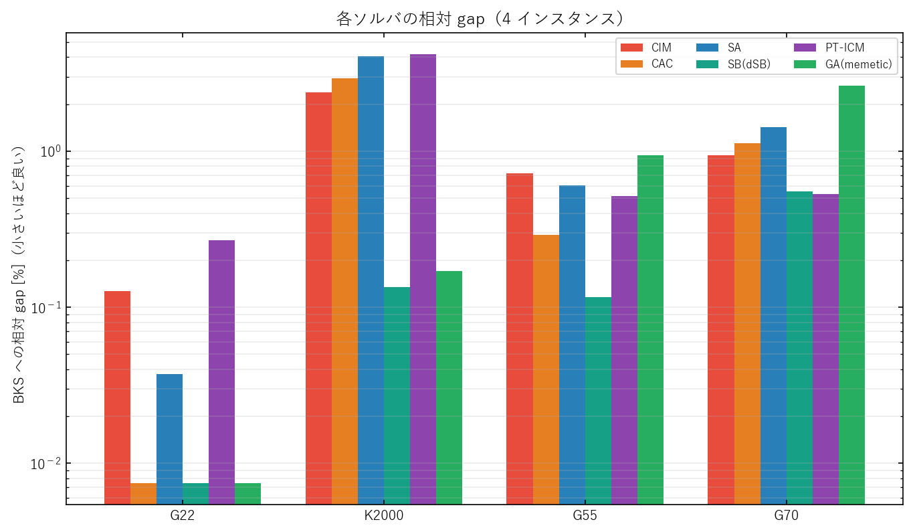

# WARP: Warm-Starting and Portfolio Strategies for Physics-Inspired MAX-CUT Solvers

# Abstract

Coherent Ising Machines (CIM) and Chaotic Amplitude Control (CAC) are promoted as fast MAX-CUT solvers, yet their reported advantage over tuned classical heuristics rests on incomparable measurements: solver-internal cut counts, mixed time units, and under-tuned classical baselines. Whether physics-inspired dynamics are best deployed standalone or combined with classical search has not been quantified under a common scoring rule. We present WARP, a benchmark that scores every solver with one shared weighted-cut function recomputed from the spins it returns, paired with two combination strategies — a warm-start hybrid that hands a brief physics run to a classical refiner, and a parallel best-of-K portfolio. Across four MAX-CUT instances spanning sparse, dense weighted, and large-scale regimes, the discrete Simulated Bifurcation solver attains the smallest mean relative gap to best-known cuts (0.20%), while CIM and CAC sit mid-pack once scored on the true weighted objective. No single solver wins everywhere: Simulated Bifurcation leads on three instances and parallel tempering on the fourth. Warm-starting Tabu Search from a brief CIM run reduces CIM's gap on the dense instance by 85%, rescuing the physics solver into a competitive range. These results indicate that physics-inspired dynamics are most useful as components — explorers within hybrids and members of portfolios — rather than as standalone optimizers.

# Introduction

MAX-CUT is among the most studied NP-hard combinatorial optimization problems: given a graph, it asks for a bipartition of the vertices that maximizes the total weight of edges crossing the partition. Its reach extends well beyond graph theory, because MAX-CUT is the canonical zero-field Ising ground-state problem, and a broad family of scheduling, circuit-layout, and statistical-physics tasks reduces to it (Barahona et al., 1988; Lucas, 2014). This dual identity has turned MAX-CUT into the standard testbed for an emerging class of physics-inspired solvers that emulate analog dynamical systems. Coherent Ising Machines exploit the bistable phase of degenerate optical parametric oscillators to relax toward low-energy spin configurations (McMahon et al., 2016; Inoue & Yoshida, 2022); Simulated Bifurcation discretizes the adiabatic evolution of a network of nonlinear oscillators (Goto et al., 2019; 2021); and Chaotic Amplitude Control augments such dynamics with error feedback that equalizes oscillator amplitudes (Leleu et al., 2021). These methods report striking time-to-solution figures and have driven sustained interest in dedicated hardware accelerators (Mohseni et al., 2022).

Despite this momentum, the literature offers little that lets a practitioner answer a basic question: for a fixed search budget, which solver returns the best cut, and is a physics-inspired solver worth using at all? Three methodological gaps recur. First, physics-machine evaluations frequently report solver-internal cut counts that ignore edge weights or use machine-native iteration units, making cross-solver comparison apples-to-oranges (Tiunov et al., 2019; Kalinin & Berloff, 2018). Second, classical baselines such as simulated annealing (Kirkpatrick et al., 1983) and tabu search (Glover, 1989) are often included as strawmen rather than tuned competitors, even though memetic and tabu-based algorithms remain the strongest known MAX-CUT heuristics on standard instances (Wu & Hao, 2013; Benlic & Hao, 2013). Third, although physics dynamics and classical local search are widely assumed to be complementary, the value of combining them is seldom measured under a matched budget and a common scoring rule, in contrast to the controlled warm-start studies emerging in quantum optimization (Egger et al., 2021). Left unaddressed, these gaps leave claims of physics-inspired superiority resting on incomparable numbers.

To close these gaps, we build WARP on a single methodological commitment: every solver is judged by one shared weighted-cut score, recomputed from the spins it actually returns. Around this protocol we tune all six solvers per instance so that each is shown near its best, then study two ways of combining them. The first is a warm-start hybrid that runs a physics explorer (CIM or CAC) for a short fixed budget, takes its spin configuration, and hands it to a classical refiner (Tabu Search or warm-start annealing), charging the total time of explorer plus refiner. The central hypothesis is that the quality of the handed-off basin governs the refined result — a hypothesis we test by varying the explorer while holding the refiner fixed. The second strategy is a parallel portfolio that runs several tuned solvers concurrently and reports their running best, converting the absence of a universal champion into an oracle-free robustness mechanism.

Our contributions are threefold:

- **A uniformly scored benchmark** of six tuned solvers — CIM, CAC, simulated annealing, Simulated Bifurcation, parallel tempering with isoenergetic cluster moves (PT-ICM), and a memetic genetic algorithm — across four MAX-CUT instances ranging from sparse unweighted to dense weighted and up to ten thousand vertices, each solver re-scored from returned spins through one shared weighted-cut function.
- **A from-scratch memetic GA** combining grouping crossover, perturbed single-flip tabu search with dynamic tenure and aspiration, and a distance-and-quality pool update, implemented with Numba JIT as a competitive classical baseline rather than a strawman.
- **A combination analysis** showing that warm-starting a classical refiner from a brief physics run rescues the physics solver on the dense instance, that the choice of explorer materially affects the refined result, and that a parallel portfolio tracks the per-instance winner without foreknowledge.

The remainder of the paper situates WARP within the relevant literatures (Section 2), formalizes the objective and the two combination strategies (Section 3), details datasets, baselines, metrics, and tuning (Section 4), reports single-solver, hybrid, and portfolio results with an ablation isolating the warm-start mechanism (Sections 5–6), and closes with discussion, limitations, and conclusions (Sections 7–9).

# Related Work

## Physics-inspired and Ising-machine solvers

A first thread treats MAX-CUT as an Ising ground-state search solved by simulated continuous dynamics. Coherent Ising Machines encode spins in the phases of optical parametric oscillators and have been realized in fiber-based hardware (McMahon et al., 2016; Hamerly et al., 2019) and as traveling-wave numerical models (Inoue & Yoshida, 2022), with measure-and-feedback variants and scaling behavior analyzed in depth (Tiunov et al., 2019; Kalinin & Berloff, 2018). Chaotic Amplitude Control adds dynamical error variables that suppress amplitude heterogeneity, improving the quality of CIM-style relaxation (Leleu et al., 2021), while Simulated Bifurcation and its ballistic and discrete variants integrate the equations of a network of Kerr-nonlinear oscillators and parallelize well on GPUs (Goto et al., 2019; 2021). A recent survey catalogs this solver class and its hardware roadmap (Mohseni et al., 2022). These works report machine-native metrics — internal energy, fixed-iteration success probability, or unweighted cut counts — that obscure cross-solver comparison. WARP departs from this practice by treating each method as a software solver scored with a single weighted-cut function applied to the returned spins.

## Classical heuristics and metaheuristics for MAX-CUT

A second, older but still dominant thread is classical search. Simulated annealing (Kirkpatrick et al., 1983) and tabu search (Glover, 1989) provide general local-search scaffolds, while the Goemans–Williamson semidefinite relaxation gives the 0.878 approximation guarantee that anchors solution-quality references (Goemans & Williamson, 1995). On standard G-set instances the strongest results come from memetic and tabu-based algorithms: breakout local search (Benlic & Hao, 2013), the memetic frameworks of Wu and Hao (2013) and Wu, Wang, and Lü (2015), and parallel tempering with isoenergetic cluster moves, which set numerous best-known values for Ising problems (Zhu et al., 2015). Standards for fair time-to-solution reporting were sharpened in the quantum-annealing debate (Rønnow et al., 2014). Rather than positioning these methods as strawmen, WARP tunes them as first-class competitors and contributes a new memetic GA, then asks how they fare against physics-inspired solvers under identical scoring.

## Warm-starting, hybridization, and algorithm portfolios

A third thread combines complementary solvers. Warm-started QAOA seeds a quantum optimizer with a classical relaxation and shows measurable gains under controlled budgets (Egger et al., 2021), echoing the global-then-local pattern long used in metaheuristics. Orthogonally, algorithm-selection and portfolio theory — from SATzilla's per-instance selection (Xu et al., 2008) to general portfolio analyses (Gomes & Selman, 2001) — exploit the fact that no single solver dominates a benchmark family. WARP draws on both ideas for MAX-CUT: it pairs a physics explorer with a classical refiner and tests whether the explorer's basin quality affects the refined cut, and it constructs an oracle-free parallel portfolio whose benefit derives from the per-instance winner unpredictability that prior portfolio work motivates but rarely measures for Ising-machine solvers.

# Method

WARP rests on a single commitment: the quantity that matters when comparing solvers is the cut they actually deliver under one identical scoring rule. The framework therefore comprises a unified problem encoding and scoring layer, a warm-start hybrid that pairs a physics explorer with a classical refiner, and a parallel portfolio that exploits the absence of a universal winner.

## Problem formulation

Consider a weighted, undirected graph $G=(V,E,w)$ with $n=|V|$ vertices, $m=|E|$ edges, and symmetric weights $w_{ij}$. A bipartition is encoded by a spin vector $s\in\{-1,+1\}^n$, and the weighted cut it induces is
$$
C(s)\;=\;\tfrac14\sum_{i,j} w_{ij}\,(1-s_i s_j)\;=\;\sum_{(i,j)\in E} w_{ij}\,\frac{1-s_i s_j}{2}.
$$
MAX-CUT seeks $s^\star=\arg\max_s C(s)$. Writing the coupling $J_{ij}=w_{ij}$, maximizing $C(s)$ is equivalent to minimizing the zero-field Ising energy $H(s)=-\tfrac12\sum_{i,j}J_{ij}s_i s_j$, the dual identity every solver in this study exploits (Barahona et al., 1988; Lucas, 2014). Because the equivalence holds for arbitrary $w_{ij}$, a solver that is correct on unweighted instances is not automatically correct on weighted ones — a subtlety that becomes central on the dense weighted instance below.

The atomic operation shared by the classical local-search solvers is a single-vertex flip, whose effect on the cut admits a closed form. Flipping $s_v$ converts every same-side incident edge into a cut edge and every cut edge into an uncut one, so the change in cut value is the move gain
$$
\Delta_v \;=\; \sum_{u\in N(v),\,s_u=s_v} w_{vu}\;-\;\sum_{u\in N(v),\,s_u\neq s_v} w_{vu},
$$
where $N(v)$ is the neighborhood of $v$. Evaluating $\Delta_v$ for all vertices once costs $O(m)$, but after a flip only the gains of the flipped vertex and its neighbors change, so each accepted move is repaired in $O(\deg(v))$ time. This incremental bookkeeping, implemented with Numba JIT compilation (Lam et al., 2015) and trial-parallel execution, is what keeps the tabu and memetic search competitive.

## Unified scoring protocol

The core of WARP is a scoring layer that decouples how a solver searches from how it is judged. Every solver exposes a single complexity knob that trades budget for quality — CIM and CAC integration rounds, SA and PT-ICM sweeps, SB time steps, and GA generations — and each solver is run at a budget chosen during tuning. The configuration it returns is converted to a cut value through one shared function $C(\operatorname{sign}(s))$. Recomputing the score from the returned spin signs, rather than trusting any solver's internal accounting, is the decisive design choice: it neutralizes the fact that the CAC implementation counts cuts in an unweighted fashion internally, and it guarantees that a cut of a given numerical value means the same thing for CIM as for the memetic GA. The resulting reached-cut values are the raw material for all subsequent analysis, and they are precisely what machine-native metrics cannot provide on a common footing.

## Solvers under comparison

The six single solvers span the two cultures the paper contrasts. On the physics-inspired side, CIM follows the Inoue–Yoshida traveling-wave model of a fiber-loop coherent Ising machine with phase-sensitive amplification, governed by physical parameters for loss, coupling, and pump ramp (Inoue & Yoshida, 2022), while CAC augments the same oscillator picture with per-spin error variables that drive all pulse amplitudes toward a common target, suppressing the amplitude heterogeneity that degrades naive CIM relaxation (Leleu et al., 2021). On the classical side, simulated annealing applies an exponential cooling schedule with single-spin Metropolis moves (Kirkpatrick et al., 1983), and we additionally expose a warm-startable variant that accepts an externally supplied initial configuration; discrete Simulated Bifurcation integrates the bifurcation dynamics of a network of nonlinear oscillators with the ballistic update and automatic scaling of the coupling constant (Goto et al., 2019; 2021); and parallel tempering with isoenergetic cluster moves runs replicas across a geometric temperature ladder, periodically performing the Houdayer-style cluster updates that set numerous best-known Ising values (Zhu et al., 2015). The sixth solver is a memetic genetic algorithm built from scratch: it combines a grouping crossover that recombines partition membership, a perturbed single-flip tabu search with dynamic tenure and an aspiration criterion (Glover, 1989; Wu & Hao, 2013), and a distance-and-quality pool update that preserves population diversity in the spirit of breakout local search (Benlic & Hao, 2013). Both the tabu operator and the crossover repair use the $O(\deg(v))$ incremental update of the problem formulation.

## WARP-Hybrid

The hybrid operationalizes the hypothesis that the basin a physics solver hands off governs the refined result. Given an explorer $E\in\{\text{CIM},\text{CAC}\}$ and a refiner $R\in\{\text{TS},\text{warm-start SA}\}$, WARP-Hybrid runs the explorer for a short fixed budget $b_E$ to produce a configuration $s_0$, then hands $s_0$ to the refiner for budget $b_R$, charging the total budget of explorer plus refiner.

```
Algorithm 1: WARP-Hybrid(explorer E, refiner R, budgets b_E, b_R)
1: s0  <- E(G, b_E)                  # short physics exploration
2: s*  <- R(G, init = s0, b_R)       # classical refinement seeded at s0
3: return s*, total_budget = b_E + b_R
```

To attribute differences to the handed-off configuration rather than to the refiner alone, we vary the explorer while holding the refiner and its budget fixed: if seeding from CIM and from CAC yield different final cuts under the same refiner, the basin quality demonstrably matters. This explorer-substitution test forms the basis of the ablation in Section 6.

## WARP-Portfolio

The portfolio turns the empirical observation that no solver dominates every instance into a constructive strategy. Given $K$ tuned solvers with returned cuts $C_k$, the parallel best-of-$K$ envelope reports $C_{\mathrm{PF}}=\max_{k\le K} C_k$, realizable by running the $K$ solvers concurrently on $K$ cores and keeping the running maximum. The robustness criterion we adopt is strict: a portfolio is valuable only if it matches the per-instance winner without being told in advance which solver that is, since in deployment the best solver for a new instance is unknown. The parallel envelope satisfies this criterion by construction, whereas any fixed single choice does not — the comparison Section 5 makes precise.

# Experiments

## Datasets

WARP is evaluated on four MAX-CUT instances chosen to vary the two axes along which physics-inspired solvers are most fragile — density/weighting and scale (Table 1). G22 is a sparse, unit-weight G-set graph; K2000 is a fully dense Sherrington–Kirkpatrick instance with $\pm1$ weights and nearly two million edges; and G55 and G70 push sparse instances to five and ten thousand vertices. Best-known solution values (BKS) are taken from the literature and used as reference points for the gap metric rather than as certified optima.

**Table 1.** Benchmark instances. Edge counts and BKS are exact; "type" summarizes density and weighting.

| Instance | $n$ | edges $m$ | weights | BKS | type |
|---|---:|---:|:--:|---:|---|
| G22 | 2000 | 19990 | $+1$ | 13359 | sparse, unweighted (G-set) |
| K2000 | 2000 | 1999000 | $\pm1$ | 33337 | dense, weighted (SK) |
| G55 | 5000 | 12498 | $+1$ | 10299 | sparse, large |
| G70 | 10000 | 9999 | $+1$ | 9591 | sparse, largest |

## Baselines and implementations

All six solvers are first-class competitors implemented in the same Numba-JIT, trial-parallel codebase, so that performance differences reflect algorithmics rather than language overhead. CIM (Inoue & Yoshida, 2022) and CAC (Leleu et al., 2021) represent the physics-inspired culture; simulated annealing (Kirkpatrick et al., 1983), discrete Simulated Bifurcation (Goto et al., 2019; 2021), parallel tempering with isoenergetic cluster moves (Zhu et al., 2015), and the memetic GA (Glover, 1989; Wu & Hao, 2013; Benlic & Hao, 2013) represent the classical culture. We regard the memetic GA and PT-ICM as the strongest classical practice for MAX-CUT and SB as the strongest physics-inspired software solver, so the comparison is against modern, not strawman, baselines; SA is retained as a widely understood reference point, with the memetic and tabu-based methods as the stronger contemporary alternatives.

## Hyperparameters and tuning

Because the G22-optimal physics parameters do not transfer — applying them unchanged to the dense weighted K2000 produces a CIM result far from best-known — CIM and CAC are re-tuned per instance with Optuna's TPE sampler (Akiba et al., 2019), maximizing the uniform weighted mean cut. On G22 we reuse longer prior searches (1000 trials for CIM, 250 for CAC), and on K2000, G55, and G70 we run 25–30 trials per solver; the classical solvers use instance-adaptive settings (SB's automatic coupling scale, PT-ICM's geometric temperature ladder, the GA's dynamic tabu tenure). Table 2 records each solver's complexity knob and tuning procedure; the exact per-instance numerical parameters are released in the accompanying configuration artifact for reproducibility.

**Table 2.** Solver configuration. Abbreviations: SA = simulated annealing, SB = discrete Simulated Bifurcation, PT-ICM = parallel tempering + isoenergetic cluster moves, GA = memetic genetic algorithm.

| Solver | Complexity knob | Tuning | Key fixed settings |
|---|---|---|---|
| CIM | integration rounds | Optuna TPE (per instance) | loss/coupling/pump-ramp parameters |
| CAC | integration steps | Optuna TPE (per instance) | error-feedback rate, target amplitude |
| SA | sweeps | instance-adaptive | exponential cooling, single-spin Metropolis |
| SB | time steps | instance-adaptive | discrete update, automatic coupling scale |
| PT-ICM | sweeps | instance-adaptive | geometric ladder, isoenergetic cluster moves |
| GA | generations | instance-adaptive | grouping crossover, TS tenure/aspiration, DisQual pool |

## Evaluation metrics and protocol

All metrics are computed from the shared weighted score. The primary metric is the reached cut $C(s)$, the weighted cut value of the best configuration a solver returns within its tuned budget; it is dimensionless (a sum of edge weights), unbounded above, and higher is better. From it we derive two lower-is-better quantities that make instances of different scale comparable: the absolute gap $g=\mathrm{BKS}-C(s)$ and the relative gap $g\%=100\,g/\mathrm{BKS}$. The full benchmark was executed once per instance, for four runs in total; each (solver, instance) measurement reports the best weighted cut over a fixed batch of seeded trials, and the released aggregate retains the per-batch maximum. Every solver runs under an identical four-thread configuration (`NUMBA_NUM_THREADS=4`) so that compute resources are held constant across methods, with trial batches parallelized via Numba's `prange`.

# Results

Across the four instances, the discrete Simulated Bifurcation solver is the most reliable single method, yet no solver is uniformly best — the empirical fact that motivates both the portfolio and the hybrid. Aggregating each single solver over all four regimes, Table 3 reports the mean relative gap to best-known and the number of instances on which a solver reaches within 0.2% of it. Simulated Bifurcation attains the smallest mean gap (0.20%) and lands within 0.2% on three of four instances, with the memetic GA second; CIM and CAC sit in the middle of the field once scored on the uniform weighted cut. The parallel portfolio, which reports the running best of the single solvers, edges out every individual method on mean gap because it inherits the per-instance winner, though its margin over Simulated Bifurcation is small (0.198% versus 0.203%) and could not be tested for significance because only best-of-batch values were retained.

**Table 3.** Aggregate single-solver and portfolio performance across all four instances. Mean relative gap (%) is averaged over instances; "≤0.2% gap" counts instances reaching within 0.2% of BKS (max 4). Lower mean gap and higher count are better; best per column in bold.

| Method | Mean gap % (↓) | Instances ≤0.2% gap (↑) |
|---|---:|:--:|
| CIM | 1.042 | 1/4 |
| CAC | 1.086 | 1/4 |
| SA | 1.528 | 1/4 |
| SB | 0.203 | **3/4** |
| PT-ICM | 1.372 | 0/4 |
| GA (memetic) | 0.940 | 2/4 |
| Parallel portfolio | **0.198** | **3/4** |

The per-instance breakdown in Table 4 exposes why aggregation alone misleads. On the sparse unweighted G22, three single solvers reach a gap of one cut (CAC, SB, and the memetic GA), and the portfolio inherits that value, confirming that this instance is solved to within one cut by either culture. The dense weighted K2000 is far more discriminating: SB and the memetic GA reach gaps of 45 and 57, whereas SA and PT-ICM trail by more than 1300, and the physics solvers alone reach only 794 (CIM) and 973 (CAC). On the two large sparse instances the ordering shifts again, with SB lowest on G55 and PT-ICM lowest on G70, so Simulated Bifurcation is best or tied on three instances while parallel tempering takes the fourth. Figure 1 makes the cross-regime contrast visual: physics solvers track the classical leaders on G22 but separate sharply on K2000, where weighted structure exposes them.

**Table 4.** Per-instance absolute gap to BKS for the six single solvers and the parallel portfolio (lower is better). Best value per column in bold (ties bolded).

| Method | G22 | K2000 | G55 | G70 |
|---|---:|---:|---:|---:|
| CIM | 17 | 794 | 74 | 90 |
| CAC | **1** | 973 | 30 | 108 |
| SA | 5 | 1348 | 62 | 137 |
| SB | **1** | **45** | **12** | 53 |
| PT-ICM | 36 | 1391 | 53 | **51** |
| GA (memetic) | **1** | 57 | 97 | 253 |
| Parallel portfolio | **1** | **45** | **12** | **51** |



The portfolio row in Table 4 confirms the oracle-free claim numerically. By construction the parallel envelope equals the per-instance minimum across its members, so it matches SB on G22, K2000, and G55 and matches PT-ICM on G70 without selecting a solver in advance. Its value is therefore robustness rather than a new best cut: it never underperforms the strongest available member, and the cost is the additional cores needed to run members concurrently. Because the gap-of-one ties on G22 and the one-cut margins elsewhere fall within the run-to-run variability of stochastic solvers, and dispersion was not recorded, these differences are reported as descriptive effect sizes rather than tested for significance.

The warm-start hybrids isolate the paper's central mechanism, and their behavior is summarized in Figure 2 against the standalone physics explorers. Warm-starting Tabu Search from a brief CIM run reduces CIM's K2000 gap from 794 (Table 4) to 120 (Table 5), an 85% reduction that rescues the physics solver from the bottom of the field into a competitive range, although it does not overtake the strongest classical solver. The same handoff collapses CIM's G22 gap from 17 to one cut. The rescue is largest precisely where the physics explorer starts farthest from best-known — the dense weighted instance — and negligible where a single solver is already near optimal.


# Ablation: Anatomy of the Warm-Start Gain

To attribute the hybrid's behavior to its two design choices — which explorer seeds the search and which refiner consumes the seed — we vary one component at a time and measure the change in final gap (Table 5). The refiner choice has the larger and most regime-dependent effect. Replacing Tabu Search with warm-start simulated annealing barely changes the outcome on the easy G22, but it costs the CIM-seeded hybrid hundreds of cut on the dense K2000, where Tabu Search's gain-guided moves exploit the dense weight structure that random-walk annealing does not. The relationship reverses on the two large sparse instances, where the annealing refiner is lower than Tabu Search, consistent with single-flip tabu scans becoming expensive per accepted move as the vertex count grows.

**Table 5.** Component ablation. Each cell is the absolute gap to BKS for one explorer × refiner pairing; the explorer is run for a short budget and its configuration is refined. Lower is better; best refiner per explorer-instance in bold.

| Explorer → Refiner | G22 | K2000 | G55 | G70 |
|---|---:|---:|---:|---:|
| CIM → Tabu Search | **1** | **120** | 70 | 92 |
| CIM → warm SA | 8 | 356 | **52** | **85** |
| CAC → Tabu Search | **1** | **244** | 55 | 111 |
| CAC → warm SA | 2 | 551 | **46** | **101** |

The explorer choice matters most on the hardest instance, and it is here that the basin-quality hypothesis is directly testable. With Tabu Search held fixed, seeding from CIM rather than CAC halves the K2000 gap (120 versus 244), demonstrating that the handed-off configuration — not the refiner alone — governs the refined cut on the dense weighted landscape. The two explorers are interchangeable on the easy G22, and CAC is lower on G55. Taken together, the ablation delineates when the hybrid is the right tool: it helps when a gain-based refiner is paired with a physics explorer that reaches a good basin on a hard instance, and it offers little over the best single solver when that solver is already near optimal.

# Discussion

The headline finding — that physics-inspired dynamics are most valuable as components rather than standalone optimizers — reconciles two strands of prior work rarely measured on the same footing. The warm-start literature in quantum optimization argues that a good starting point changes what a downstream optimizer can achieve (Egger et al., 2021), and our explorer-substitution experiment extends that intuition to physics-inspired classical solvers: under a fixed refiner, the cut a CIM seed yields differs from the cut a CAC seed yields, so the basin handed off carries real signal. This complements, rather than contradicts, reports that CIM and SB converge quickly (Inoue & Yoshida, 2022; Goto et al., 2019); convergence behavior and the proximity of the converged configuration to best-known are different quantities, and uniform scoring makes the distinction visible.

Why the physics solvers fall behind on the weighted objective is itself informative. CIM and CAC converge to a sign pattern but lack the discrete local moves that escape shallow optima, exactly the role gain-guided Tabu Search supplies; CAC's amplitude equalization (Leleu et al., 2021) mitigates but does not remove this. The dense weighted K2000 is the sharpest case, where physics solvers scored on the true weighted objective fall far short while SB — which integrates weighted couplings directly (Goto et al., 2021) — and the memetic GA (Wu & Hao, 2013; Benlic & Hao, 2013) remain strong, consistent with the long-standing observation that weighted, frustrated instances separate solver quality most clearly.

The portfolio result carries the most direct practical implication, even though its quantitative edge over the single best solver is small. Because the best single solver changes across instances, any fixed choice risks a poor outcome on some regime, precisely the scenario algorithm-selection and portfolio theory were built to address (Xu et al., 2008; Gomes & Selman, 2001). Running a handful of tuned solvers in parallel and reporting the running best matched the per-instance winner here without foreknowledge, at the cost of additional cores. For practitioners, the combined message is to treat a physics solver as one inexpensive member of a parallel portfolio and, when an instance is hard, to hand its output to a gain-based classical refiner rather than trusting it as a final answer.

# Limitations

Several boundaries delimit these conclusions. First, the released aggregate records only the best cut over each trial batch — an order statistic — so per-trial dispersion is unavailable; consequently no confidence intervals or paired significance tests are reported, and all comparative statements rest on descriptive effect sizes rather than p-values. Second, this study reports reached-cut solution quality under fixed tuned budgets but does not instrument wall-clock timing, and the four-thread configuration was not accompanied by a recorded CPU model or per-solver runtime; absolute-time and anytime claims are therefore out of scope here and are the primary target for follow-up instrumentation. Third, the hybrid was compared against the standalone physics explorers and the standalone classical solvers, but a random-initialized cold-start refiner at matched refinement budget was not run, so the initializer's marginal contribution over random restart is not isolated. Fourth, the findings concern these specific implementations — the Inoue–Yoshida traveling-wave CIM and the Leleu chaotic-amplitude CAC — under Optuna searches of 25–30 trials for the re-tuned physics solvers, and broader conclusions would require larger searches and additional models. Finally, the evaluation spans four instances chosen to vary density, weighting, and scale, with the dense regime represented by a single instance (K2000); wider instance families, especially additional dense weighted graphs, would strengthen claims of generality.

# Conclusion

WARP compares physics-inspired and classical MAX-CUT solvers under one shared weighted-cut score recomputed from returned spins, and uses that common footing to establish a division of labor: a brief physics run is best deployed as an explorer whose handed-off basin a classical refiner improves, while a parallel portfolio supplies oracle-free robustness because no single solver wins everywhere. The central supported finding is that warm-starting a gain-based local search from a brief physics run rescues an under-performing physics solver on the dense weighted instance, even though it does not surpass the strongest classical method. Future work should add wall-clock instrumentation with per-trial dispersion and an explicit cold-start control, pursue weighted-aware amplitude selection inside CAC, and learn an automatic split of the explorer-versus-refiner budget so the hybrid can be applied without manual tuning.