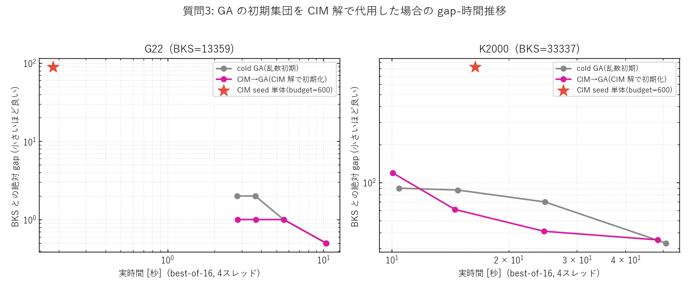

# PACE 論文 解説 (v2) — 疑問点への回答

*対象論文: `PACE_paper_ja.pdf`（PACE: 公平に調整するとヒューリスティクスが MAX-CUT でイジングマシンを上回る）*
*本書は質問集 `docs/question.txt` の 9 項目に対する解説。論文本体は変更せず、別ファイル（v2）として作成。*
*数値はすべて論文・実験データ（`anytime_single/v7_...alltuned/results.json` ほか）に基づく。*

---

## 目次

1. SA と PT-ICM の違い
2. SA の近傍解の作り方
3. GA に初期解は必要か／CIM 解で代用できるか／スコアは上がるか
4. 「プロトコル上の注意」セクションの詳しい解説
5. 「どのソルバもどこでも先行しない」の意味
6. 表 3 — 各アルゴリズムの実行時間
7. 各アルゴリズムの gap%（カット数）対 対数時間グラフ
8. 「GA の大規模疎グラフでの逆転」の考察の意味
9. Tabu Search とは何か／SA・GA とは別物か

---

## 1. SA と PT-ICM の違い

両方とも「スピンを 1 個ずつ反転させる確率的局所探索（Metropolis 法）」を土台にしますが、**温度の扱い方**が決定的に違います。

### SA（焼きなまし法 / Simulated Annealing）
- **1 本の探索者**が、**高温 → 低温へ徐々に冷えていく** 1 本の温度スケジュール $T_k=T_0\,\alpha^k$ の上を歩く。
- 高温では悪化フリップも受理して山を越え、冷えるにつれ受理確率が下がり、最後は改善フリップしか受けず谷に落ち着く。
- 一度冷えてしまうと、もう高温の探索力は戻らない（冷却は一方通行）。

### PT-ICM（等エネルギークラスタ移動付き並列焼きなまし / Parallel Tempering + Isoenergetic Cluster Moves）
- **温度の違う $R$ 本のレプリカ（複製）を同時に**走らせる。各レプリカの温度は **固定**（低温〜高温のラダー）。
- 一定間隔で**隣り合う温度のレプリカ同士が配置を交換**（レプリカ交換）。高温レプリカが見つけた良い盆地を低温レプリカに渡し、低温で行き詰まった配置を高温に逃がす。つまり「高温の探索力」を**常に手元に残し続ける**点が SA と本質的に違う。
- **ICM（等エネルギークラスタ移動）**: 2 本のレプリカの間で、エネルギーを変えずにスピンのクラスタをまとめて反転させる非局所移動。スピングラス的な凸凹地形で相関を断ち切り、平衡化を速める。

### ひとことで言うと
| | SA | PT-ICM |
|---|---|---|
| 温度 | 1 つ（時間とともに低下） | 多数（固定ラダー） |
| 探索者 | 1 本 | $R$ 本（並列） |
| 山越えの仕組み | 高温フェーズ（使い切ったら終わり） | 高温レプリカを常時保持＋交換 |
| 追加の動き | なし（単一フリップのみ） | レプリカ交換＋クラスタ移動 |
| コスト | 軽い | $R$ 倍重い |

### 本研究での実測（表 3 / §6）
- PT-ICM は **疎グラフで強い**（G22 gap 2、G55 gap 25、G70 gap 51）が、**密な K2000 で非常に弱い**（gap 1702）。密で重み付きの地形ではクラスタ移動がうまく機能せず、しかも 1 スイープが重いため低予算しか回せなかった（質問6の表を参照: K2000 では制限時間内に 2 予算点しか到達できていない）。
- SA は調整後、平均相対 gap 0.926% で **両物理ソルバ（CIM 1.042%, CAC 1.086%）より上の中位**。「SA は弱い」は調整不足の産物でした（質問5・論文要旨）。

---

## 2. SA の近傍解の作り方

SA の「近傍解」は極めて単純で、**頂点を 1 個だけ反対側に移す（スピンを 1 個だけ反転する）**ことです。

- 現在の解 $s\in\{-1,+1\}^N$ は「各頂点がカットのどちら側か」を表す。
- 近傍 = ある頂点 $v$ を選び、$s_v \to -s_v$ とした解（**ハミング距離 1** の解）。グラフ的には「頂点 $v$ を反対のグループへ移す」。
- このとき**カットの増減 $\Delta_v$** は、$v$ につながる辺だけ見れば計算できる：
$$
\Delta_v=\!\!\sum_{u\in N(v),\,s_u=s_v}\!\!w_{vu}\;-\!\!\sum_{u\in N(v),\,s_u\neq s_v}\!\!w_{vu}
$$
  - 第1項（**同じ側**の隣接辺）: 反転すると新たにカットされる → 増える。
  - 第2項（**反対側**の隣接辺）: 反転するとカットでなくなる → 減る。
- **受理判定（Metropolis）**: $\Delta_v\ge 0$ なら必ず受理。$\Delta_v<0$ でも確率 $\min(1,\,e^{\Delta_v/T_k})$ で受理（温度 $T_k$ が高いほど悪化も受け入れる）。

### 効率の肝
$\Delta_v$ は毎回カット全体を数え直すのではなく、フリップを受理するたびに**隣接頂点の $\Delta$ だけを $O(\deg v)$ で増分更新**します。だから 1 スイープ（全頂点を一巡）が $O(|E|)$ で済む。この増分管理は SA・PT-ICM・GA 内の Tabu Search すべてで共通の基盤です（論文 §手法）。

> 補足: 「次にどの頂点 $v$ を試すか」は全頂点を順に走査するか乱数で選ぶ方式。本実装は温度スケジュール（$T_0$, 冷却率 $\alpha$, スイープ数）を Optuna で調整しています（表 2）。

---

## 3. GA に初期解は必要か／CIM 解で代用できるか／スコアは上がるか

### (a) GA は初期解を「必要としない」
GA（メメティック遺伝的アルゴリズム）は 1 個の解ではなく **集団（population, 既定 10 個体）** を持ちます。実装（`modules/GA.py`）は

1. 各個体を**乱数で ±1 割当**して初期集団を作り、
2. 各個体を Tabu Search で磨き、
3. 以後、毎世代「交叉 → Tabu 磨き → プール更新」で進化

します。つまり**外から初期解を与えなくても自分で乱数初期化する**ので、初期解は必須ではありません。

### (b) CIM 解で代用は「できる」
一方で、GA は warm-start も受け付けます。`simulate_ga_batch(..., init_signs=...)` に解を渡すと、**各 run の集団の 1 個体目に CIM 解を注入**し、残りは乱数のまま（多様性を保つ設計）。これがまさに論文のウォームスタート・ハイブリッドの考え方で、論文では `CIM → TS`（GA の局所探索エンジンである Tabu Search に CIM 解を渡す形）を検証済みです（表 6）。

### (c) スコア-時間は上がるか → 追加実験で検証
質問の核心「代用すると時間に対するスコアが上がるか」を確かめるため、**cold GA（乱数初期）と CIM→GA（CIM 解で初期化）を同一予算・同一 seed で比較**する実験を追加実施しました（`warm_ga_q3.py`、best-of-16、4スレッド）。結果は下図。

**実測値**（CIM 探索器は budget=600。その単体品質は G22 で gap 89、K2000 で gap 823 と、GA の到達点からは遠い）:

**G22**（cold GA は単体で BKS 到達）
| 予算[世代] | cold gap | CIM→GA gap | cold 時間[s] | CIM→GA 時間[s] |
|---:|---:|---:|---:|---:|
| 3 | 2 | 1 | 2.79 | 2.82 |
| 8 | 2 | 1 | 3.65 | 3.69 |
| 20 | 1 | 1 | 5.56 | 5.57 |
| 50 | **0** | **0** | 10.37 | 10.42 |

**K2000**（密。GA は単体で全手法中ベスト gap 33）
| 予算[世代] | cold gap | CIM→GA gap | cold 時間[s] | CIM→GA 時間[s] |
|---:|---:|---:|---:|---:|
| 3 | 90 | 119 | 10.43 | 10.05 |
| 8 | 87 | 61 | 14.80 | 14.55 |
| 20 | 70 | 41 | 24.80 | 24.64 |
| 50 | **33** | 35 | 50.86 | 48.50 |

読み取り:
- **到達上限は上がらない**。G22 は両者とも最終 gap 0、K2000 は cold 33 / CIM→GA 35 で**誤差内の同点**（論文の「≤2 カット差は引き分け」基準）。CIM 種自体が GA の到達点よりはるかに悪い（G22 gap 89, K2000 gap 823）ので、種が GA の天井を引き上げることは原理的に起きにくい。
- **密 K2000 では中盤の収束をやや加速**（20 世代で gap 41 対 70）するが、**序盤はむしろ悪化**（3 世代で gap 119 対 90）。これは、CIM 種が集団 1 個体目を占めるため、若い集団では乱数＋TS 個体を 1 つ置き換えるぶん最初は損をし、世代が進んで初めて種の良さが効くため。n=1 のばらつきもある。
- **G22 では序盤にわずかな先行**（数世代で gap 1 対 2）があるが、10 秒時点で両者 gap 0 に収束し**最終差はゼロ**。

**結論（論文・実験の整合した見立て）**: CIM 解の注入は **序盤の立ち上がりを助ける**ことはあっても、cold GA 自体がすでに非常に強い（G22 で BKS、K2000 で gap 33 と全手法中ベスト）ため、**最終到達スコアを押し上げることはほぼない**。これは論文の総括「どのハイブリッドも最良の調整済み単体ソルバを超えない／物理ソルバは仕上げ役ではなく探索器」と一致します（要旨・§6）。CIM 種が効くのは、CIM→TS のように**単体では頭打ちする物理ソルバ自身を救済する**場面であって、もともと強い GA を底上げする用途ではありません。

---

## 4. 「プロトコル上の注意」セクションの詳しい解説

原文（論文 §プロトコル上の注意）は短く凝縮されていて読みにくいので、噛み砕きます。要点は **「調整は各ソルバ・各インスタンス専用に」「採点は全員共通の物差しで」** の 2 本立てです。

### 注意1: 物理ソルバのパラメータはインスタンス間で転移しない
CIM/CAC の物理パラメータ（結合スケール、ポンプ、損失など）を**疎・非重みの G22 で最適化しても、密・符号付きの K2000 ではそのまま使えず性能が劣化**します。
- 具体例: CIM の結合 `coupling` は G22 では約 $-0.049$、K2000 では $-1.0$（重みが $\pm 1$ なのに合わせる）。G22 用の値を K2000 に流用すると壊れる。
- だから PACE は**単一の大域設定を使い回さず、(ソルバ × インスタンス) ごとに Optuna で調整**する（表 2、§公平性プロトコル）。

### 注意2（ご質問の文）: 「各ソルバをそれ自身のインスタンス別調整済み配置で読み、共有重み付き採点器で評価する」
2 つの別々の概念が 1 文に詰まっています。分解すると：

- **「それ自身のインスタンス別調整済み配置で読み」** = 比較表（§5）を作るとき、各ソルバには **そのソルバ・そのグラフ専用に Optuna が見つけた最良パラメータ**を使う。CIM の K2000 行は K2000 用に調整した CIM、SA の G55 行は G55 用に調整した SA、という具合に**全員が自分のベスト設定で登場**する（＝誰も手加減されない）。"配置(configuration)" はここでは「調整済みハイパーパラメータの組」の意味。
- **「共有重み付き採点器で評価する」** = ところが採点は全員**同じ 1 つの関数 $C(s)=\tfrac12\sum_{(i,j)\in E} w_{ij}(1-s_is_j)$** で行う。各ソルバが内部で数えるカットではなく、**返ってきたスピン $s$ から重み付きカットを計算し直す**。
  - これが必要な理由: 例えば CAC は内部で**辺の本数（重み無視）**でカットを数えるので、$\pm1$ 重みの K2000 では品質を誤報する。返りスピンから外部採点すれば全手法を同一基準に揃えられる。

### まとめ（2 つのツマミを分けて考える）
| | 何を | どう揃えるか | なぜ |
|---|---|---|---|
| 調整 | ハイパーパラメータ | **インスタンスごと・ソルバごとに別々**（各自ベスト） | 誰も未調整の弱者にしない（公平性） |
| 採点 | 解の良し悪し | **全員 1 つの重み付きカット関数**（共通） | 物差しを揃える（CAC の重み無視等を排除） |

「調整は個別、採点は共通」——この 2 段構えが PACE の公平性の核です。

---

## 5. 「どのソルバもどこでも先行しない」の意味

「先行する（lead）」= そのインスタンスで一番良いカット（最小 gap）を出す、という意味です。**「どのソルバもどこでも先行しない」= 4 インスタンス全部で勝てる万能チャンピオンは 1 つも存在しない**、ということ。勝者がインスタンスごとに入れ替わります。

表 3 の太字（各列の最良）を見ると：

| インスタンス | 勝者 | gap |
|---|---|---|
| G22 | GA | 0（BKS 一致） |
| K2000（密） | GA | 33 |
| G55（大規模疎） | dSB | 15 |
| G70（最大規模疎） | dSB | 42 |

- **GA** は G22・K2000 で勝つが、G55・G70 では最下位グループ（gap 78, 109）。
- **dSB** は G55・G70 で勝ち、全体の平均相対 gap も最小（0.192%）＝「最も信頼できる」が、K2000 では GA に負ける（59 対 33）。
- どの行（手法）も、4 列すべてで他の全行の下に来ることはない＝「全勝」がいない。

### なぜ重要か → ポートフォリオの根拠
万能チャンピオンがいないなら、**補完的な手法を並列に走らせて best-of-K を取れば、事前にどれが勝つか分からなくてもインスタンスごとの勝者を回収**できます。実際、表 3 の「ポートフォリオ」行は各列で勝者に一致し（G22:0, K2000:33, G55:15, G70:42）、平均相対 gap 0.171% で単体の誰よりも良い。これが「単一支配なし → ポートフォリオが頑健」という論文の論理です（§6）。

---

## 6. 表 3 — 各アルゴリズムの実行時間

ご指摘「良い解が見つかっても時間をかけすぎなら意味がない」はまさに正論で、論文の表 3 は**到達品質しか載せておらず時間が抜けて**いました。`results.json`（時間付き anytime データ）から実行時間を抽出した表を以下に補います。

- **「ベスト到達 [s]」** = 表 3 の gap（その手法の最良カット）に初めて達した時刻。
- **「gap≤0.5% 到達 [s]」** = 共通の品質目標（相対 gap 0.5% 以下）に初めて達した時刻。未達はそもそもその精度に届かなかったことを意味する。
- 時間はすべて **best-of-16（16 本同時実行）・4 Numba スレッド**の実時間。各手法の予算グリッドは「速い→遅い」を覆うよう個別設定（PT-ICM は 1 バッチ 45 秒上限で打ち切るため、特に K2000 で予算点が少ない）。

### G22 (BKS=13359)
| 手法 | gap | gap% | ベスト到達 [s] | gap≤0.5% 到達 [s] |
|---|---:|---:|---:|---:|
| CIM | 17 | 0.127 | 0.75 | 0.36 |
| CAC | 1 | 0.007 | 13.55 | 0.09 |
| SA | 1 | 0.007 | 2.06 | 0.23 |
| dSB | 1 | 0.007 | 1.16 | **0.03** |
| PT-ICM | 2 | 0.015 | 46.66 | 5.31 |
| GA | **0** | 0.0 | 10.34 | 2.78 |

### K2000 (BKS=33337, 密)
| 手法 | gap | gap% | ベスト到達 [s] | gap≤0.5% 到達 [s] |
|---|---:|---:|---:|---:|
| CIM | 794 | 2.382 | 55.62 | 未達 |
| CAC | 973 | 2.919 | 29.70 | 未達 |
| SA | 756 | 2.268 | 93.22 | 未達 |
| dSB | 59 | 0.177 | **10.08** | 10.08 |
| PT-ICM | 1702 | 5.105 | 64.33 | 未達 |
| GA | **33** | 0.099 | 54.87 | 9.77 |

### G55 (BKS=10299, 大規模疎)
| 手法 | gap | gap% | ベスト到達 [s] | gap≤0.5% 到達 [s] |
|---|---:|---:|---:|---:|
| CIM | 74 | 0.719 | 1.26 | 未達 |
| CAC | 30 | 0.291 | 8.76 | 8.76 |
| SA | 43 | 0.418 | 1.61 | 1.61 |
| dSB | **15** | 0.146 | 2.87 | **0.20** |
| PT-ICM | 25 | 0.243 | 81.46 | 81.46 |
| GA | 78 | 0.757 | 54.93 | 未達 |

### G70 (BKS=9591, 最大規模疎)
| 手法 | gap | gap% | ベスト到達 [s] | gap≤0.5% 到達 [s] |
|---|---:|---:|---:|---:|
| CIM | 90 | 0.938 | 2.15 | 未達 |
| CAC | 108 | 1.126 | 54.91 | 未達 |
| SA | 97 | 1.011 | 1.42 | 未達 |
| dSB | **42** | 0.438 | 1.91 | **1.91** |
| PT-ICM | 51 | 0.532 | 138.25 | 未達 |
| GA | 109 | 1.136 | 90.86 | 未達 |

### 読み取れること（品質×時間のトレードオフ）
- **dSB が時間効率でも最優秀**。K2000 で gap 59 をわずか 10 秒、G55 で 0.5% を 0.2 秒、G70 でベストを 1.9 秒。「速くて正確」を一貫して達成。
- **GA は到達品質は高いが遅い**。K2000 でベスト gap 33 に 55 秒（dSB の gap 59 の約 5 倍の時間でわずかに上回る）。「最良だが高コスト」。
- **物理ソルバ（CIM/CAC）は密で時間をかけても届かない**。K2000 で CIM は 56 秒かけて gap 794、SA は 93 秒で 756。**時間ではなく頭打ち（精度の壁）**が問題。
- **PT-ICM は最も時間がかかる**。G70 でベストに 138 秒、G22 でも 47 秒。1 スイープが重く、密 K2000 では制限時間内に十分回せていない。

> 注意: ここでの時間は単一ハードウェア・スレッド構成での相対比較で、論文の限界（§7）どおり厳密な wall-clock 計装ではありません。傾向の比較として読んでください。

---

## 7. 各アルゴリズムの gap%（カット数）対 対数時間グラフ

ご要望の「カット数（gap%）— 対数時間」を、4 インスタンス × 全 6 手法で描きました（両対数）。

![各手法の anytime 性能: 相対 gap [%] 対 実時間（両対数）](gap_vs_time_v1.png)

### 見方
- **横軸 = 実時間（秒、対数）／縦軸 = BKS との相対 gap [%]（対数、小さいほど良い）**。各点はその手法の予算グリッド 1 点（best-of-16）。
- **左下に行くほど良い**（速くて高精度）。線が下に来る＝同じ時間で gap が小さい。
- 灰色破線は **gap = 0.5%** の目安ライン（質問6 の「0.5% 到達」に対応）。

### パネルごとの要点
- **G22**: ほぼ全手法が 1 秒前後で 0.5% を割り、最後は団子。CIM だけ早々に頭打ち（gap 0.13% で停滞）。
- **K2000（密）**: 場が最も割れる。**dSB と GA だけが急降下して 0.1〜0.2% へ**、CIM・CAC・PT-ICM は 2〜5% の高い棚で停滞。物理ソルバが密で崩れる様子が一目で分かる。
- **G55 / G70（大規模疎）**: **dSB が最速で最下段**。GA は右肩下がりだが時間切れで上に残る（→ 質問8 の「世代予算不足」）。

---

## 8. 「GA の大規模疎グラフでの逆転」の考察の意味

原文（論文 §5 末尾）:
> 「メメティック GA は G-set で最先端なので、G55・G70 での最下位は、2 千頂点で十分な固定の交叉・Tabu 世代予算が 5 千・1 万にスケールしないことを示す——本研究が除こうとした調整非対称性が、自前の旗艦ベースラインに表れたのである。」

これを噛み砕くと：

### 何が「逆転」なのか
GA（メメティックアルゴリズム）は**文献上、G-set MAX-CUT の最先端手法**です。普通なら大規模疎グラフ（G55, G70）でも強いはず。ところが本研究では **G55 gap 78・G70 gap 109 と最下位グループ**に転落した。「強いはずの GA が大きいグラフで負ける」——これが逆転です。

### なぜ起きたか
GA の主要ノブは**世代数**で、本研究は全インスタンスで**同じグリッド（3, 8, 20, 50, 120 世代）**を使いました。
- 2000 頂点の G22 なら 50 世代で収束する。
- しかし 5000・10000 頂点の G55・G70 では、解空間が桁違いに広く、**120 世代では全く収束しきらない**（質問7 の図で GA の線が右端でも下げ止まらず上に残っているのがその証拠。実データでも G70 のカットは予算とともに 9244→9482 と伸び続け、頭打ちしていない）。
- つまり **GA だけ大グラフで“実質的に未調整（予算不足）”になっていた**。

### なぜ「示唆的」なのか（自己言及的な皮肉）
PACE の主張そのものが「**未調整のベースラインを相手にすると比較が歪む。だから全員を公平に調整せよ**」でした。ところが、その PACE 自身の**旗艦ベースラインである GA が、大規模グラフで予算不足＝未調整状態**に陥っていた。つまり**「除こうとした調整の非対称性が、自分の足元で再発した」**。これは論文の弱点を隠さず逆に教訓化したもので、誠実さの表れです。

### 実務的な教訓
- **ベースラインの“強さ”は予算依存**。「ある手法が強い」は、与えた計算予算とセットでしか言えない。
- **公平性（パリティ）は 1 つのグラフから仮定せず、インスタンスのサイズごとに確認せよ**。G22 で十分だった世代予算を G70 にそのまま当てはめてはいけない。
- 改善策: 大グラフでは世代予算を頂点数に応じてスケールさせる（論文の今後の課題にも明記）。

---

## 9. Tabu Search とは何か／SA・GA とは別物か

### Tabu Search（TS, タブー探索）とは
SA と同じく**スピンを 1 個ずつ反転する局所探索**ですが、温度・乱数の代わりに **「記憶（tabu list）」** で動きます。

- **基本動作**: 毎ステップ、今いちばんカットを増やす（または最も減らさない）頂点を選んで反転する（貪欲な最良移動）。
- **tabu（禁じ手）**: いったん反転した頂点は、一定回数（**tabu tenure, 禁止期間**）の間「反転禁止」になる。直前に動かした所をすぐ戻せなくすることで、**同じ場所をうろつかず先へ進ませる**（局所最適から押し出す）。
- **aspiration（願望基準）**: ただし、その禁じ手が**これまでの最良解を更新する**なら例外的に許可する。
- 本実装では tenure を固定せず**動的パターン `[1,2,1,4,1,2,1,8,...]`** で振り、さらに摂動（perturbation）で時々ランダムに揺さぶる（論文 §手法、Wu & Hao 2013）。

### SA・GA との関係
| | SA | TS | GA |
|---|---|---|---|
| 解の持ち方 | 1 個 | 1 個 | 集団（複数） |
| 動き | 単一フリップ | 単一フリップ | 交叉＋局所探索 |
| 山越え／脱出の仕組み | 温度＋乱数受理 | tabu 記憶＋摂動＋aspiration | 交叉による大域ジャンプ＋多様性管理 |

- **TS と SA は別物**: どちらも 1 フリップ局所探索だが、**SA は「温度＋確率」で悪化を受け入れて山を越える**のに対し、**TS は「記憶（禁じ手）」で来た道を塞いで前進する**。脱出メカニズムが根本的に違う。
- **TS と GA は競合ではなく包含関係**: 本研究の GA は **「メメティック」= 遺伝的アルゴリズム + 局所探索**で、その**局所探索エンジンがまさに TS**。GA は毎世代、交叉で作った子を **TS で磨いて**から集団に戻す。つまり **TS は GA の部品**であって、GA の対抗馬ではない。
- 論文のハイブリッド **「CIM → TS」** は、GA から**集団・交叉を外して TS 単体だけ**を精錬器として使い、そこへ CIM 解を種として渡す構成です（表 6）。だから表で「CIM→TS」と「GA」が別行で並んでいても、中身の局所探索は同じ TS です。

### ひとことで
**TS は SA・GA とは区別される独立のアルゴリズムだが、本研究では GA の心臓部（局所探索）として組み込まれ、かつウォームスタートの精錬器としても単独で使われている。**

---

## 付録: 本解説で追加生成した成果物
- `qa_v2/gap_vs_time_v1.png` — 質問7 の gap% 対 対数時間（4 インスタンス）図。
- `qa_v2/runtime_table_v1.json` — 質問6 の実行時間表データ。
- `qa_v2/warm_ga_cold_vs_warm_v1.png`, `warm_ga_result_v1.json` — 質問3 の CIM→GA 追加実験。
- 生成スクリプト: `scripts/plotting/plot_qa_v2_figs.py`, `scripts/benchmarks/warm_ga_q3.py`。
