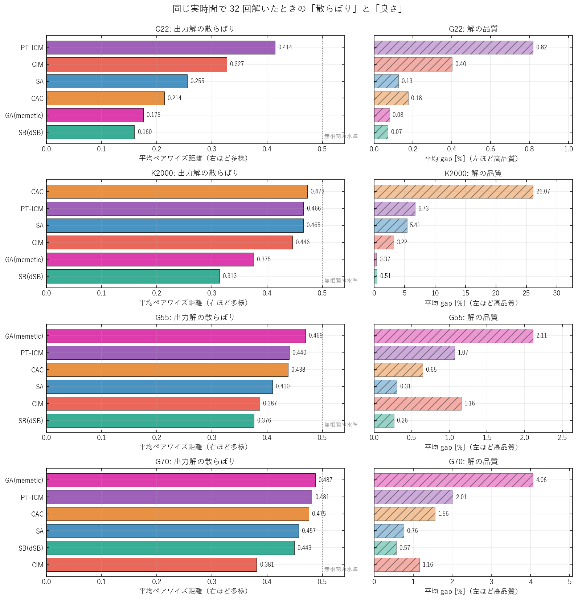
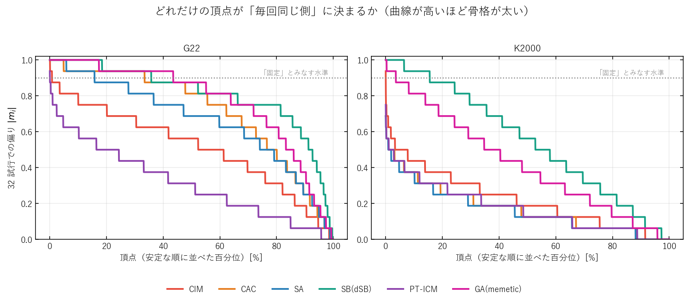
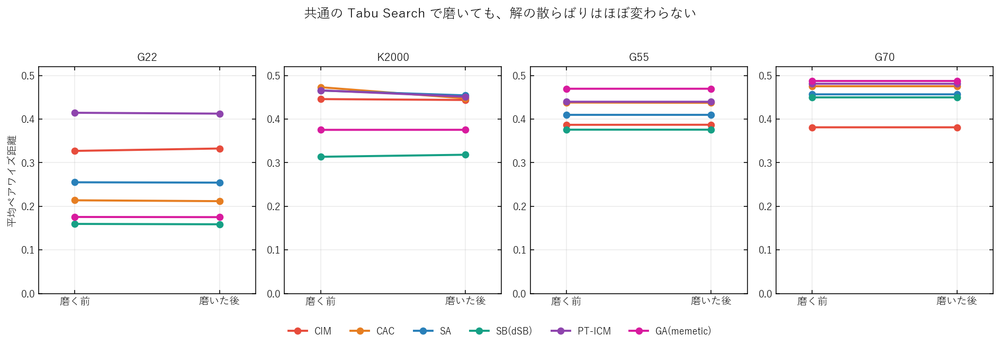
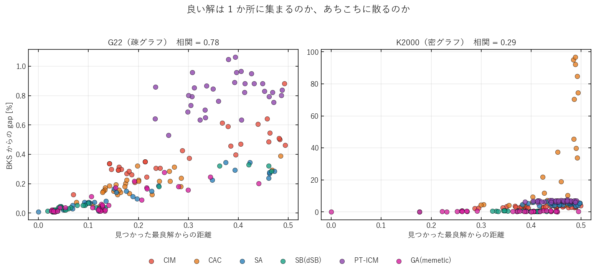
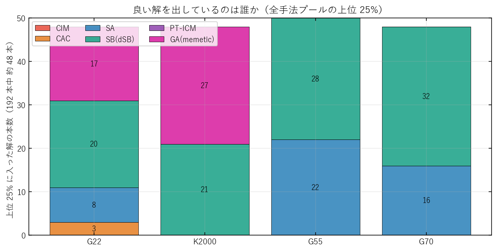
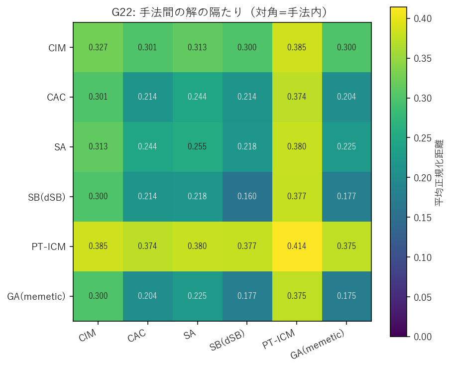
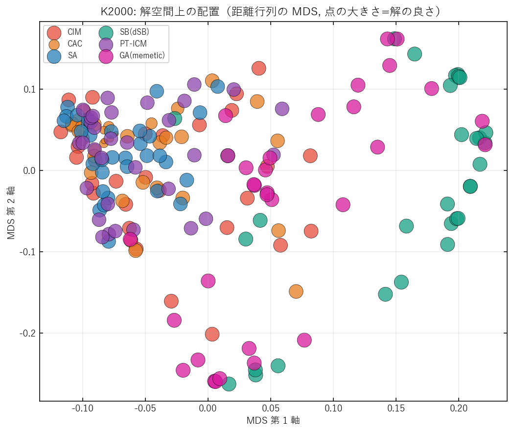

# 図で見る：CIM は他のソルバより「バラバラな解」を出すのか

2026-08-18 実施 / 対象: CIM・CAC・SA・dSB・PT-ICM・GA の 6 手法 × G22・K2000・G55・G70 の 4 インスタンス
（数値の詳細版は同じフォルダの `RESULTS.md` / `RESULTS.pdf`）

---

## 0. 3 行でいうと

1. **CIM は確かにバラバラな解を出す。**疎な G22 では、独立に 32 回解かせると毎回 3 割の頂点が入れ替わり、
   「毎回同じ側に決まる頂点」は 2000 個中たった 16 個しかない。
2. **でもそのバラバラさは「良い解の周り」ではない。**CIM の解は上位 25% に 1 本も入らない。
   多様性と品質はおおむね逆行する。
3. **ただし見せかけの多様性ではない。**全手法を同じ局所探索で磨いても距離はほとんど縮まらないので、
   各手法は本当に別々の場所に着地している。**その多様性が役に立つかはインスタンス次第**
   （疎グラフでは無駄、密グラフでは資源になり得る）。

---

## 1. 何を測ったか

MAX-CUT の答えは「頂点を 2 グループに分ける分け方」なので、**白黒を全部ひっくり返した解は同じ解**。
そこで 2 つの解の違いを次の距離で測る。

$$d(a,b) = \frac{\min\big(H(a,b),\ n - H(a,b)\big)}{n}$$

$H$ はハミング距離（違う側に入っている頂点の数）。この $d$ は

- $d = 0$ … 完全に同じ分け方
- $d = 0.1$ … 頂点の 1 割が入れ替わっている
- $d = 0.5$ … 2 つの解に何の関係も無い（でたらめに分けたのと同じ）

を意味する。**32 個の独立シードで解いて、できた 32 本の解の全ペア（496 組）の平均**を「多様性」とする。

比較を公平にするため、**手法ごとに実時間を揃えた**（予算グリッドを小さい方から走らせ、
目標秒を超える直前の予算を採用。G22 は約 10 秒、K2000 は約 60〜100 秒）。

---

## 2. 全体像：散らばりと良さ

> **読み方**: 左が「解の散らばり」（右に長いほどバラバラ）、右が同じ並び順での「解の悪さ」
> （右に長いほど gap が大きい＝悪い）。左右の棒の長さが似ていれば「多様なのは単に解けていないから」。

- **G22（疎・n=2000）**: 散らばりの順は dSB(0.160) < GA(0.175) < CAC(0.214) < SA(0.255) < **CIM(0.327)** < PT-ICM(0.414)。
  gap の順とほぼ逆。良い手法ほど毎回同じ解に着地する。
- **K2000（密・n=2000）**: CAC は距離 0.473 と最も散らばるが gap が 26% で、これは「多様」ではなく「解けていない」。
  一方 dSB(0.313) と GA(0.375) は gap 0.4〜0.5% と高品質で、**それでもかなり散らばっている**。
- **G55 / G70（大きい疎グラフ）**: 全手法が 0.38〜0.49 に張り付く（ほぼ無相関の水準）。この時間ではどの手法も
  収束しておらず、**CIM だけが例外的に最も凝集している**（0.381〜0.387）。

---

## 3. 「骨格」はどれくらい太いか

> **読み方**: 各頂点について「32 回中どれくらい同じ側に来たか」を測り、安定な順に並べた曲線。
> 曲線が高いところまで伸びているほど、その手法は**毎回共通の骨格を持って**いる。

- G22 で **GA（ピンク）と dSB（緑）は 4 割前後の頂点が「ほぼ毎回同じ側」**。解の大枠が決まっている。
- **CIM（赤）は水準 0.9 を超える頂点が 0.8%（16 個）しかない**。PT-ICM（紫）はさらに少ない。
  CIM は「大枠を決めてから細部を詰める」のではなく、**毎回ゼロから別の分岐に落ちている**。
- 密な K2000 ではどの手法も骨格が細くなるが、dSB と GA だけは 2〜6 割の頂点を保っている。

---

## 4. 「収束していないだけ」ではないことの確認

多様性は「まだ解き終わっていない」だけでも大きくなる。そこで **全手法の出力を同じ Tabu Search
（20000 反復・摂動なし）で磨いてから**、同じ指標を測り直した。

> **読み方**: 線がほぼ水平＝磨いても散らばりが変わらない、という意味。

磨きは品質を大きく改善する（K2000 の CAC は gap **26.1% → 2.1%**、CIM は **3.2% → 1.6%**）。
それでも距離はほとんど動かない（CAC 0.473 → 0.447、CIM 0.446 → 0.444）。
つまり観測された多様性は**解き残しのノイズではなく、着地点そのものの違い**である。

※ G55 / G70 では出力がすでに局所最適で、この磨きは何も改善できなかった（線が完全に水平）。

---

## 5. その多様性は役に立つのか — 疎グラフと密グラフで正反対

> **読み方**: 横軸は「見つかった最良解からどれだけ離れているか」、縦軸は「その解がどれだけ悪いか」。
> 右上がりの直線に乗っていれば「良い解は 1 か所に集まっている（big valley）」。

- **G22（疎）は典型的な big valley**（相関 0.78）。良い解どうしは互いに **0.070** しか離れておらず、
  実質「1 つの谷」しかない。この構造では**離れた解を持ち込んでも意味が無い**。
- **K2000（密）は big valley が弱い**（相関 0.29）。**上位 25% の解ですら互いに 0.353 離れている** ——
  つまり同じくらい良い解が、まったく違う分け方として多数存在する。ここでは多様性が探索資源になり得る。

> **読み方**: 全 192 本（6 手法 × 32 本）のうち上位 25% を、どの手法が何本出したか。

**CIM は 4 インスタンスすべてで上位 25% に 1 本も入らない**（共通 TS で磨いた後の G22 で 1 本のみ）。
多様性は供給できるが、供給される解の品質帯が上位ではない、というのが率直な結論である。

---

## 6. 手法どうしは同じ場所を見ているか

> **読み方**: 対角が「その手法の中での散らばり」、非対角が「2 つの手法の解どうしの隔たり」。
> 色が明るいほど遠い。

G22 では **dSB・GA・CAC の 3 手法が互いに 0.18〜0.21** と近く、同じ谷を共有している。
一方 **CIM は他手法から 0.30、PT-ICM は 0.37〜0.39 離れる**。役割としては「別の場所を見る係」である。

> **読み方**: 距離行列を 2 次元に押し込んだ図（MDS）。近い点ほど似た解。点が大きいほど良い解。

K2000 では高品質な dSB（緑）と GA（ピンク）が右側の領域に、それ以外の手法が左側に固まる。
**密インスタンスでは手法どうしが文字通り違う場所に着地している。**

---

## 7. 数字のまとめ（主要 2 インスタンス）

| インスタンス | 手法 | 平均 gap [%] | 平均距離 | 骨格（固定頂点）[%] | 上位25%への寄与 |
|---|---|---|---|---|---|
| G22 | dSB | 0.07 | 0.160 | 35.8 | 20 本 |
| G22 | GA | 0.08 | 0.175 | 43.5 | 17 本 |
| G22 | SA | 0.13 | 0.255 | 15.8 | 8 本 |
| G22 | CAC | 0.18 | 0.214 | 33.5 | 3 本 |
| G22 | **CIM** | **0.40** | **0.327** | **0.8** | **0 本** |
| G22 | PT-ICM | 0.82 | 0.414 | 0.1 | 0 本 |
| K2000 | GA | 0.37 | 0.375 | 3.6 | 27 本 |
| K2000 | dSB | 0.52 | 0.313 | 15.6 | 21 本 |
| K2000 | **CIM** | **3.22** | **0.446** | **0.1** | **0 本** |
| K2000 | SA | 5.41 | 0.465 | 0.0 | 0 本 |
| K2000 | PT-ICM | 6.73 | 0.466 | 0.0 | 0 本 |
| K2000 | CAC | 26.07 | 0.473 | 0.0 | 0 本 |

（G55 / G70 を含む全 24 行と、磨き後の値は `RESULTS.md` の表 1・表 3 を参照）

---

## 8. 実務的な含意

| 状況 | 判断 |
|---|---|
| GA の初期集団を CIM で作りたい（疎グラフ） | **効果は期待しにくい。** 上位解は互いに 0.07 の狭い谷にあり、CIM の解（0.33 離れ）はその外側。過去の Q3 実験「CIM 種でも到達上限は上がらない」と整合。 |
| 密グラフ（K2000 型）でポートフォリオを組む | **多様性は資源になる**（上位解自体が 0.35 離れて縮退）。ただし現状の CIM は gap 3.2% で上位帯に届かず、まず品質の底上げが要る。 |
| 「別の領域を探す係」が欲しい | CIM より **PT-ICM の方が他手法から遠い**（G22 で 0.37〜0.39）。ただし低予算では品質が最下位。 |
| 密グラフで CIM を使う | **出力に軽い局所探索を必ず掛ける。** K2000 の CIM 出力は 1 頂点反転で改善できる頂点が平均 37 個あり（局所最適率 0%）、TS を掛けるだけで gap 3.2% → 1.6%。 |

---

## 9. 注意点

- CIM / CAC の物理パラメータはインスタンス別調整が前提。K2000 は調整済みだが **G55 / G70 は G22 の定数流用**なので、
  そこでの CIM の挙動（最も凝集する）はパラメータ依存の可能性が高い。
- 予算グリッドが粗く、実時間は完全には揃っていない（G22 で 7.6〜15.6 秒、K2000 で 61〜159 秒）。
- 32 シードは平均を見るには十分だが、上位 25% の部分集合（数本〜数十本）の統計は誤差が大きい。
- G55 / G70 は全手法が未収束の領域での比較であり、「収束後の多様性」ではなく
  「同じ短い時間での着地点の多様性」を見ている。

---

図の再生成: `python scripts/plotting/plot_diversity_report.py <run_dir>`（本書の fig1〜fig5）、
`python scripts/plotting/plot_diversity.py <run_dir>`（個別図・summary.csv）。
