# 図で見る：CIM は他のソルバより「バラバラな解」を出すのか

2026-08-18 実施 / CIM・CAC・SA・dSB・PT-ICM・GA の 6 手法 × G22・K2000・G55・G70 の 4 インスタンス
数値の詳細版は `RESULTS.md` / `RESULTS.pdf`（過去版の図は `RESULTS_visual_v1.pdf` / `RESULTS_visual_v2.pdf`）。

**この版の作り**: 6 手法を**マーカー形状・線種・ハッチで固定**して色に頼らず識別できるようにし、
凡例を探さなくても線や棒に直接名前が付く。注目手法の CIM は太線・大マーカーで強調。
図には**図番号（図1〜図8）**を振り、補助線は意味のある 2 本
（距離 0.5 = 無相関の上限、偏り 0.9 = 「毎回同じ側」のしきい値）だけに絞った。

---

## 図の見方（共通の凡例）

| 手法 | 印 | 線 | 塗り |
|---|---|---|---|
| **CIM**（注目手法・太線で強調） | ● 丸 | 実線 | 斜線 ／ |
| CAC | ■ 四角 | 破線 | 逆斜線 ＼ |
| SA | ▲ 三角 | 点線 | ×印 |
| dSB | ◆ ひし形 | 一点鎖線 | 点 |
| PT-ICM | ▼ 逆三角 | 二点鎖線 | ＋印 |
| GA | ★ 星 | 細破線 | 丸 |

距離の意味は次のとおり（MAX-CUT の答えは「2 グループへの分け方」なので、白黒を反転した解は同じ解として扱う）。

| 距離 | 意味 |
|---|---|
| 0.0 | 完全に同じ分け方 |
| 0.1 | 頂点の 1 割が入れ替わっている |
| 0.5 | 2 つの解に何の関係も無い（でたらめに分けたのと同じ） |

**「平均ペアワイズ距離」の作り方**（1 手法 × 1 インスタンスにつき）:

1. シード 0〜31 の **32 本**を同じ実時間で走らせ、解ベクトル $s^{(1)}, \ldots, s^{(32)}$ を集める。
2. 順序を区別しないすべてのペア（$\binom{32}{2} = 496$ 組）でハミング距離 $H_{ij}$
   （＝違う側に入っている頂点の数）を数える。
3. 白黒反転は同じ解なので $d_{ij} = \min(H_{ij},\ n - H_{ij}) / n$ と折り返す。
4. **その 496 個を単純平均**したものが「平均ペアワイズ距離」。箱ひげ図もこの 496 点を描いている。

手法間の距離（図7 の非対角）だけは 2 集合の全組み合わせ $32 \times 32 = 1024$ 組の平均。
なお、ランダムな分割どうしの実際の期待値は $0.5 - \sqrt{1/(2\pi n)}$（$n$=2000 で 0.491、10000 で 0.496）で、
図中の 0.5 の線は上限を示す。計算の実装は `scripts/benchmarks/diversity_metrics.py`。

---

## 0. 3 行でいうと

1. **CIM は 6 手法の中では「多様性の低い側」**（4 インスタンスの平均順位 4.25 / 6 位）。
   バラバラな解を出すのは疎で小さい G22 だけで（2 位。毎回 3 割の頂点が入れ替わり、
   「毎回同じ側に決まる頂点」は 2000 個中たった 16 個）、**G70 では逆に 6 手法中もっとも凝集する**。
2. **でもそのバラバラさは「良い解の周り」ではない。** CIM の解は上位 25% に 1 本も入らない。
3. **ただし見せかけの多様性ではない。** 全手法を同じ局所探索で磨いても距離はほぼ縮まらない。
   その多様性が役に立つかは**インスタンス次第**（疎グラフでは無駄、密グラフでは資源になり得る）。

---

## 1. まず全体像：4 象限で位置づけを見る（図1）

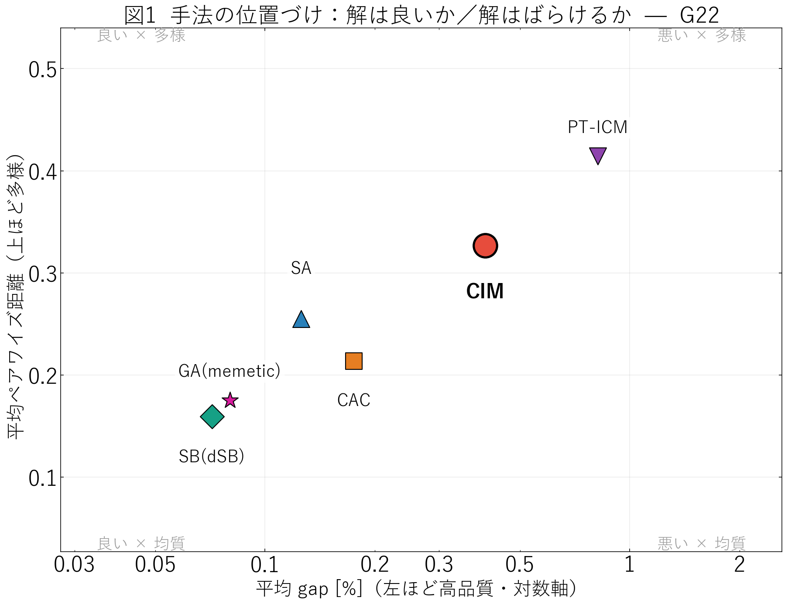

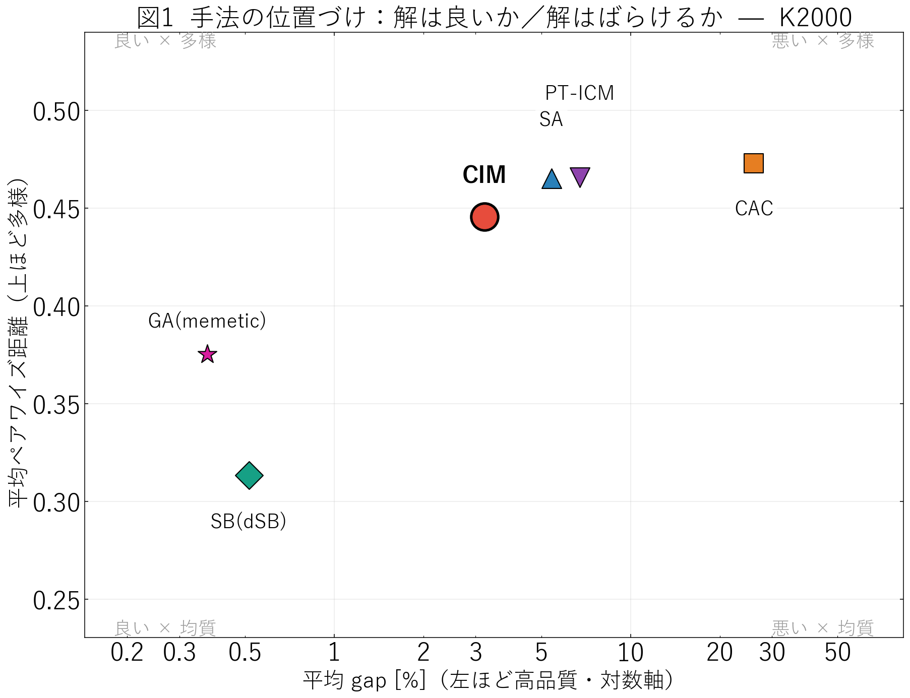

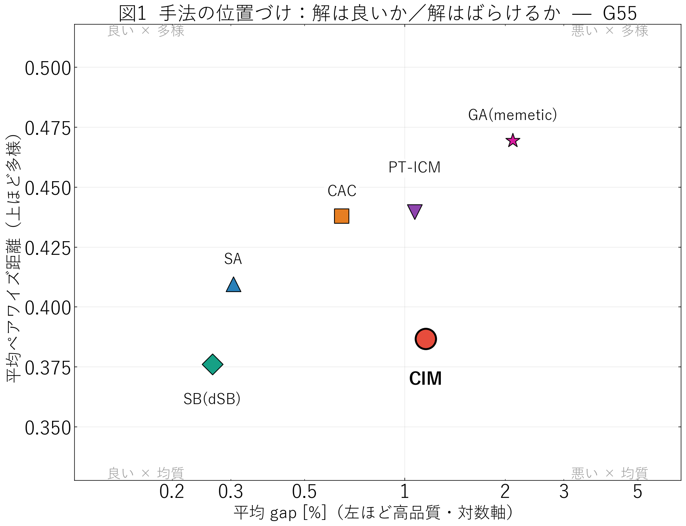

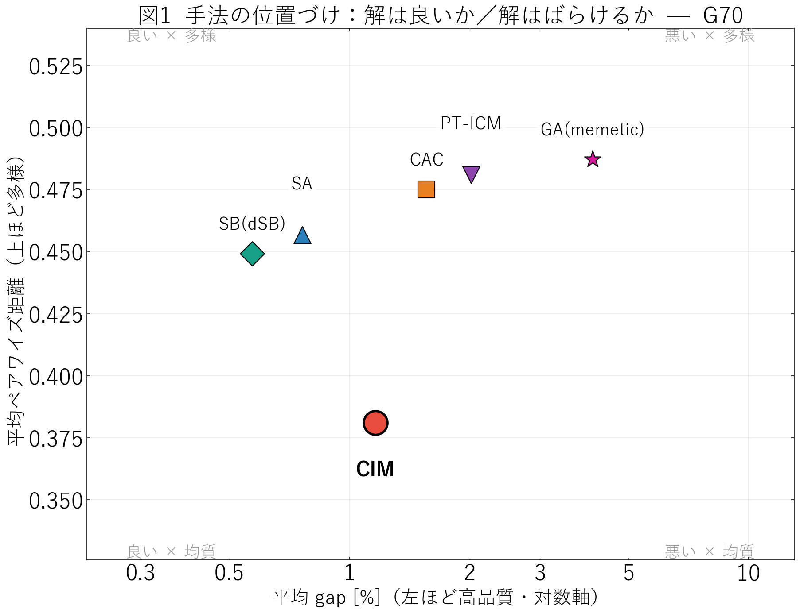

> **図1 の読み方**: 横軸が「解の悪さ」（左ほど良い・対数軸）、縦軸が「解の散らばり」（上ほど多様）。
> 四隅の淡い文字が示すとおり、**左上（良い × 多様）が理想**の位置。

- **G22**: 理想の左上は空で、**dSB と GA が左下（良い × 均質）**、**CIM は右上（やや悪い × 多様）**。
  多様性と品質がきれいに逆行している。
- **K2000**: CIM は右側（品質が低い側）の中ほど。多様性では CAC・PT-ICM・SA の方が上。
- **G55 / G70**: **CIM だけが下（均質側）に落ちる**。大きい疎グラフでは CIM は「最もばらけない手法」になる。
  つまり「CIM＝多様」は普遍の性質ではなく、G22 に限った話である。

**多様性の順位（1 = 最も多様、平均ペアワイズ距離ベース）**

| 手法 | G22 | K2000 | G55 | G70 | 平均順位 |
|---|---|---|---|---|---|
| PT-ICM ▼ | 1 | 2 | 2 | 2 | **1.75** |
| CAC ■ | 4 | 1 | 3 | 3 | 2.75 |
| GA ★ | 5 | 5 | 1 | 1 | 3.00 |
| SA ▲ | 3 | 3 | 4 | 4 | 3.50 |
| **CIM ●** | **2** | **4** | **5** | **6** | **4.25** |
| dSB ◆ | 6 | 6 | 6 | 5 | **5.75** |

エントロピー基準・固定頂点率基準でも順位は同じ（CIM はいずれも平均 4.25 位）。

---

## 2. 散らばりと良さを並べて見る（図2）

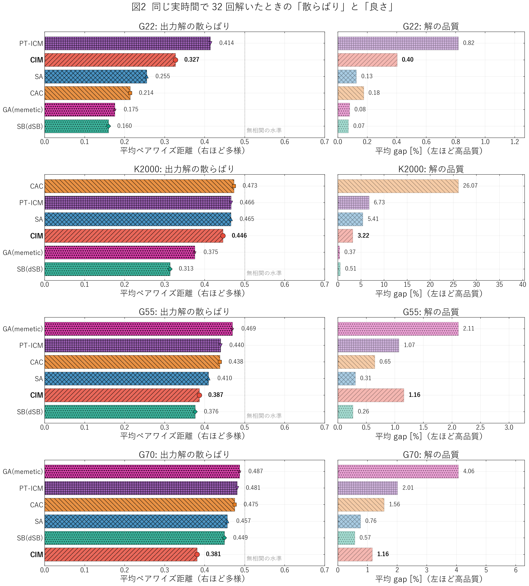

> **図2 の読み方**: 左が「解の散らばり」（右に長いほどバラバラ）、右が同じ並び順での「解の悪さ」。
> 左右の棒の長さが似ていれば「多様なのは単に解けていないから」。

- **G22（疎・n=2000）**: dSB(0.160) < GA(0.175) < CAC(0.214) < SA(0.255) < **CIM(0.327)** < PT-ICM(0.414)。
  gap の順とほぼ逆。良い手法ほど毎回同じ解に着地する。
- **K2000（密・n=2000）**: CAC は距離 0.473 で最も散らばるが gap 26% ——「多様」ではなく「解けていない」。
  一方 dSB(0.313)・GA(0.375) は gap 0.4〜0.5% と高品質で、**それでもかなり散らばっている**。
- **G55 / G70**: 全手法が 0.38〜0.49（ほぼ無相関の水準）に張り付く。この時間ではどの手法も収束していない。

---

## 3. 「骨格」はどれくらい太いか（図3）

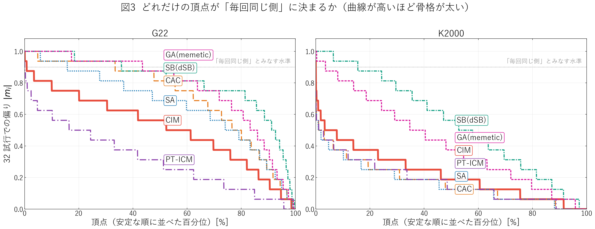

> **図3 の読み方**: 各頂点が「32 回中どれくらい同じ側に来たか」を、安定な順に並べた曲線。
> 高いところまで伸びているほど、その手法は**毎回共通の骨格**を持っている。

- G22 で **GA（★・細破線）と dSB（◆・一点鎖線）は 4 割前後の頂点がほぼ毎回同じ側**。
- **CIM（●・太実線）は水準 0.9 を超える頂点が 0.8%（16 個）だけ**。PT-ICM はさらに少ない。
  CIM は「大枠を決めて細部を詰める」のではなく、**毎回ゼロから別の分岐へ落ちている**。
- 密な K2000 ではどの手法も骨格が細るが、dSB と GA だけは 2〜6 割の頂点を保つ。

---

## 4. 「収束していないだけ」ではないことの確認（図4）

全手法の出力を**同じ Tabu Search（20000 反復・摂動なし）で磨いてから**測り直した。

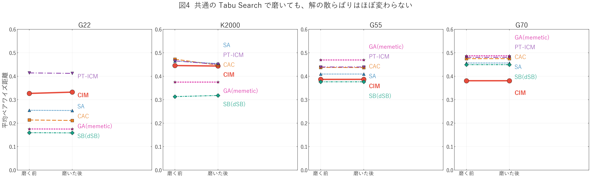

> **図4 の読み方**: 線がほぼ水平＝磨いても散らばりが変わらない。

磨きは品質を大きく改善する（K2000 の CAC は gap **26.1% → 2.1%**、CIM は **3.2% → 1.6%**）のに、
距離はほとんど動かない（CAC 0.473 → 0.447、CIM 0.446 → 0.444）。
観測された多様性は**解き残しのノイズではなく、着地点そのものの違い**である。

※ G55 / G70 では出力がすでに局所最適で、この磨きは何も改善できなかった（完全に水平）。

---

## 5. その多様性は役に立つのか — 疎と密で正反対（図5・図6）

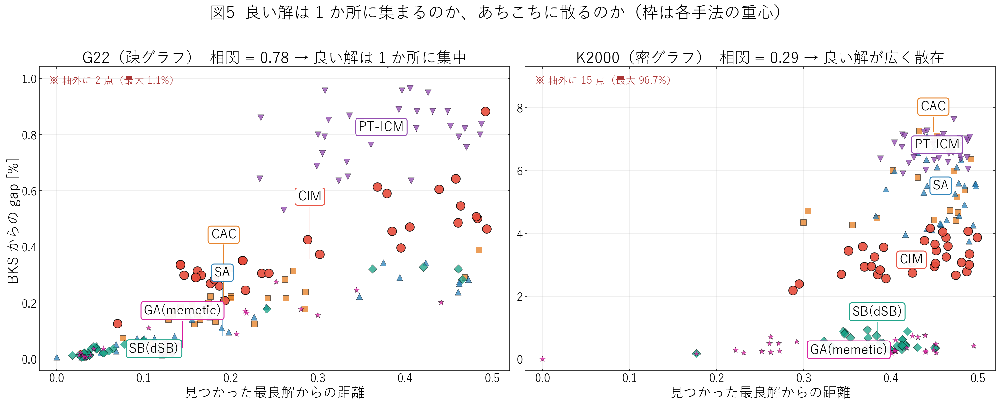

> **図5 の読み方**: 横軸「見つかった最良解からどれだけ離れているか」、縦軸「その解がどれだけ悪いか」。
> 右上がりに乗っていれば「良い解は 1 か所に集まっている（big valley）」。
> 枠付きラベルは各手法のかたまりの位置（引出線の先が重心）。

- **G22（疎）は典型的な big valley**（相関 0.78）。良い解どうしは互いに **0.070** しか離れていない。
  この構造では**離れた解を持ち込んでも意味が無い**。
- **K2000（密）は big valley が弱い**（相関 0.29）。図の右下に注目すると、
  **gap 1% 未満の dSB / GA の解が、最良解から 0.3〜0.5 も離れた位置に広く分布**している。
  同じくらい良い解が、まったく違う分け方として多数存在する。

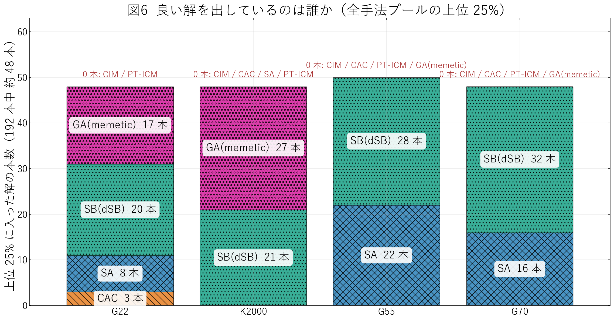

> **図6 の読み方**: 全 192 本（6 手法 × 32 本）のうち上位 25% を、どの手法が何本出したか。
> 棒の上の赤字が「1 本も入らなかった手法」。

**CIM は 4 インスタンスすべてで上位 25% に 1 本も入らない**（共通 TS で磨いた後の G22 で 1 本のみ）。
多様性は供給できるが、供給される解の品質帯が上位ではない。

---

## 6. 手法どうしは同じ場所を見ているか（図7・図8）

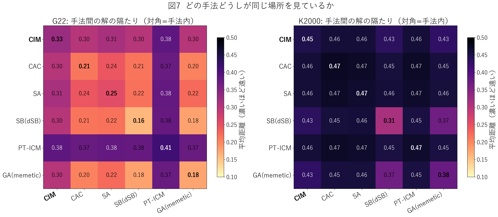

> **図7 の読み方**: 対角が「その手法の中での散らばり」、非対角が「2 つの手法の解どうしの隔たり」。
> 濃いほど遠い。

G22 では **dSB・GA・CAC の 3 手法が互いに 0.18〜0.21**（明るい ＝ 近い）で同じ谷を共有する一方、
**CIM は他手法から 0.30、PT-ICM は 0.37〜0.39 離れる**。K2000 は全体が濃く、
**dSB↔GA の 0.37 以外はすべて 0.43 以上**（ほぼ無相関）。

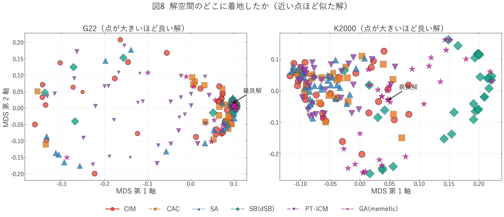

> **図8 の読み方**: 距離行列を 2 次元に押し込んだ図（MDS）。近い点ほど似た解、点が大きいほど良い解。

G22 では右端の小さな塊に良い解（大きな ◆ ★ ■）が密集し、**CIM（●）と PT-ICM（▼）だけが左半分に散る**。
K2000 では高品質の dSB（◆）と GA（★）が右側に、それ以外が左側にまとまる。

---

## 7. 数字のまとめ（主要 2 インスタンス）

| インスタンス | 手法 | 平均 gap [%] | 平均距離 | 骨格（固定頂点）[%] | 上位25%への寄与 |
|---|---|---|---|---|---|
| G22 | dSB ◆ | 0.07 | 0.160 | 35.8 | 20 本 |
| G22 | GA ★ | 0.08 | 0.175 | 43.5 | 17 本 |
| G22 | SA ▲ | 0.13 | 0.255 | 15.8 | 8 本 |
| G22 | CAC ■ | 0.18 | 0.214 | 33.5 | 3 本 |
| G22 | **CIM ●** | **0.40** | **0.327** | **0.8** | **0 本** |
| G22 | PT-ICM ▼ | 0.82 | 0.414 | 0.1 | 0 本 |
| K2000 | GA ★ | 0.37 | 0.375 | 3.6 | 27 本 |
| K2000 | dSB ◆ | 0.52 | 0.313 | 15.6 | 21 本 |
| K2000 | **CIM ●** | **3.22** | **0.446** | **0.1** | **0 本** |
| K2000 | SA ▲ | 5.41 | 0.465 | 0.0 | 0 本 |
| K2000 | PT-ICM ▼ | 6.73 | 0.466 | 0.0 | 0 本 |
| K2000 | CAC ■ | 26.07 | 0.473 | 0.0 | 0 本 |

（G55 / G70 を含む全 24 行と磨き後の値は `RESULTS.md` の表 1・表 3）

---

## 8. 実務的な含意

| 状況 | 判断 |
|---|---|
| GA の初期集団を CIM で作りたい（疎グラフ） | **効果は期待しにくい。** 上位解は互いに 0.07 の狭い谷にあり、CIM の解（0.33 離れ）はその外側。過去の Q3 実験「CIM 種でも到達上限は上がらない」と整合。 |
| 密グラフ（K2000 型）でポートフォリオを組む | **多様性は資源になる**（上位解自体が 0.35 離れて縮退）。ただし現状の CIM は gap 3.2% で上位帯に届かず、まず品質の底上げが要る。 |
| 「別の領域を探す係」が欲しい | CIM より **PT-ICM の方が他手法から遠い**（G22 で 0.37〜0.39）。ただし低予算では品質が最下位。 |
| 密グラフで CIM を使う | **出力に軽い局所探索を必ず掛ける。** K2000 の CIM 出力は 1 頂点反転で改善できる頂点が平均 37 個あり（局所最適率 0%）、TS を掛けるだけで gap 3.2% → 1.6%。 |

---

## 9. 注意点

- CIM / CAC の物理パラメータはインスタンス別調整が前提。K2000 は調整済みだが **G55 / G70 は G22 の定数流用**なので、
  そこでの CIM の挙動（最も凝集する）はパラメータ依存の可能性が高い。
- 予算グリッドが粗く、実時間は完全には揃っていない（G22 で 7.6〜15.6 秒、K2000 で 61〜159 秒）。
- 32 シードは平均を見るには十分だが、上位 25% の部分集合（数本〜数十本）の統計は誤差が大きい。
- G55 / G70 は全手法が未収束の領域での比較であり、「収束後の多様性」ではなく
  「同じ短い時間での着地点の多様性」を見ている。
- 図5 の K2000 パネルは、未収束の CAC が最大 96.7% まで外れるため縦軸を切っている（外れ点数は図中に明記）。

---

図の再生成: `python scripts/plotting/plot_diversity_report_v3.py <run_dir>`（本書の図1〜図8）。
個別図・`summary.csv` は `plot_diversity.py`。
