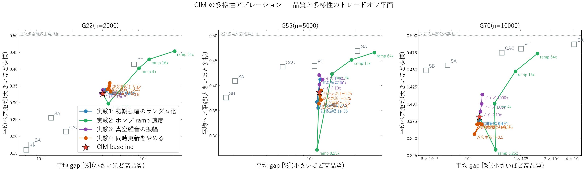
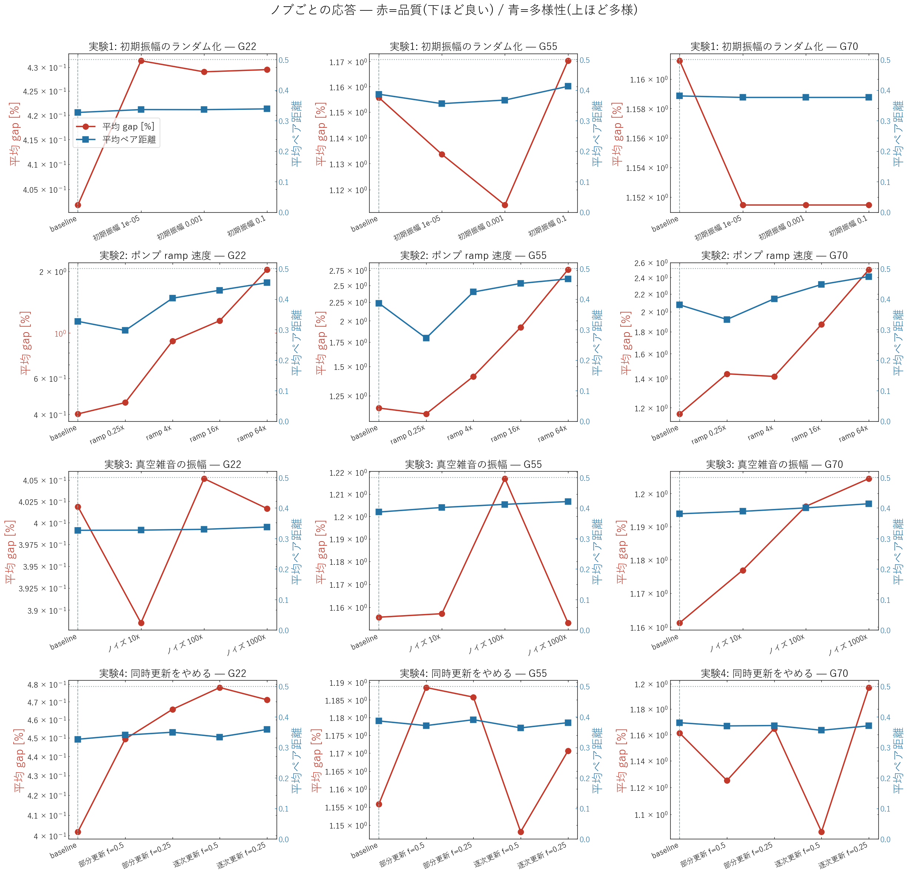
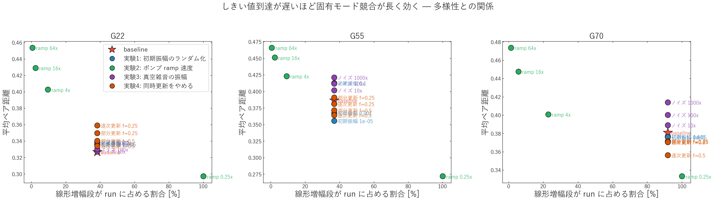
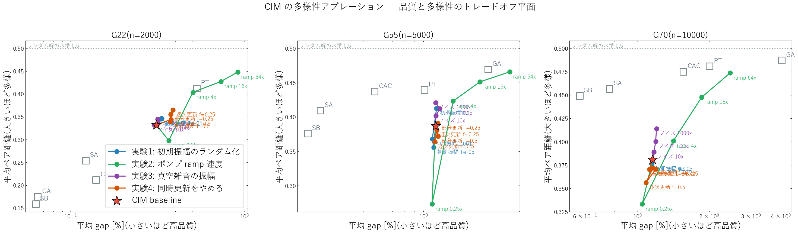
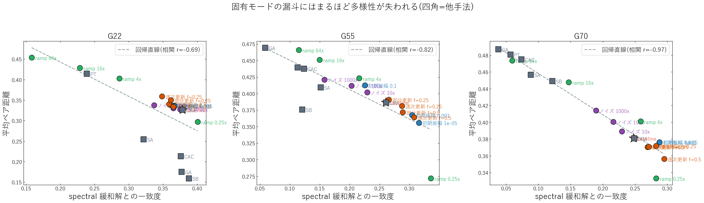
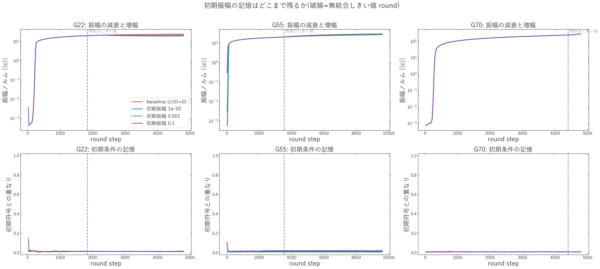

# CIM の解の多様性が低い原因 — 4 実験によるアブレーション

実験日: 2026-08-23 / グラフ: **G22**(N=2000, 辺19990, BKS 13359) / **G55**(N=5000, BKS 10299) / **G70**(N=10000, BKS 9591)
再現コード: `modules/2026-08-23_CIM_ablation.py`, `scripts/benchmarks/cim_diversity_ablation.py`
補助解析: `scripts/benchmarks/cim_spectral_alignment.py`, `scripts/benchmarks/cim_init_memory_probe.py`
データ: `results/2026-08-23/cim_diversity_ablation/v3_G22_G55_G70_nt32_ex1234_main/`
参照 run: `results/2026-08-18/solution_diversity/v2_G22_K2000_G55_G70_nt32_main/`(6 手法の多様性ベンチ)

---

## 1. この実験で何を試したか(一言で)

> **「CIM は全頂点を毎 round 同時に更新しているのだから多様性が出るはず」という直感は成り立たない。**
> 符号を決めているのはしきい値近傍の線形増幅段で、そこは J のトップ固有ベクトルを選ぶ
> 決定論的な漏斗になっている。4 つの候補原因を 1 つずつ潰したところ、**多様性を支配するのは
> ポンプ ramp 速度(＝線形増幅段の長さ)だけ**で、初期条件のランダム化も非同期更新も効かなかった。
> 真空雑音の増幅だけが、品質をほぼ落とさずに多様性を上げる唯一のノブだった。

前提となる観測(参照 run): CIM は「品質あたりの多様性」で他手法に劣る。とくに **G70 では
SA・SB に品質・多様性の両軸で支配される**(CIM gap 1.16% / 距離 0.381 に対し SB gap 0.57% / 距離 0.449)。

---

## 2. 数式の変更点

基準となる CIM の更新方程式は以下(`docs/assets/base_update_equations.png`)。

$$\mathbf{F}(n) = a\mathbf{E}(n-1) + b\mathbf{J}\mathbf{E}(n-1) + c\,\mathbf{n}_0$$
$$\mathbf{E}(n) = \mathbf{F}(n)\exp\!\left[\alpha\,p(n)\bigl(1 - \beta|\mathbf{F}(n)|^2\bigr)\right]$$

**基準式の記号:**

| 記号 | 意味 |
|---|---|
| $\mathbf{F}(n)$ | round $n$ の結合後・増幅前の場(中間量) |
| $\mathbf{E}(n)$ | round $n$ の振幅(更新後の状態) |
| $a$ | 自己項(前 round の自分)の係数 |
| $b$, $\mathbf{J}$ | 結合係数 と 結合行列 |
| $c$, $\mathbf{n}_0$ | ノイズ強度 と ノイズベクトル |
| $\alpha$ | 利得スケール |
| $p(n)$ | ポンプ(時間依存) |
| $\beta$ | 飽和係数 |

**この実験での変更(4 条件。それぞれ 1 箇所だけ変える):**

| 実験 | 記号/項 | 基準式 | 変更後 | 変更理由 |
|---|---|---|---|---|
| 1 | $\mathbf{E}(0)$ | $\mathbf{E}(0) = \mathbf{0}$(全試行で同一) | $E_i(0) \sim U(-s, +s)$ | 「初期条件の自由度が無い」ことが原因か |
| 2 | $p(n)$ | $p(n) = n\,\Delta P$ | $p(n) = n\,(m\,\Delta P)$ | 「線形増幅段が長い」ことが原因か |
| 3 | $c$ | $c$(真空雑音の物理値) | $c \to \mu\,c$ | 「飽和後にノイズが効かない」ことが原因か |
| 4 | 更新集合 | 全 $i$ を同時に更新 | 各 round で割合 $f$ の $i$ のみ更新 | 「更新順序という対称性の破れ源が無い」ことが原因か |

実験 4 の「逐次更新」版では、さらに $\mathbf{J}\mathbf{E}$ を更新のたびに差分反映する
(Gauss–Seidel 型)。すなわち $\mathbf{F}(n)$ の第 2 項が、同じ round 内で先に更新された
頂点の新しい値を見る形になる。

**公平性の制御**: 実験 4 で更新頂点を割合 $f$ に減らすときは、round 数を $1/f$ 倍し
**同時に $\Delta P$ を $f$ 倍**した。頂点更新回数とポンプ ramp の物理的な速さの両方を
baseline に揃えるためで、この結果「線形増幅段が run に占める割合」はどの $f$ でも 37〜38% で一定になる。

**baseline との一致検証**: ablation 実装は既定ノブ($s=0$, $m=1$, $\mu=1$, $f=1$)で
`modules/CIM.py` と**ビット一致**する(乱数の消費順序も含めて確認済み)。したがって
各行の差分はノブの効果そのものである。実際、下表の baseline 行は参照 run の CIM 行と完全に一致している。

---

## 3. 実験条件

| 項目 | 値 |
|---|---|
| グラフ | G22(N=2000) / G55(N=5000) / G70(N=10000) |
| baseline round 数 | 4800 / 9600 / 4800(参照 run の実時間マッチ済み予算と同一) |
| 独立試行数 | 32(seed 0–31) |
| CIM 物理パラメータ | G22 は optuna 実測値、G55/G70 は同一定数 + coupling $-0.03$ |
| 多様性指標 | 平均ペア距離(反転対称を畳んだ正規化ハミング距離、0.5 = 無相関) |
| 磨き | 全条件共通の Tabu Search(20000 反復、摂動なし)で局所最適化してから再測定 |
| 誤差の見積り | baseline を seed ブロック 3 本(0/100/200)で反復。sd = G22 0.0089 / G55 0.0053 / G70 0.0035 |

---

## 4. 結果サマリー

平均ペア距離(磨き後)と gap の主要行。**Δ距離**は baseline からの差、$\sigma$ は上記 seed 変動の sd。

| データセット | 条件 | gap 平均 [%] | 平均ペア距離 | Δ距離 | 判定 |
|---|---|---|---|---|---|
| **G70** | baseline | 1.157 | 0.3810 | — | — |
| | 初期振幅 0.1 | 1.148 | 0.3761 | −0.005 | 効果なし(1.4σ) |
| | ramp 16x | 1.862 | 0.4477 | **+0.067** | 効くが品質 −0.71pt |
| | ノイズ 1000x | 1.201 | 0.4139 | **+0.033** | **効く(9σ)。品質 −0.04pt** |
| | 逐次更新 f=0.5 | 1.085 | 0.3563 | **−0.025** | **逆効果(7σ)** |
| **G55** | baseline | 1.148 | 0.3869 | — | — |
| | 初期振幅 0.1 | 1.162 | 0.4127 | **+0.026** | 効く(5σ)が G55 のみ |
| | ramp 16x | 1.910 | 0.4512 | **+0.064** | 効くが品質 −0.76pt |
| | ノイズ 1000x | 1.149 | 0.4210 | **+0.034** | **効く(6σ)。品質 ±0** |
| | 逐次更新 f=0.5 | 1.138 | 0.3642 | −0.023 | 逆効果(4σ) |
| **G22** | baseline | 0.311 | 0.3324 | — | — |
| | 初期振幅 0.1 | 0.334 | 0.3467 | +0.014 | 効果なし(1.6σ) |
| | ramp 16x | 0.733 | 0.4275 | **+0.095** | 効くが品質 −0.42pt |
| | ノイズ 1000x | 0.317 | 0.3448 | +0.012 | 効果なし(1.4σ) |
| | 逐次更新 f=0.25 | 0.387 | 0.3652 | +0.033 | 効くが品質 −0.08pt |

全 15 条件 × 3 グラフの完全な表は `summary.csv` / `results.json` / `results_ref20k.json` にある。

---

## 5. 図と読み取り

### 5.1 品質と多様性のトレードオフ平面

横軸 gap(左ほど高品質)、縦軸 平均ペア距離(上ほど多様)。灰色の四角は参照 run の他手法。

- **緑線(ramp 掃引)が CIM 自身のトレードオフ曲線**を描いている。ramp を速くすると
  右上へ、遅くすると左下へ滑るだけで、曲線そのものは動かない。
- **紫(ノイズ)は G55/G70 でほぼ真上に伸びている** — 品質を落とさずに多様性だけ上がっており、
  4 つの中で唯一トレードオフ曲線を外へ押している。
- 青(初期振幅)と橙(非同期)は baseline の周りに団子になっている。
- **G55/G70 では、CIM がどのノブでも届かない左上に SB・SA が居る。** 多様性の問題は
  ノブ調整で解けるレベルではなく、力学そのものに由来する。

### 5.2 ノブごとの応答

赤が gap(下ほど良い)、青が多様性(上ほど多様)。実験 2 だけが両方を大きく動かしている。
実験 4(最下段)は 3 グラフとも青がほぼ水平、G70 では baseline より下がっている。

### 5.3 線形増幅段の長さと多様性

横軸は「無結合しきい値に達する round が run 全体に占める割合」。これが小さいほど
線形増幅段が短く、固有モード競合の時間が短い。右下がりの関係がはっきり出ており、
**ramp を速くして得られる多様性は、線形増幅段を短くしたことの直接の帰結**とわかる。

### 5.4 磨いた後の平面(品質との交絡を落とす)

全条件を共通の Tabu Search で局所最適まで落としてから測り直した図。G55/G70 では
移動距離が 0.000〜0.014 と小さく、**磨いても配置がほとんど変わらない**。
つまり CIM の解は「同じ谷の斜面の途中」ではなく既に局所最適で、上の多様性の差は
収束不足のゆらぎではなく構造的なものである。

> 注意: G70(n=10000)では Tabu 20000 反復が 2 sweep 相当しかなく、磨きが弱い。
> G70 の「磨いても変わらない」はこの弱さも含んだ結論である。

### 5.5 spectral 緩和解との一致度 vs 多様性(機構の直接検証)

飽和前の CIM は $c_{k+1} \approx e^{g_0/2}(\sqrt{\eta}\,I + \mathbf{J})c_k + \xi$ という
線形写像なので、$\sqrt{\eta}I$ が全モードを同じだけ持ち上げることから、最初に不安定化するのは
**$\mathbf{J}$ のトップ固有ベクトル $v_1$** である。$v_1$ は $\mathbf{J}$ だけで決まり試行に依らない。
そこで各解と $\mathrm{sign}(v_1)$ の重なり(反転対称を畳んで $[0,1]$)を測った。

- **参照 run の 6 手法と比べると、G55/G70 で CIM だけが突出して $v_1$ に寄っている**:
  G55 で CIM 0.261 に対し CAC 0.123 / SA 0.151 / SB 0.121 / PT 0.113 / GA 0.059、
  G70 で CIM 0.249 に対し他は 0.038〜0.121。**2〜4 倍**の偏り。
- ablation の全条件を通して、一致度と多様性は**強い右下がり**(相関 r = −0.69 / −0.82 / **−0.97**)。
  多様性を上げたノブはすべて、$v_1$ への一致度を下げることで上げている。
- G22 では CIM 0.379 に対し SB 0.388 / GA 0.377 / CAC 0.376 と差が無い。**この機構が効くのは
  大きな疎グラフ(G55, G70)で、CIM の多様性欠如が観測されたのと同じ場所である。**

### 5.6 初期条件の記憶(実験 1 の補助診断)

上段が振幅ノルム、下段が初期符号との重なり。破線は無結合しきい値 round。

- **最終的な初期符号との重なりは全条件で 0.007〜0.020**、つまりゼロ。初期条件は完全に消える。
- G70 では初期振幅を 4 桁変えても(1e-5 / 1e-3 / 1e-1)結果が**ビット一致**する。
- 一方 G55 では初期振幅 0.1 だけが seed ブロック 3 本すべてで再現性のある
  +0.026 / +0.046 / +0.036 の多様性増を示した。ただし初期符号との相関は 0 なので
  「初期条件を覚えている」のではなく、最初の数十 round を飽和領域で始めることの副作用と考えられる。

---

## 6. 考察 — 何が効いたのか

### 「同時更新だから多様性が出る」が成り立たない理由

同時更新は乱数の**回数**を増やすが、乱数が**符号の分岐を選べる時間窓**を増やさない。CIM で
符号が決まるのはしきい値近傍のごく短い区間だけで、そこは §5.5 のとおり $v_1$ を選ぶ
決定論的な漏斗である。飽和後は $\mathbf{E}$ が深い井戸に落ち、$c\,\mathbf{n}_0$ の項は
振幅の $10^{-5}$ 程度でしかないので符号を反転できない。だから残り数千 round のノイズは無力になる。

実験 4 はこの読みを裏づけた。同時更新をやめても多様性は増えず、**G70 では逐次更新が
むしろ多様性を 0.025 下げた(7σ)**。逐次更新は $\mathbf{J}\mathbf{E}$ を即時反映するぶん
局所場の追随が速く、モード選択がより鋭くなる — 一致度も 0.248 → 0.295 と上がっている。
「更新順序という対称性の破れ源」は、この力学では多様性の源ではなかった。

### 効いたノブとその意味

- **実験 2(ramp 速度)が唯一の強いノブ**。速くすると線形増幅段が短くなり、$v_1$ が
  独り勝ちする前に飽和が始まるので一致度が下がり(G70 で 0.248 → 0.060)、多様性が上がる。
  ただし品質も同時に落ちるので、**CIM 自身のトレードオフ曲線の上を滑っているだけ**であり、
  他手法との差は縮まらない。
- **実験 3(ノイズ振幅)だけがトレードオフ曲線を外へ押した**。G55 で品質据え置きのまま
  +0.034、G70 で品質 −0.04pt で +0.033。飽和後のノイズが符号を反転できる水準まで上がると、
  漏斗を抜けたあとに別の谷へ移れるようになるためと解釈できる。ただし G22 では効かない
  (baseline の一致度が既に他手法並みで、漏斗が主因ではないため)。
- **実験 1 は否定された**。初期条件は完全に消える(§5.6)。

### なぜ大きな疎グラフでだけ問題になるか

G22(n=2000, 平均次数 20)では CIM の一致度は他手法と同水準で、多様性の劣位も小さい。
G55(n=5000)・G70(n=10000)は疎で、$\mathbf{J}$ のトップ固有ベクトルが局在しやすく、
かつ spectral 緩和解自体が悪い(gap 8.7% / 4.1%)。この「悪い方向」へ全試行が
同じだけ引っ張られるので、品質も多様性も同時に損なわれる。

---

## 7. 注意点・今後の課題

- **統計**: 各条件 32 試行、baseline のみ seed ブロック 3 本で誤差を見積もった。
  非 baseline 条件の誤差は baseline の sd で代用しており、条件ごとの sd は取っていない。
  実験 1 のみ 3 ブロック反復で再現性を確認した。
- **G70 の磨きが弱い**: Tabu 20000 反復は n=10000 では 2 sweep 相当。より長い磨きで
  §5.4 の結論が変わらないか確認したい。
- **`threshold_round` は無結合近似**: $\sqrt{\eta}e^{g_0/2}=1$ から求めており、$\mathbf{J}$ の
  寄与($\sqrt{\eta}+\lambda_{\max}$)を無視している。実際のモード不安定化はこれより早い。
  条件間の相対比較には使えるが、絶対値は上界として読むべき。
- **次に試すこと**:
  1. ノイズ増幅(実験 3)と ramp 加速(実験 2)の 2 次元掃引。トレードオフ曲線を外へ押す
     方向が両者の組み合わせでさらに伸びるか。
  2. 試行ごとに $\mathbf{J}$ を微小ランダム摂動する(漏斗の行き先自体を試行ごとに変える)。
     $v_1$ の縮退・準縮退を人工的に作る操作にあたる。
  3. $v_1$ 方向を明示的に射影除去したうえで走らせ、一致度と多様性の因果を確定させる。
  4. K2000(重み付き)での追試。参照 run では CIM の一致度が 0.193 と低く、この機構が
     効いていない可能性がある。
