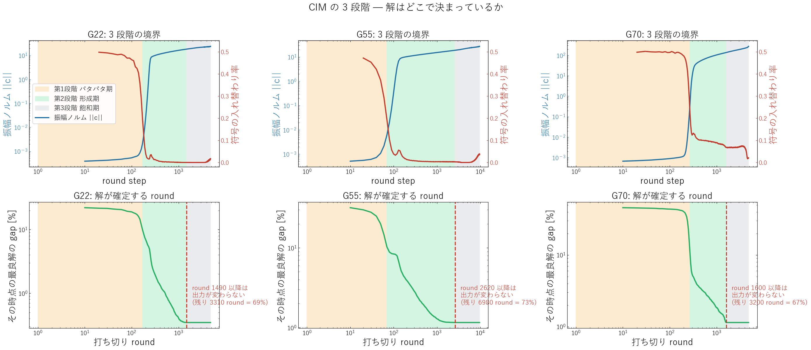
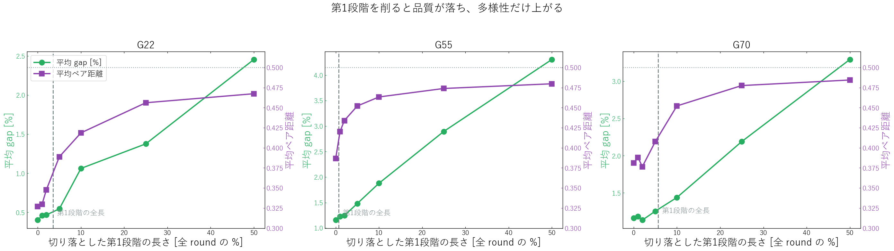

# CIM の 3 段階 — 第1段階と第3段階は要るのか

実験日: 2026-08-24 / グラフ: **G22**(N=2000, BKS 13359) / **G55**(N=5000, BKS 10299) / **G70**(N=10000, BKS 9591)
再現コード: `modules/2026-08-23_CIM_ablation.py`, `scripts/benchmarks/cim_phase_ablation.py`
データ: `results/2026-08-24/cim_phase_ablation/v1_G22_G55_G70_nt32_main/`
先行実験: `results/2026-08-23/cim_diversity_ablation/v3_G22_G55_G70_nt32_ex1234_main/`(多様性アブレーション)

---

## 1. この実験で何を試したか(一言で)

> CIM の 1 run は 3 局面に分かれる — **第1段階「パタパタ期」**(振幅が小さく符号が毎 round ほぼ
> ランダムに入れ替わる)、**第2段階「形成期」**(振幅が指数的に立ち上がり符号が確定する)、
> **第3段階「飽和期」**(振幅が飽和し符号が動かない)。この 2 つを削って影響を測った。
>
> **結論: 第3段階は完全に不要(全 round の 67〜73% が出力に一切寄与しない)。
> 第1段階は必要で、全体の 1% を削るだけで品質が落ち始める。**
> 第1段階は「無駄なパタパタ」ではなく、固有モードの選択が複利で進行している期間だった。

---

## 2. 数式の変更点

$$\mathbf{F}(n) = a\mathbf{E}(n-1) + b\mathbf{J}\mathbf{E}(n-1) + c\,\mathbf{n}_0$$
$$\mathbf{E}(n) = \mathbf{F}(n)\exp\!\left[\alpha\,p(n)\bigl(1 - \beta|\mathbf{F}(n)|^2\bigr)\right]$$

| 記号 | 意味 |
|---|---|
| $\mathbf{F}(n)$ | round $n$ の結合後・増幅前の場 |
| $\mathbf{E}(n)$ | round $n$ の振幅 |
| $a$ / $b$, $\mathbf{J}$ / $c$, $\mathbf{n}_0$ | 自己項 / 結合 / ノイズ |
| $\alpha$ / $p(n)$ / $\beta$ | 利得スケール / ポンプ / 飽和係数 |

**この実験での変更:**

| 記号/項 | 基準式 | 変更後 | 変更理由 |
|---|---|---|---|
| $p(n)$ | $p(n) = n\,\Delta P$(round 0 の水準から始める) | $p(n) = (n + K_0)\,\Delta P$、総 round は $N - K_0$ | 第1段階だけを丸ごと飛ばすため |

$K_0$ 以降のポンプ列は baseline と**完全に一致**し、終端のポンプ水準も同じ。
変わるのは「最初の $K_0$ round が無いこと」だけである。

**第3段階の削除には run を追加しない。** 出力は round 1..$k$ の累積最良カット
$\mathrm{best\_cut}(k)$ なので、**$k$ round で打ち切ることと $\mathrm{best\_cut}(k)$ を読むことは厳密に同値**。
軌跡診断でこれを記録すれば、打ち切りの効果がそのまま読める。

**baseline との一致検証**: $K_0 = 0$ で `modules/CIM.py` とビット一致することを確認済み。

---

## 3. 実験条件

| 項目 | 値 |
|---|---|
| baseline round 数 | G22 4800 / G55 9600 / G70 4800 |
| 軌跡診断 | 8 試行、stride 10 round |
| $K_0$ 掃引 | 全 round の 0 / 1 / 2 / 5 / 10 / 25 / 50%、各 32 試行(seed 0–31) |
| 段階の定義 | 第1→2: 符号の入れ替わり率が初期値の半分に落ちる round 第2→3: $\mathrm{best\_cut}$ が最終値に達する round |
| 多様性指標 | 平均ペア距離(反転対称を畳んだ正規化ハミング距離、0.5 = 無相関) |

---

## 4. 結果サマリー

### 4.1 段階の境界(軌跡診断)

| | 全 round | 第1段階の終わり | 解が確定する round | 第3段階の長さ |
|---|---|---|---|---|
| G22 | 4800 | 170 | 1490 | **3310 (69%)** |
| G55 | 9600 | 70 | 2620 | **6980 (73%)** |
| G70 | 4800 | 270 | 1600 | **3200 (67%)** |

符号の入れ替わり率は第1段階で 0.40〜0.50(0.5 = 完全ランダム)、最終的に 0.017〜0.038 まで落ちる。
$\mathrm{best\_cut}$ が最終値の 99% に達するのは round 410 / 420 / 870 — **全体の 9〜18% の時点**で
ほぼ答えが出ている。

### 4.2 第1段階を削る($K_0$ 掃引)

| データセット | $K_0$ | 残り round | gap 平均 [%] | 平均ペア距離 |
|---|---|---|---|---|
| **G22** | 0 | 4800 | **0.402** | 0.3269 |
| | 48 (1%) | 4752 | 0.460 | 0.3296 |
| | 96 (2%) | 4704 | 0.468 | 0.3477 |
| | 240 (5%) | 4560 | 0.546 | 0.3888 |
| | 480 (10%) | 4320 | 1.062 | 0.4186 |
| | 2400 (50%) | 2400 | 2.455 | 0.4674 |
| **G55** | 0 | 9600 | **1.156** | 0.3867 |
| | 96 (1%) | 9504 | 1.229 | 0.4202 |
| | 480 (5%) | 9120 | 1.481 | 0.4521 |
| | 960 (10%) | 8640 | 1.878 | 0.4633 |
| | 4800 (50%) | 4800 | 4.307 | 0.4797 |
| **G70** | 0 | 4800 | **1.161** | 0.3810 |
| | 48 (1%) | 4752 | 1.185 | 0.3879 |
| | 240 (5%) | 4560 | 1.254 | 0.4077 |
| | 480 (10%) | 4320 | 1.438 | 0.4522 |
| | 2400 (50%) | 2400 | 3.294 | 0.4845 |

参考: baseline の seed 変動 sd は G22 0.0089 / G55 0.0053 / G70 0.0035(先行実験で実測)。
gap の劣化も多様性の増加も、これをはるかに超えている。

---

## 5. 図と読み取り

### 5.1 3 段階の境界と、解が確定する round

**上段**: 青が振幅ノルム(対数)、赤が符号の入れ替わり率。橙 = 第1段階、緑 = 第2段階、灰 = 第3段階。
第1段階では入れ替わり率が 0.5 付近に張りつき、符号は毎 round ほぼ独立にランダム。
ノルムが立ち上がると同時に入れ替わり率が急落し、形成期に入る。

**下段**: 「その round で打ち切ったときの出力」の gap。赤破線以降は**完全に平坦**で、
走らせても出力が 1 ビットも変わらない。G22 で 3310 round、G55 で 6980 round、
G70 で 3200 round がまるごと無駄になっている。

### 5.2 第1段階を削ったときの品質と多様性

緑が gap(上ほど悪い)、紫が多様性。**削れば削るほど品質が落ち、多様性だけが上がる。**
第1段階の全長(灰破線)より手前でもう劣化が始まっており、第1段階は最後まで効いている。

---

## 6. 考察 — 何が起きているのか

### 第3段階が無寄与なのは、飽和後にノイズが符号を反転できないから

飽和すると $\exp[\alpha p(n)(1 - \beta|\mathbf{F}|^2)]$ の指数が 0 付近に押し戻され、利得が 1 に戻る。
このとき $c\,\mathbf{n}_0$ の項は振幅の $10^{-5}$ 程度でしかない(先行実験で確認)。
つまり第3段階は「解を保持しているだけ」で、探索は 1 ビットも進まない。
**round 数を 1/3 に削っても出力は完全に同一**なので、そのぶんを試行数に回すのが合理的である。

### 第1段階は「無駄なパタパタ」ではなく、モード選択が複利で進む期間

第1段階では符号が毎 round ランダムに入れ替わるので、一見すると何も決まっていない。
しかし飽和前の更新は $c_{k+1} \approx e^{g_0/2}(\sqrt{\eta}I + \mathbf{J})c_k + \xi$ という線形写像で、
固有モード成分ごとに倍率 $(\sqrt{\eta} + \lambda_i)$ が違う。**符号は暴れていても、モード分布は
静かに絞られ続けている。** 実測すると 1 周あたりの利得差は mode1/mode2 でわずか +0.406%(G22)
だが、これが数百周の複利で効いて上位モードが勝ち残る。

$K_0$ を削ることはこの複利の期間を短くすることであり、**先行実験の「ramp を速くする」と
同じ操作**にあたる(どちらも実効的にポンプ水準を先に進める)。結果も一致していて、
品質が落ち・多様性が上がるという同じ動き方をする。多様性が上がるのは「探索が良くなった」
のではなく、**モード選択が不十分なまま飽和して行き先がばらけた**だけである。

### ご質問への答え

- **第3段階は無くても解の評価は変わらない** — その通り。しかも 7 割が該当する。
- **第1段階は無いと解の評価が変わる(悪くなる)** — 見た目は無秩序だが、ここで選択が進んでいる。

---

## 7. 注意点・今後の課題

- **段階の境界は連続的**で、上表の値は「入れ替わり率の半減」「$\mathrm{best\_cut}$ の到達」という
  操作的な定義に依存する。とくに G70 は入れ替わり率の減衰が緩やかで、第1→2 の境界が
  他の 2 つより曖昧である(1/10 に落ちるのは round 4300)。
- **軌跡診断は 8 試行の平均**。$\mathrm{best\_cut}$ の平均が最終値に達する round は
  「全試行が確定した round」にほぼ相当するので保守側の見積りだが、試行数は少ない。
- **$K_0$ 掃引では総 round も $N - K_0$ に減っている**。ただし §4.1 で解の確定が
  round 1490〜2620 と分かっているため、$K_0 \le 50\%$ の範囲では round 不足による劣化ではない。
- **次に試すこと**:
  1. **第3段階を削って浮いた計算量を試行数に回す**。同じ実時間で 3 倍の試行が回せるので、
     anytime 性能と「n 試行中の最良解」が改善するはず。先行実験で見た多様性の低さは、
     試行数を増やすことで部分的に補える可能性がある。
  2. 第3段階の途中でポンプを一度下げて再度上げる(re-pump)。飽和を解いて第2段階を
     やり直させれば、無寄与だった 7 割を探索に変えられるかもしれない。
  3. 第1段階だけ引き延ばす($\Delta P$ を第1段階中だけ小さくする)。複利期間を伸ばすと
     品質が上がり多様性がさらに下がる、という予測の確認。
