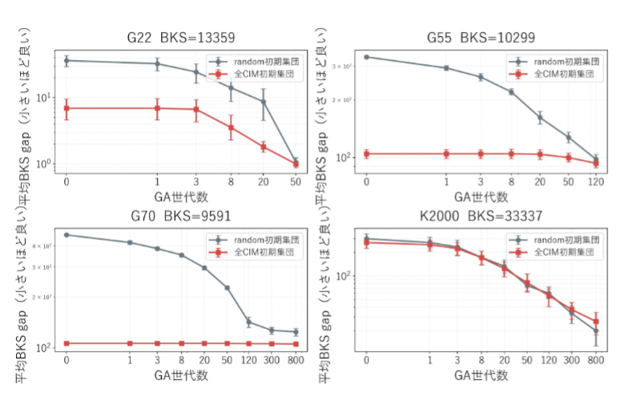
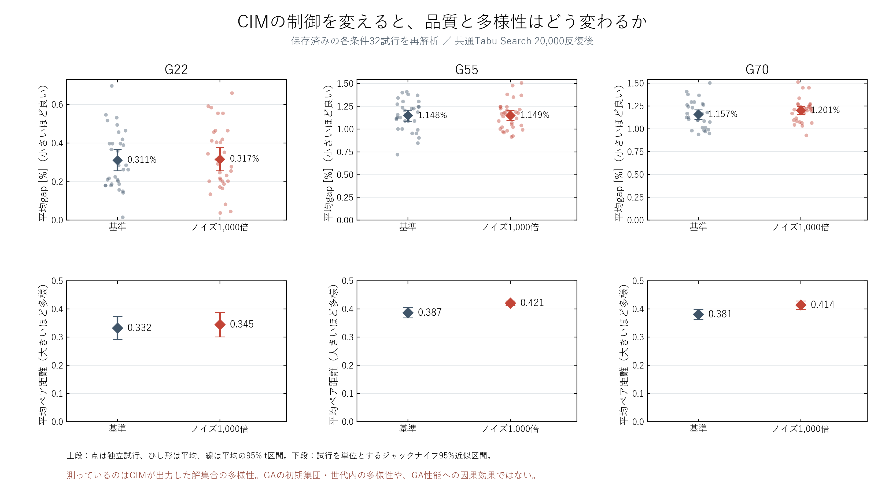
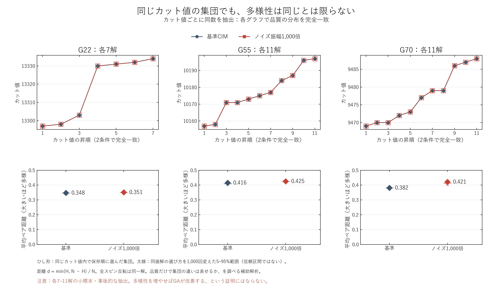
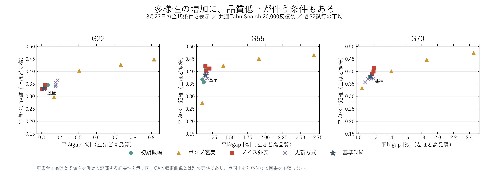

# CIMの多様性について説明するための既存結果の再解析

## 最初に伝える結論

スクリーンショットは、良い初期解から始めても、その後の改善が大きいとは限らないことを示している。
今回の再解析は、**同じカット値の分布でも、CIM解集合の多様性が異なる**ことを示す。
この2点は『多様性を研究する根拠』になるが、**多様性がGAの停滞の原因であるという証明ではない**。
GAの実際の初期集団や世代内の多様性を測ったデータは、今回確認した保存データにはない。

## 図の説明順

### 0. ユーザー提供のGA収束曲線

G55・G70では全CIM初期集団の曲線は序盤から良いが、その後の改善が小さい。G22・K2000では改善も見られる。
多様性の値はこの図には描かれていない。誤差棒の定義・試行数・世代0の定義は元データ未確認のため不明。
リポジトリの warm_ga_q3.py は1個体だけCIMで初期化する実験であり、この『全CIM』の図とは一致しない。
2026-09-14に git pull --ff-only origin master を実施したが Already up to date。master は bb5f62d（2026-08-24）だった。
リモートの他ブランチも確認したが、今回の全CIM初期集団の元データは見つからなかった。
画像はそのまま複製した。数値の読み取り・補間・誤差棒の推定は行っていない。

### 1. 品質と多様性を併記する

8月23日に保存された基準CIMとノイズ振幅1,000倍条件の各32試行を使用した。
全解に共通のTabu Search（20,000反復、摂動なし、tenure=15）を施した保存結果を使う。
これはCIM解集合を同じ後処理で比較したものであり、GA内で実際に選ばれた初期集団ではない。
平均gapが近いG55でも多様性には差が見られる。G22で差が小さいことも併記する。
上段の区間は試行平均の95% t区間、下段は試行を単位とした削除1ジャックナイフの95%近似区間。
496個のペアを独立標本とは扱っていない。多重比較を含む探索的記述であり、因果や有意性の断定はしない。

### 2. カット値の分布を完全にそろえる

カット値ごとに、2条件の解数の小さい方だけ取り出す。保存順の先頭を採用し、距離による選別は行わない。
平均値だけでなく、カット値の多重集合が完全一致する。全32試行からの事後抽出である。

|グラフ|各条件の解数|同じ平均カット値|基準CIMの距離|ノイズ条件の距離|
|---|---:|---:|---:|---:|
|G22|7|13317.857|0.3476|0.3512|
|G55|11|10176.909|0.4158|0.4254|
|G70|11|9477.273|0.3817|0.4213|

太線は同じカット値の解をランダムに選び直したときの5–95%範囲。統計的な信頼区間ではなく、選び方への感度である。
標本数は7–11解に減っており、未使用のグラフや独立seed集団での追試が必要。品質をそろえても、配置の構造など他の差は残る。

### 3. 都合のよい条件だけを取り出さず、全15条件も見る

多様性の増加に品質低下が伴う条件もある。『多様性は大きいほどよい』とは結論できない。

## 先生への説明例

> 全CIM初期集団は初期の品質が良い一方、G55・G70ではその後の改善が小さくなっています。
> したがって、初期カット値以外の性質を調べる必要があると考えました。
> 保存済みのCIM解を解析すると、カット値の分布を完全にそろえても集団の多様性が異なりました。
> そこで、多様性をCIM出力の評価軸として加え、その形成機構を研究したいです。
> 多様性がGAの停滞を引き起こしているかは、初期品質をそろえた集団を同一GAに渡して検証します。

## 因果効果を確かめる次の比較

同じ品質分布・同じ集団サイズの中で距離が低い／高い集団を複数構成し、同一GA・同一計算予算・対応する乱数で比較する。
比較するのはGA開始時の品質、初期局所探索後の品質と多様性、各世代の多様性、交叉直後と局所探索後の改善である。
CIM生成条件だけを変えた比較では、多様性以外の構造的変化も生じる。複数の生成条件・集団構成を使い結果の頑健性を調べる。
matched_solutions.npz は今回の同品質部分集合であり、次の検証への入力候補。今回GAを再実行してはいない。

## 再現・検証

元データ: `results/2026-08-23/cim_diversity_ablation/v3_G22_G55_G70_nt32_ex1234_main`

元のグラフ辺重みから全解のカット値を独立に再計算し、保存値と完全一致することを確認した。
全体反転を同一視した平均距離も保存JSONと照合済み。元ファイルのSHA-256はmanifest.jsonに記録。
抽出した全メンバーの試行番号はmatched_members.csv、集計値はmetrics.jsonに保存。
PNGは発表用、SVGは拡大用。既存ファイルは上書きしていない。

再実行: `python scripts/plotting/plot_cim_diversity_evidence.py --screenshot <元画像のパス>`
