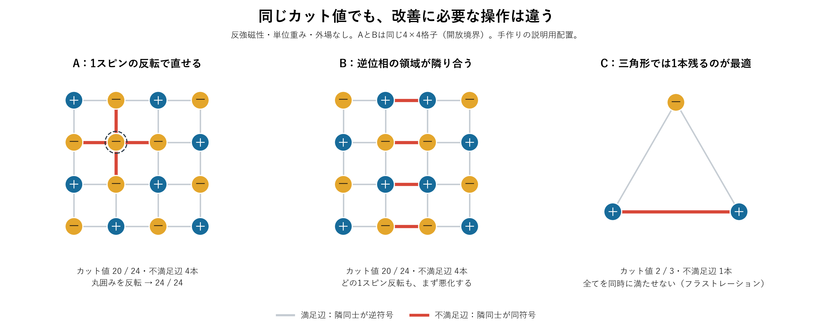
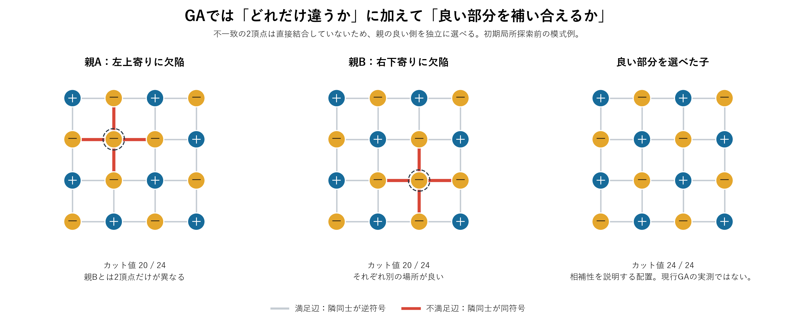

# CIM解の「後段での有望さ」を反強磁性モデルから調べる計画

作成日：2026-09-27。研究計画・文献調査・手作り配置の検算。CIM・SA・GAの追加性能実験は行っていない。

## 提案する研究の問い

**同程度のカット値を持つCIM解のうち、どの欠陥配置がSAで修正されやすく、どの部分構造の組がGAで良い子を生むか。**

「反強磁性体を図示し、どんな状態をCIMから得たいかを先に考える」という方針を採る。図から仮説を作り、小規模問題で検証し、G22・G55・G70へ移す。CIMの生成条件を変えるのは、有望な構造の候補が分かってからとする。

確認した進捗報告は `docs/20260928/進捗報告9-28.pptx`。スライド3は「従来の多様性スコアではG55/G70の改善を説明できない」、スライド4は今回のNA二項目。既存の調査は [種評価の先行研究](../../../../docs/20260921/cim_seed_evaluation_literature_v1.md) にある。本稿はそこへ物理的な図と検証順序を加える。

## 1. まず図で分けたい三つの状態



全て外場なし、正の単位重みを持つMax-Cutであり、隣接スピンが逆符号になるほど良い反強磁性系である。AとBは開放境界の4×4正方格子（16頂点24辺）。

| 配置 | 現在の品質 | 言えること |
|---|---|---|
| A：ネール配置から内点1個だけ反転 | cut=20、不満足辺4本 | その点を反転するとcut=24。局所修正で完全に直せる |
| B：ネール配置の左半分を一括反転 | cut=20、不満足辺4本 | 全16通りの1スピン反転が悪化。最大gainも−1。単一反転で探索を始めるなら悪化の受容が必要 |
| C：三角形 | cut=2、不満足辺1本 | これが最適。1本の不満足辺は構造的に不可避 |

配置と全1-flip利得は [examples.json](./examples.json) に保存し、反転前後のcutの直接計算と局所利得の式を照合した。**CIMが実際にこの配置を出したというデータではない。** BがSAで何秒かかるか、Aより常に不利かも未測定であり、温度と予算に依存する。

この図から、「不満足辺が何本あるか」「取り除くためにどんな操作が必要か」「そもそも全て除けるか」を分ける。不満足辺の本数は単位正重みでは辺数−cutなので、現在のcutを越える情報にはならない。

### 図示の注意

- 正方格子では生のスピンに加え、`q(r,c)=(-1)^(r+c)s(r,c)` を色表示すると、交互配列の位相が揃った領域と境界が見やすい。`s`はCIM振幅`E`の符号、`q`は可視化用の変換であり更新方程式の変更ではない。
- 「反強磁性のドメイン」は同じスピン色の塊ではなく、交互配列の位相が揃う領域として読む。
- 正方格子や偶数リングは二部グラフなので、全結合を満たせる。奇数閉路を含む系では満たせない結合が残る。**正方格子だけでG-setの難しさを説明しない。**
- 一般グラフの描画で近くに見える点を物理的な隣接・ドメインと扱わない。G-setでは不満足辺、局所利得、親の不一致部分グラフとして定義し直す。
- 重みに負値を含む問題へ拡張するときは、満足辺の定義を重みの符号に合わせる。本図は正重みに限定する。

## 2. 評価対象を分ける

| 評価対象 | 問い | 最初の計測 | 固定するもの |
|---|---|---|---|
| 問題グラフ | どんな障害・不可避な不満足があるか | 二部性、奇数閉路、次数、連結成分、小問題の最適値 | グラフ内で候補解を比較 |
| 解単体（主にSA） | どの操作で良い領域へ進めるか | 1-flip利得分布、ゼロ利得の点、短いSAでの遷移・到達品質 | 初期cut、温度、探索予算 |
| 解の組・集団（GA） | 良い部分を補い合えるか | 辺状態距離、不一致部分の連結構造、交叉前後・TS後の品質 | 親品質、交叉法、局所探索予算、集団サイズ |
| CIM生成と全体利用 | 有望な構造を安価に供給できるか | 条件別の有望解出現率、選別後の最終品質、総時間 | 候補数または総時間、後段の設定 |

グラフの特徴は同じG22から得た全候補に共通なので、それだけでは候補の順位をつけられない。単体評価と集団評価も別に作る。

### 「良い種」の正解ラベル

SAでは、候補解から所定予算内に到達した**最良cutの平均と目標到達確率**を主指標にする。GAでは、同じ基準集団へ候補を追加・置換したときの最終最良cutの差を測る。改善幅だけを主指標にすると、出発点が悪い解を選びやすい。

候補比較では同じ初期cutの群を作り、後段の乱数を複数回変える。改善の機構を調べるときは後段予算を揃え、実用性を調べるときはCIM生成・選別・SA/GAの合計時間を揃える。

## 3. SAで確かめる仮説

**仮説S：同じ初期cutでも、局所修正できる部分や低い障壁を通る経路を持つ解の方が、短時間のSAで高品質へ到達しやすい。**

正の辺重みを`w_ij`、スピンを`s_i∈{−1,+1}`とすると、

`C(s)=1/2 Σ_(i,j) w_ij(1−s_i s_j)`

頂点iの反転利得は

`g_i(s)=C(sをiで反転)−C(s)=Σ_j w_ij s_i s_j`。

これらは離散解の評価式であり、CIMの更新方程式を改変する提案ではない。リポジトリの反強磁性結合行列`J`と、Max-Cutの辺重み`w`は符号・係数が異なるため混同しない。

1. 利得の最大値、正・ゼロ・負の割合、ゼロ近傍の頂点がまとまっているかを計測する。
2. 小さい問題では全列挙で最適値を求め、必要なら1-flip状態グラフ上で「より良いcutへ行くまでに必要な最小の一時悪化」を調べる。最初の1-flipだけで経路全体の障壁を決めない。
3. 固定のSA設定で短・中・長の予算を試し、最良cut、目標到達確率、初期状態からの辺状態の変化を記録する。
4. 初期cutを揃えた候補間で、提案した特徴が到達品質を説明するかを見る。

大きな問題では障壁の厳密計算を目指さず、短いSAプローブを実用的な比較対象にする。高温から始めるとCIM由来の状態が早く失われる可能性があるので、温度を変える追試は主比較と分ける。

**最初の成果物：同じcutの2〜4解について、初期配置→反転箇所→到達配置を同じ座標で並べた図。**

## 4. GAで確かめる仮説

**仮説G：単なる解間距離より、局所探索後にも残る部分構造の相補性が、後続の改善を説明する。**



この図では親Aと親Bの不一致点が非隣接の2頂点であり、異なる親から良い側を選べる。Partition Crossoverの発想で説明できる。ただし両親はそれぞれ単独の局所探索でも最適化できるため、**GAがSA/TSより有利という証拠にはならない**。初期局所探索後の集団ではこの差が消える可能性を含む、説明用の例である。

手元の `modules/GA.py` を読むと、初期集団全体にTSを行い、交叉で子を作り、子にもTSを行っている。交叉は親の共通する頂点を保存し、不一致点はランダム順に並べて側を交互に割り当てる実装である。**不一致部分の連結構造を保存するPXそのものではない。**

したがって、次の段階を分けて保存する。

`CIM生出力 → 初期TS後 → 交叉直後 → 子へのTS後 → 集団への採否`

既存の`population_observer`は生の初期集団（−1）、初期TS後（0）、世代後を観察できる。交叉直後と子へのTS直後の親子対応は追加の記録点が必要になる。

| 調べる点 | 計測案 | 読み取り |
|---|---|---|
| 初期TSで違いが消えるか | TS前後のユニークな辺状態数・距離 | CIM由来の多様性が交叉に届いているか |
| 違いがどこにあるか | 親が異なる頂点の誘導部分グラフ、その成分数・最大成分比率 | 独立に組み合わせられる部分があるか |
| 良い部分が相補的か | 成分ごとの親の優劣、PXを仮適用したcutの増加 | 違うだけでなく良い部分の交換価値があるか |
| 現行交叉が利用できるか | 交叉直後とTS後のcut、親の最良値を超える割合 | 構造の価値と交叉の能力を分けられるか |
| 集団として効くか | 同一基準集団へ1候補置換した最終品質差 | 相手を限定した好例が集団でも役立つか |

最初は品質を揃えた親ペアで1回の交叉を繰り返す。その後、同じTS予算をかける。全GAを先に長時間回すより、どの段階で差が消えるかを判断しやすい。

多様性には「辺がcutされるか」の不一致率も使う。全スピン反転、連結成分ごとの一括反転、孤立点の符号違いは目的関数上の新しい配置ではない。G55/G70についてこの問題は既存の種評価調査でも確認済み。ただし現行交叉の動作は表現に依存し得るので、表現の正規化と性能測定は分ける。

**最初の成果物：親A・親B・不一致部分・交叉直後の子・TS後の子を並べた図と、同じ品質で距離と改善率の関係を示す散布図。**

## 5. モデルと実験を増やす順序

1. **説明と検算**：偶数リング、4×4正方格子、三角形。今回の図はこの段階。可解な格子で局所修正と領域境界の違いを理解する。
2. **小規模の比較**：4×4格子に一部の対角辺を加えて奇数閉路を作る。16頂点なら2^16通りの全列挙が可能。複数の対角配置で、単一の見栄えの良い例に依存しないかを見る。フラストレーションがあるだけで必ず難しいとは限らない。
3. **実CIM出力の検証**：各問題にまず独立64候補程度を作り、同じ初期cutの群で比較。SAは候補ごとに10乱数程度の予備評価。GAは品質帯を揃えた親ペアを抽出し、同程度の距離で改善する／しない組を探す。数は予備実験の開始案であり、十分な統計精度を保証しない。
4. **実問題へ接続**：G22・G55・G70の保存済み解を優先して再解析。格子で考えた指標を辺状態・局所利得・不一致部分構造へ置き換える。G55/G70を優先する理由は、進捗報告で多様性スコアと改善が対応しなかったため。
5. **CIMの生成条件へ戻す**：停止時刻、ポンプの立ち上げ、ノイズ強度、seedで有望な構造の出現率が変わるかを調べる。符号だけでなく振幅`E(n)`も保存し、振幅の小さい点と後段で反転する点が対応するかを追加仮説として検証する。

小規模の単純格子では初期TSだけで全候補が最適化されることもある。その場合はGAの実力比較を続けず、「初期多様性が消える対照」として扱い、別のフラストレートした例や保存済みG-set解へ進む。

「大きなドメインなら良い」「振幅が小さい点は誤り」とは先に決めない。大きな境界の固定化や、縮退した正しい配置もあり得る。CIM設定の最適化目標は、単独cut最大化に加え、**後段まで含む到達品質**とする。

### 比較対象と成功条件

- 候補からランダム選択、cut上位選択、cut＋従来距離、cut＋提案構造指標、短いSA/TSで試して選択を比較する。
- 「同程度の初期cutでも構造が違えば後段の品質が変わる例」を最初の成功条件にする。次は未使用seed・未使用問題でも選別効果が残るかを確認する。
- 同じCIM軌跡の途中状態や対称変換を独立サンプルとして数えず、同じ生成runは同じ評価分割にまとめる。
- 候補の生成・特徴計算・選別・後段探索の総時間で有利になって、はじめて全体の効率化と主張する。
- 初めからGraph Transformerへ進む必要はない。手作り指標に説明力があれば、単純な回帰・順位付けを経て学習器へ進める。

## 6. 読む論文と、実験へ持ち帰るもの

2026-09-27時点で確認。以下はこの問いに合わせた選択的なサーベイであり、網羅的レビューではない。各論文の主張と本計画への転用案を分けて記す。

### 最優先：CIMでの欠陥・ドメイン形成

**Hamerly et al. (2016), Topological defect formation in 1D and 2D spin chains realized by network of optical parametric oscillators.** Int. J. Mod. Phys. B 30, 1630014。 [本文](https://arxiv.org/html/1605.08121v1) / [書誌](https://arxiv.org/abs/1605.08121)

本文のSec. 4–5を確認。OPOネットワークの成長・飽和段階、ドメイン壁の運動、2D格子、競合する結合によるフラストレーションを扱う。特にFig. 4、7–11は今回の「図で考える」目的に合う。

持ち帰るもの：ポンプ・飽和までの時間と欠陥配置を結びつける仮説。論文の連続振幅ダイナミクスでの壁運動を、単一スピン反転SAの障壁と同一視しない。手元のCIMモデルとパラメータも一致するとは限らない。

### GAで良い部分を受け渡す条件

**Tinós, Whitley, Chicano (2015), Partition Crossover for Pseudo-Boolean Optimization.** FOGA 2015, 137–149。 [出版社概要・DOI](https://doi.org/10.1145/2725494.2725497)

出版社概要を確認。親の不一致変数がq個の相互作用しない集合へ分かれるとき、部分評価を使って2^q通りの候補から最良の子を選べる。

持ち帰るもの：距離の大きさから、不一致部分の分割可能性・相補性へ進む指標。成分が多くても片方の親が全成分で優位なら、良い親を越える子は得られない。保証は親由来の候補集合内であり、大域最適性や現行GAへの保証ではない。

**Wu & Hao (2012), A Memetic Approach for the Max-Cut Problem.** PPSN 2012, 297–306。 [著者公開PDF](https://leria-info.univ-angers.fr/~jinkao.hao/papers/WuHaoPPSN2012.pdf)

著者公開本文の取得と既存調査・実装を照合。共通する部分を扱う交叉と、局所探索を組み合わせるMax-Cutメメティック手法。

持ち帰るもの：現行実装に沿って交叉とTSの効果を分離するアブレーション。リポジトリは関連手法を取り入れた実装であり、論文の全手順と同一だとは扱わない。

### SAで良い探索領域へ移れるか

**Herrmann, Ochoa, Rothlauf (2018; online 2017), PageRank centrality for performance prediction: the impact of the local optima network model.** Journal of Heuristics 24, 243–264。 [出版社概要](https://link.springer.com/article/10.1007/s10732-017-9333-1)

出版社概要を確認。局所最適解の領域間遷移を表すネットワークと、SA・反復局所探索の性能を検討する。

持ち帰るもの：SAでは局所最適解への距離だけでなく、別の良い領域へ移る経路を見る。これは解空間のネットワークであり、入力グラフG22のPageRankではない。大規模問題では短い探索による近似に留める。

### CIMで多様な低エネルギー解を作れるか

**Ng et al. (2022), Efficient sampling of ground and low-energy Ising spin configurations with a coherent Ising machine.** Phys. Rev. Research 4, 013009。 [論文](https://arxiv.org/abs/2103.05629)

要旨・書誌を確認。測定フィードバックCIMの量子雑音を含むモデルで、縮退基底状態や低エネルギー配置のサンプリングを扱う。

持ち帰るもの：最良解を1個得る以外に、構造の異なる低エネルギー候補群を供給するという役割。ただしサンプリングの多様性がGAで有用とは別途検証が必要。手元の古典数値モデルへ量子的な優位をそのまま帰属させない。

### 近接する新しい研究の確認

**Zheng et al. (2026), Accelerating ground state search of spatial photonic Ising machines with genetic-simulated annealing hybrid algorithm.** arXiv:2605.23295（2026-05-22投稿）。 [プレプリント](https://arxiv.org/abs/2605.23295)

要旨を確認。空間光変調器を使うSPIMで、前半のGAと後半のSAを組み合わせる。**CIM解を既存GA/SAの種として選別する本計画とは構成が違う。** 要旨の同一反復予算での比較を、総実時間での高速化と読み替えない。最新の近接研究として本文精読の候補にする。

### 各論文の読書メモを統一する

1本につき、対象モデル／操作（単独反転・交叉・連続振幅）／使う構造情報／測る成果／本実験で借りる指標／適用限界、を1行ずつ埋める。論文の要約で終わらず、測定項目か対照実験を最低1個持ち帰る。

## 7. NAにそのまま使える記述

**GA・SAにおいて改善する可能性のあるCIM解の評価**

> 小規模な反強磁性モデル上で、同程度のカット値を持つCIM解の欠陥配置を可視化する。SAでは局所修正と障壁、GAでは初期局所探索後に残る部分構造の相補性に着目し、固定予算後の到達品質との関係を評価する。有効な指標をG55・G70等の保存済み解へ適用する。

**関連論文のサーベイ**

> CIMのドメイン・欠陥形成、SAの探索領域間遷移、GAの構造保存交叉、CIMの低エネルギー解サンプリングに分けて調査し、各分野から評価指標と検証可能な仮説を抽出する。

最初の報告では、欠陥配置の比較図、親子の変化を追う図、仮説・計測・文献の対応表を揃える。今回作成したのは説明用の2図と本計画であり、次に必要なのは実際のCIM出力と後段探索の対応データである。

## 再現

プロジェクトルートから次を実行する。出力先は実行日×実験種別×新しい版へ自動採番される。

```powershell
python scripts/plotting/2026-09-27_cim_seed_antiferro_concept.py
```

再現コード： [図の生成・局所利得の検算](../../../../scripts/plotting/2026-09-27_cim_seed_antiferro_concept.py)。既存ソルバ・既存実験成果は変更していない。
