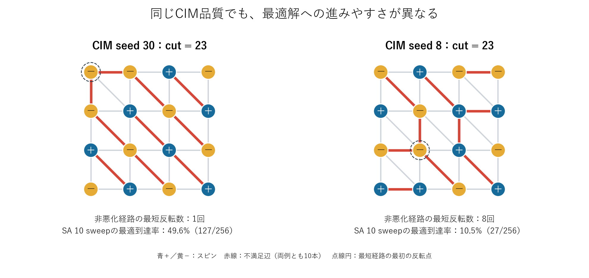
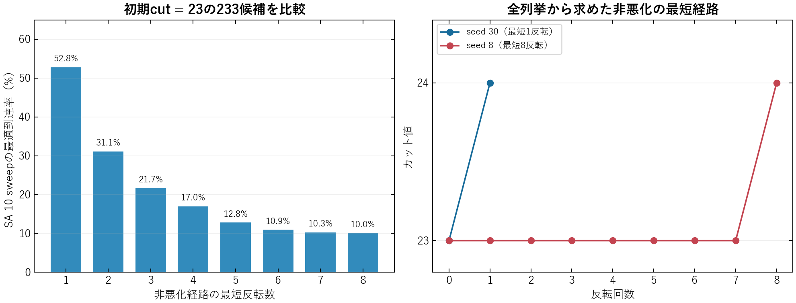
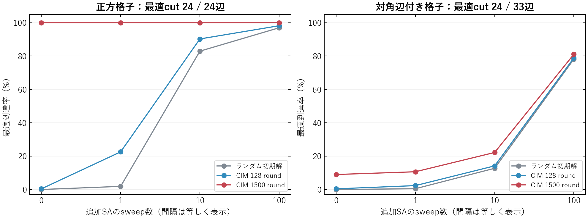
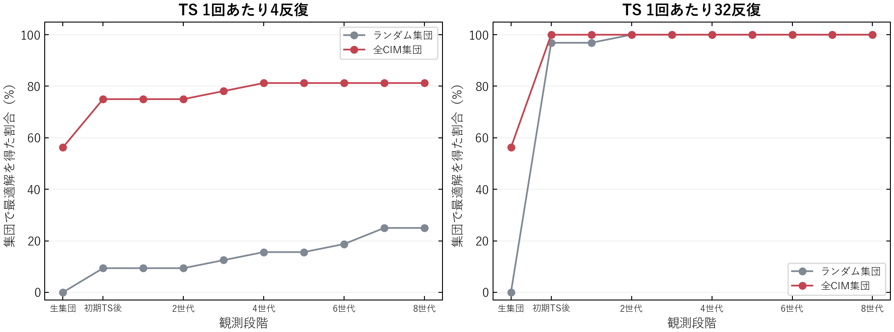
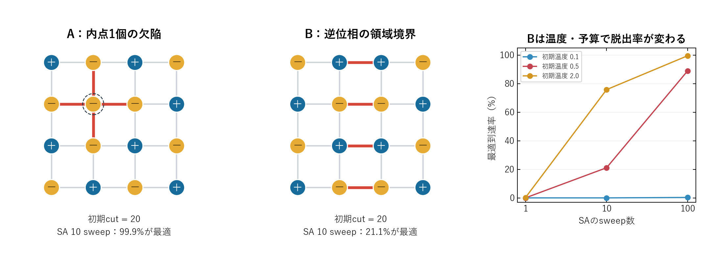
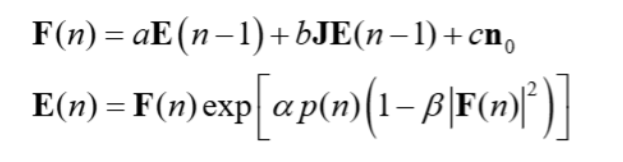

<style>
@page { size: A4; margin: 14mm 15mm; }
body { padding: 0 !important; font-size: 9.5pt !important; line-height: 1.45 !important; }
h1 { font-size: 18pt !important; }
h2 { font-size: 14pt !important; margin-top: 12px !important; }
h3 { font-size: 11pt !important; margin-top: 8px; }
table { font-size: 8.5pt !important; width: 100%; }
td, th { padding: 4px 6px !important; }
img { max-height: 100mm; object-fit: contain; }
tr, img { break-inside: avoid; }
.pagebreak { break-before: page; }
</style>

# 反強磁性モデルでのCIM解の後段評価

実験日：2026-09-28。数値CIM・SA・メメティックGAの実測。全て16スピン、単位正重み、外場なし、開放境界。

## 1. 結論と実際の配置

**同じカット値でも、解の配置によって短いSAでの改善率が変わった。** 対角辺付き格子で、CIMの初期cutが23の233候補を比較すると、非悪化経路が最短1反転の群では最適到達率52.8%、8反転の群では10.0%だった。各候補256回の独立乱数追試による。



両図はCIM 1500 roundの実出力から選択。両方ともcut=23、不満足辺10本。正の辺重みを反強磁性結合として埋め込むため、隣同士が逆符号の辺が得点になる。最適値は24で、不満足辺9本が残る。三角形があり全結合の同時満足はできない。

- **左（seed 30）**：1点の反転で24へ到達できる。SA 160回の反転提案で、127/256回が最適へ到達。
- **右（seed 8）**：単独反転で即改善できず、cut=23のまま移動してから24へ進む経路が必要。27/256回が最適へ到達。
- 例は成功率を見て選ばず、最短経路長1と8の各群で最小のCIM seedを選んだ。最短経路は実際のSA軌跡ではなく、全列挙に基づく解析結果。

この小規模例では、**不満足辺の本数だけでなく、改善へつながる配置変更の経路を見る意義**を確認できた。

<div class="pagebreak"></div>

## 2. 同じcut=23の解を、別のSA乱数で追試



全65,536配置を列挙。cutが23以上の配置だけを通る1スピン反転経路について、最適解から幅優先探索で最短反転数を求めた。対象の233候補は全て悪化なしで最適解へ行けた。長い経路の例は「エネルギーを上げなければ脱出できない」型ではなく、**同じ品質の状態を何度も移動する必要がある**型である。

| 最短反転数 | CIM候補数 | 成功回数 / SA試行数 | 最適到達率 |
|---:|---:|---:|---:|
| 1 | 6 | 811/1536 | 52.8% |
| 2 | 12 | 956/3072 | 31.1% |
| 3 | 16 | 888/4096 | 21.7% |
| 4 | 20 | 869/5120 | 17.0% |
| 5 | 42 | 1375/10752 | 12.8% |
| 6 | 60 | 1676/15360 | 10.9% |
| 7 | 48 | 1260/12288 | 10.3% |
| 8 | 29 | 746/7424 | 10.0% |

SAの条件は初期温度0.5、終端パラメータ0.01、10 sweep=160反転提案。探索中の最良cutを保持する。主実験を見て経路長という特徴を選び、その後、主実験と重複しない乱数（2,000,000以降）で各候補256回追試した。

**解釈の範囲：** 同じ固定配置での再現確認であり、未見グラフへの予測性能を検証したものではない。また経路長は最適解を知った全列挙解析であり、この計算法をそのまま大規模問題の安価な選別器には使えない。非悪化経路長以外の配置特性も群間で異なり得るため、経路長だけの因果効果とは主張しない。

<div class="pagebreak"></div>

## 3. CIMからSAへ渡した全体結果



| 問題 | 初期解 | 追加SAなし | 1 sweep | 10 sweep | 100 sweep |
|---|---|---:|---:|---:|---:|
| 正方格子 | ランダム | 12.234 / 0.0% | 17.746 / 1.9% | 23.348 / 82.9% | 23.879 / 97.0% |
| 正方格子 | CIM 1500 round | 24.000 / 100.0% | 24.000 / 100.0% | 24.000 / 100.0% | 24.000 / 100.0% |
| 対角辺付き | ランダム | 16.934 / 0.0% | 21.205 / 0.5% | 22.891 / 12.7% | 23.781 / 78.1% |
| 対角辺付き | CIM 1500 round | 23.090 / 9.0% | 23.106 / 10.6% | 23.222 / 22.2% | 23.811 / 81.1% |

表の各セルは「平均最良cut / 最適到達率」。最適cutは両問題とも24。追加SAなしは256個の初期解、SAありは256候補×32乱数=8,192試行。候補生成のseedを揃えたCIMの32/128/1500 roundは同じ軌跡の異なる探索予算であり、独立な768試行とは数えない。

- **正方格子（24辺）**：CIM 1500 roundは256/256試行で最適。ここでは後段改善の余地がない。
- **対角辺付き格子（33辺）**：CIMだけでは23/256試行が最適。CIM→SA 100 sweepでは6,643/8,192試行が最適、平均cutは23.090から23.811へ+0.721。
- 同じ追加SA 100 sweepで、ランダム初期解は78.1%、CIM初期解は81.1%。差は短いSAほど大きいが、**この比較はCIM生成時間を含む総時間の比較ではない**。

CIMの返却解は「最後のroundの状態」ではなく、各runの全roundで記録した最良cutの状態。最適値24は既知ベストの引用でなく、全列挙と独立な隣接行列計算で検証した値である。

<div class="pagebreak"></div>

## 4. GA：初期局所探索と交叉を分ける



対角辺付き格子で、8個体×32集団、8世代を実行。全CIM集団は各個体が異なるCIM seed。表は「集団内に最適解を得たrunの割合」であり、前ページのSAの1候補当たりの率とは母数が違う。

| TS反復 / 回 | 初期集団 | 生集団 | 初期TS後 | 8世代後 |
|---:|---|---:|---:|---:|
| 4 | ランダム | 0.0% | 9.4% | 25.0% |
| 4 | 全CIM | 56.2% | 75.0% | 81.2% |
| 32 | ランダム | 0.0% | 96.9% | 100.0% |
| 32 | 全CIM | 56.2% | 100.0% | 100.0% |

TS 32反復では、CIM集団は**交叉前の初期TSだけで全32集団が最適解を獲得**。この成功を交叉の効果と解釈することはできない。TS 4反復でも75.0%から81.3%への追加改善に留まった。

### 同じ親にTSだけをかける対照

CIM 128 roundの実候補から、親同士のcutが同じ128ペアを抽出。各ペア32回、現行交叉後にTSを4反復する場合と、親を交互に選んでTSだけを4反復する場合を比較した。これは初期TS前の親を用いる診断で、全GAの置換実験ではない。

| 条件 | 平均cut | 親のcutを超えた割合 |
|---|---:|---:|
| 親そのもの | 22.234 | - |
| 交叉直後 | 21.203 | 1.4% |
| 交叉＋TS 4反復 | 22.492 | 27.9% |
| 親へTS 4反復 | 22.598 | 33.6% |

今回の診断では、交叉＋TSは親へのTSだけを平均で上回らなかった。**「異なるCIM解を交叉すれば良くなる」という仮説は、この条件では支持されなかった。** より大きな問題や構造を保存する交叉へ一般化した結論ではない。

<div class="pagebreak"></div>

## 5. 前回の模式例A/Bも実際にSAで検証



ここだけは実CIM出力ではなく、前回作成した手作り配置を初期解にした対照実験。両者は同じ正方格子・cut=20・不満足辺4本。初期温度0.5、10 sweep、各1,024試行で、Aは1,023/1,024（99.9%）、Bは216/1,024（21.1%）が最適へ到達した。

Aには+4の単独反転利得がある。Bは全16個の単独反転が悪化し、最大利得も−1。Bの最適到達率は初期温度2.0、100 sweepでは99.5%まで上がった。したがって「Bは解けない」ではなく、**温度と探索予算によって、同じcutの初期解の価値が変わる**という結果である。

## 6. 今回分かったことと次の検証

1. 正方格子は基準動作の確認に適するが、CIMが簡単に解き切るため、後段の改善可能性には対角辺付きの問題が適していた。
2. SA向けには、不満足辺の数に加え、すぐ改善する反転の有無と、同じ品質の状態を移動して改善へ至る構造を調べる価値がある。
3. GA向けには、初期TSで解がどう変わるかと、交叉にTS単独以上の効果があるかを別々に測る必要がある。
4. 次は対角辺の配置を変えた複数の小問題で再現性を確認し、短い局所探索から得られる安価な指標を比較する。その後、G55/G70へ進む。

制約：2種類の固定小規模問題、固定CIM設定での数値実験。実機の性能、総時間の高速化、大規模問題への汎化は未検証。GAは小問題に合わせTS予算を4/32反復に設定しており、既存G-setベンチマークの20,000反復等とは異なる。

<div class="pagebreak"></div>

## 7. 更新式・実験条件・再現性



**更新式の変更なし。** `modules/CIM.py` の既存進行波モデルをそのまま使用した。基準図の結合行列Jへ、今回は正方格子または対角辺付き格子を入れ、各辺を−0.03とした。ポンプの増加量や増幅・飽和・雑音処理に新しい項は加えていない。図は共通の説明用基準式であり、実際の物理定数から利得・雑音を計算する手順の正本は保存したCIM.py。

| 項目 | 設定 |
|---|---|
| 頂点・辺・境界 | 16頂点、正方24辺 / 対角付き33辺、開放境界 |
| 最適性検証 | 65,536配置の全列挙。両問題とも最適cut 24、最適配置2個（全反転対） |
| CIM | 256 seed（0〜255）、32/128/1500 round、各runの最良状態を返す |
| CIM物理定数 | kappa=130、L=0.05、gamma=42.09、損失11 dB |
| CIMポンプ・雑音 | 増加量0.05 mW/round、帯域1 GHz、光子エネルギー1.28e−19 J |
| SA主比較 | 1/10/100 sweep、1 sweep=16回のランダム反転提案、初期温度0.5、終端0.01 |
| SA繰り返し | 主比較は各候補32回。経路長追試は各候補256回。手作り対照は1,024回 |
| GA | 8個体×32 run、8世代、TS 4/32反復、cr=32、摂動2、tenure係数2、品質重み0.6 |
| 対照 | ランダム初期解、手作りA/B、親へのTSのみ |

GA.pyの引数`init_population`に既存の二重定義があり読み込めなかったため、重複する宣言1行のみ削除した。GA・SA warm-startの既存テスト7件が通過。今回の出力は全て辺リストから再計算し、最適値を超えていないこととソルバの返却値の一致を検証した。

### 再実行（プロジェクトルートから）

```powershell
python scripts/benchmarks/antiferro_seed_validation.py
python scripts/benchmarks/antiferro_seed_diagnostics.py <新しい出力先>
python scripts/reporting/antiferro_seed_report.py <新しい出力先>
python scripts/utils/md_to_pdf.py <新しい出力先>/RESULTS.md
```

出力先は日付×実験種別×版番号で自動採番。今回の本実験はv2、v1は32候補のsmoke試験。summary.jsonに設定・ソースSHA-256、各npzにCIM配置・SA結果・GA集団・全列挙結果を保存。diagnostics.json/npzに独立乱数追試と最短経路を保存。ソルバと実験コードのスナップショットも同梱。
